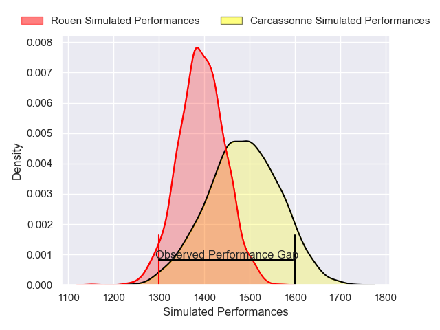
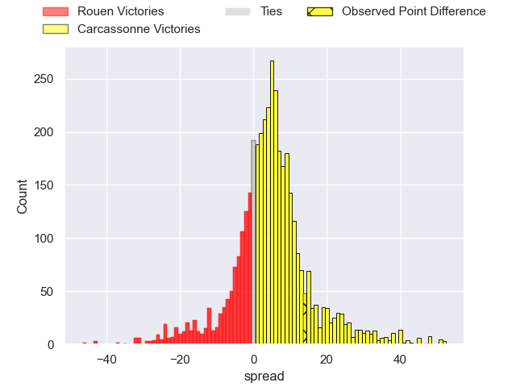
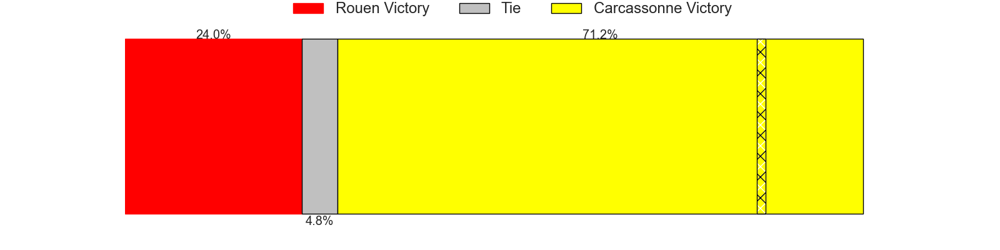
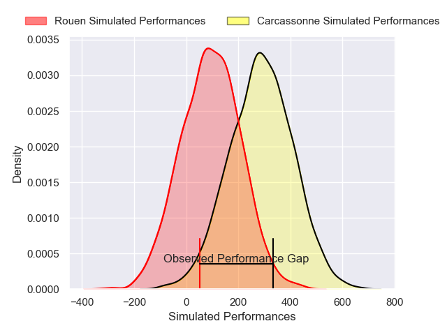
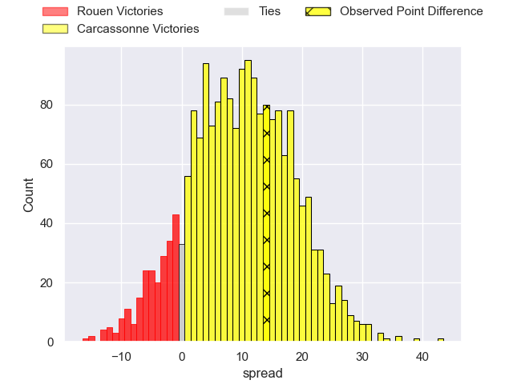
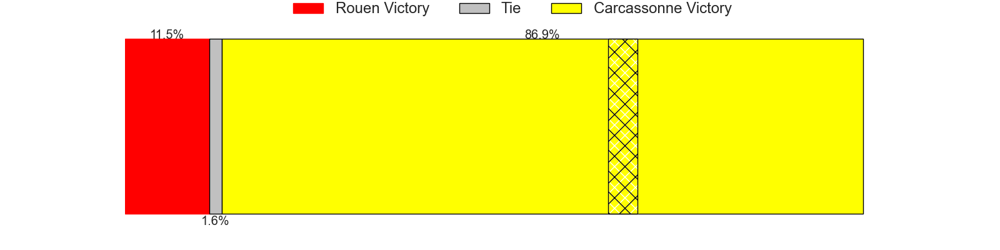

---  
layout: page  
title: Rouen at Carcassonne; 9-23  
date: 2025-01-10 18:00:00 -0500  
categories: "Nationale 2024" match review  
---
# Rouen at Carcassonne; 9-23

# Club Level Predictions

The first set of predictions treats a club as the smallest object, as the club develops its members, organizes a gameplan, and deploys its players as needed for each match. This club model has a prediction of 0.626, which translates to predicting Carcassonne to win by 4.5.

Our Over/Under is 33.5 - and combined with the spread above, we have a predicted scoreline of 14 to 19

Each club has a rating and a rating deviation (similar to a Glicko rating), and expected performances can be generated. This allows for simulated matches and spreads like the ones below.
## Projected Performances - Club Model

## Projected Spreads - Club Model

## Projected Results - Club Model

# Player Level Predictions

Treating teams instead as an entity made up of the currently active players, I have ratings for each player in an altogether different system. These can be combined to form team ratings once teamsheets are announced, weighting starters a bit higher than the reserves. After the match is played, players can be weighted by their minutes on the field, allowing for an accurate measure of the team's composition. With these compiled team ratings, we can make predictions, measure inaccuracy, and update the individual player ratings.
## Prediction without Player Minutes: Carcassonne by 11.0

Carcassonne by 1.8 on a neutral pitch

## Projected Performances - Player Model

## Projected Spreads - Player Model

## Projected Results - Player Model

|   Away Minutes | Away Player           |   Away Percentile |   Number |   Home Percentile | Home Player         |   Home Minutes |
|---------------:|:----------------------|------------------:|---------:|------------------:|:--------------------|---------------:|
|             11 | Soulemane Camara      |             32.09 |        1 |             75.38 | Yan Arnold          |              5 |
|             69 | German Kessler        |             27.06 |        2 |             58.78 | Raphael Carbou      |             80 |
|             80 | Diego Arbelo          |             24.28 |        3 |              1.53 | Vakhtangi Akhobadze |             27 |
|              5 | Octave Leleu          |             25.36 |        4 |             23.42 | Romain Manchia      |             65 |
|             15 | John-Charles Astle    |             64.36 |        5 |             31.77 | Clément Fontaine    |              4 |
|             12 | Willy N'Diaye         |              8.82 |        6 |             70.08 | Ferdinand Dreno     |             21 |
|             27 | Jean Leleu            |             41.89 |        7 |             74.95 | Etienne Herjean     |             80 |
|             21 | Abdelkarim Fofana     |             72.35 |        8 |             17.88 | Thomas Hoarau       |             80 |
|             22 | Ilan El Khattabi      |              8.27 |        9 |             16.37 | Gaetan Pichon       |             45 |
|              4 | Benjamin Pehau        |             79.69 |       10 |             91.05 | Gabin Michet        |             80 |
|             29 | Benito Masilevu       |             73.43 |       11 |             87.35 | Clement Egiziano    |             22 |
|             11 | Theo Dachary          |              3.44 |       12 |              8.78 | Jordan Puletua      |             51 |
|             55 | Nicolas Nieto         |             37.67 |       13 |             65.33 | Lukas Doyhenard     |             66 |
|             45 | Benjamin Descamps     |             71.47 |       14 |             36.67 | Naim Ben Alla       |             80 |
|             52 | Joaquin Riera         |             62.45 |       15 |             88.43 | Maxime Gianet       |             58 |
|             59 | Alexis Decaux         |             80.31 |       16 |             41    | Florent Lorenzon    |             70 |
|             76 | Mathieu Bonnot        |             48.75 |       17 |            nan    | Baptiste Moreno     |             58 |
|             80 | Khvicha Tsopurashvili |             42.19 |       18 |             82.85 | Fabien Lorenzon     |             80 |
|             80 | Ernest Eudier         |             50.2  |       19 |             86.56 | Romain Guyot        |             21 |
|             80 | Soig Mingant          |            nan    |       20 |             13.14 | Marius Iftimiciuc   |             80 |
|             80 | Gauthier Lelong       |            nan    |       21 |             16.13 | Valentin Sese       |             80 |
|             80 | Aloïs Chayla          |            nan    |       22 |             36.9  | Nils Chalies        |             23 |
|             53 | Zalan Kade            |            nan    |       23 |             12.45 | Paul Gadea          |             80 |

