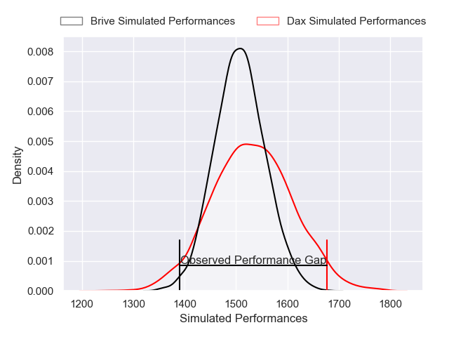
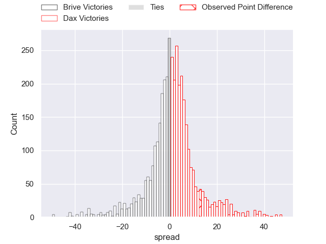
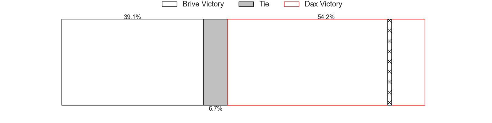
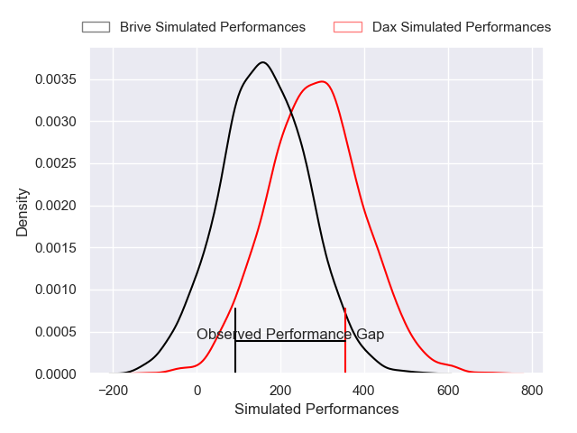
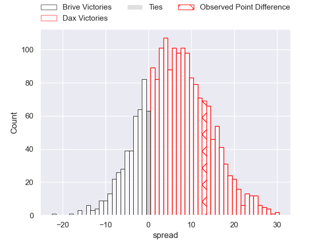
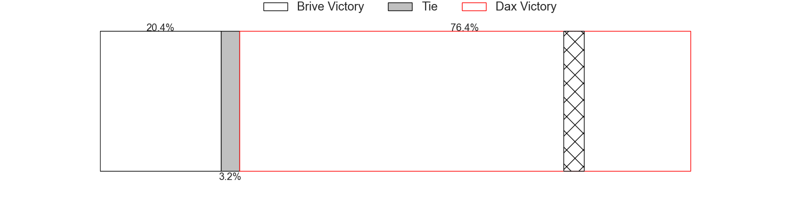

---  
layout: page  
title: Brive at Dax; 9-22  
date: 2025-01-10 18:00:00 -0500  
categories: "Pro D2 2024" match review  
---
# Brive at Dax; 9-22

# Club Level Predictions

The first set of predictions treats a club as the smallest object, as the club develops its members, organizes a gameplan, and deploys its players as needed for each match. This club model has a prediction of 0.532, which translates to predicting Dax to win by 1.1.

Our Over/Under is 42.5 - and combined with the spread above, we have a predicted scoreline of 20 to 22

Each club has a rating and a rating deviation (similar to a Glicko rating), and expected performances can be generated. This allows for simulated matches and spreads like the ones below.
## Projected Performances - Club Model

## Projected Spreads - Club Model

## Projected Results - Club Model

# Player Level Predictions

Treating teams instead as an entity made up of the currently active players, I have ratings for each player in an altogether different system. These can be combined to form team ratings once teamsheets are announced, weighting starters a bit higher than the reserves. After the match is played, players can be weighted by their minutes on the field, allowing for an accurate measure of the team's composition. With these compiled team ratings, we can make predictions, measure inaccuracy, and update the individual player ratings.
## Prediction without Player Minutes: Dax by 3.2

Brive by 8.8 on a neutral pitch

## Projected Performances - Player Model

## Projected Spreads - Player Model

## Projected Results - Player Model

|   Away Minutes | Away Player               |   Away Percentile |   Number |   Home Percentile | Home Player           |   Home Minutes |
|---------------:|:--------------------------|------------------:|---------:|------------------:|:----------------------|---------------:|
|             27 | Simon-Pierre Chauvac      |             17.04 |        1 |             16.44 | David Lolohea         |             49 |
|             29 | Lucas da Silva            |             63.46 |        2 |             14.8  | Louis Barrere         |             61 |
|             80 | Marcel van der Merwe      |              5.28 |        3 |              6.9  | Diogo Hasse Ferreira  |             19 |
|             31 | Asier Usarraga            |             82.76 |        4 |             48.07 | Étienne Loiret        |             17 |
|             13 | Hendre Stassen            |             19.17 |        5 |              7.91 | Jean-Baptiste Singer  |             80 |
|             80 | Retief Marais             |             81.9  |        6 |              3.8  | Jean-Baptiste Barrère |             29 |
|             63 | Sasha Gue                 |             20.2  |        7 |             73.7  | Paul Arnaud Ausset    |             50 |
|             31 | Rahboni Warren-Vosayaco   |             53.9  |        8 |             68.4  | Genesis Mamea Lemalu  |             80 |
|             50 | Leo Carbonneau            |             80.5  |        9 |             66.73 | Sylvère Reteau        |             50 |
|             29 | Curwin Bosch              |             87.17 |       10 |             28.32 | Romuald Séguy         |             17 |
|             31 | Erwan Dridi               |             89.93 |       11 |             38.5  | Viliame Tutuvili      |             50 |
|             49 | Paul Pimienta             |             18.98 |       12 |             66.92 | Noah Nene             |             29 |
|             27 | Matias Moroni             |             99.35 |       13 |             55.1  | Bastien Daguerre      |             80 |
|             13 | Thomas Zenon              |              4.94 |       14 |             76.31 | Théo Gatelier         |             80 |
|             31 | Mathis Ferté              |             68.58 |       15 |             58.63 | Théo Duprat           |             50 |
|             80 | Benjamin Boudou           |             45.45 |       16 |             38.93 | Thibaud Dréan         |             25 |
|             67 | Nathan Fraissenon         |            nan    |       17 |             67.56 | Iban Hiriart-Urruty   |             80 |
|             80 | Francisco Coria Marchetti |             69.08 |       18 |              5.54 | Nephi Leatigaga       |             18 |
|             51 | Taniela Sadrugu           |             61.9  |       19 |             59.4  | Arnaud Aletti         |             80 |
|             59 | Matthieu Voisin           |             67.8  |       20 |             34.89 | Alexandre Manukula    |             80 |
|             21 | Konstantin Mikautadze     |              8.62 |       21 |             87.84 | Paul Ravier           |             31 |
|             30 | Timilai Rokoduru          |             57.27 |       22 |              1.68 | Maxime Oltmann        |             80 |
|            nan | nan                       |            nan    |       23 |             12.8  | Benjamin Puntous      |             31 |

