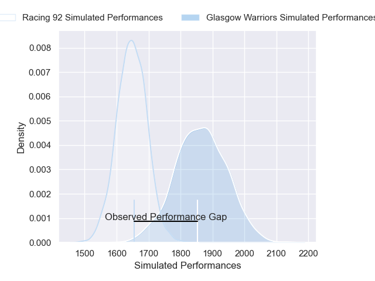
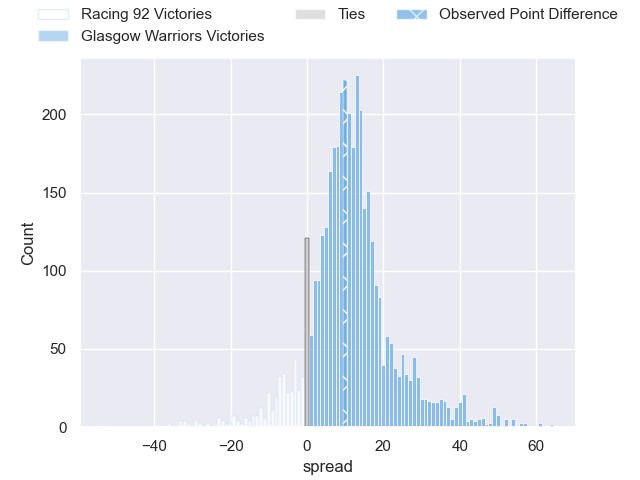
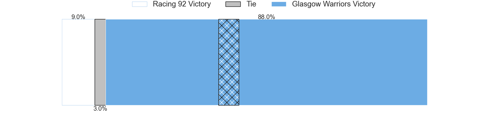
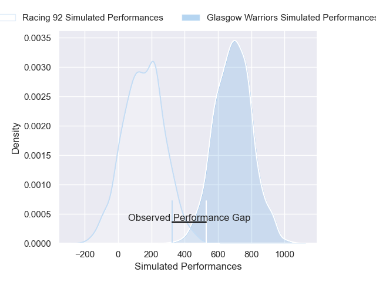
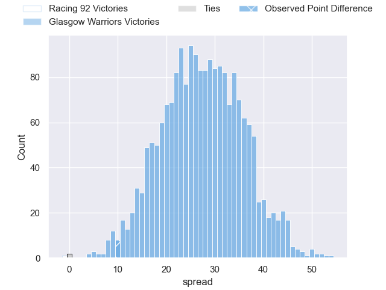
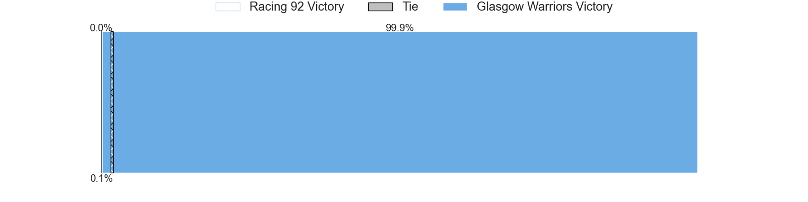

---  
layout: page  
title: Racing 92 at Glasgow Warriors; 19-29  
date: 2025-01-10 18:00:00 -0500  
categories: "European Rugby Champions Cup 2024" match review  
---
# Racing 92 at Glasgow Warriors; 19-29

# Club Level Predictions

The first set of predictions treats a club as the smallest object, as the club develops its members, organizes a gameplan, and deploys its players as needed for each match. This club model has a prediction of 0.767, which translates to predicting Glasgow Warriors to win by 10.5.

Our Over/Under is 39.5 - and combined with the spread above, we have a predicted scoreline of 15 to 25

Each club has a rating and a rating deviation (similar to a Glicko rating), and expected performances can be generated. This allows for simulated matches and spreads like the ones below.
## Projected Performances - Club Model

## Projected Spreads - Club Model

## Projected Results - Club Model

# Player Level Predictions

Treating teams instead as an entity made up of the currently active players, I have ratings for each player in an altogether different system. These can be combined to form team ratings once teamsheets are announced, weighting starters a bit higher than the reserves. After the match is played, players can be weighted by their minutes on the field, allowing for an accurate measure of the team's composition. With these compiled team ratings, we can make predictions, measure inaccuracy, and update the individual player ratings.
## Prediction without Player Minutes: Glasgow Warriors by 32.8

Glasgow Warriors by 23.2 on a neutral pitch

## Projected Performances - Player Model

## Projected Spreads - Player Model

## Projected Results - Player Model

|   Away Minutes | Away Player                       |   Away Percentile |   Number |   Home Percentile | Home Player           |   Home Minutes |
|---------------:|:----------------------------------|------------------:|---------:|------------------:|:----------------------|---------------:|
|             80 | Lino Julien                       |             56.18 |        1 |             62.83 | Rory Sutherland       |             13 |
|             29 | Feleti Kaitu'u                    |              6.12 |        2 |             67.27 | Johnny Matthews       |             17 |
|             80 | Lucio Sordoni                     |             96.47 |        3 |             99.92 | Zander Fagerson       |             80 |
|             50 | Boris Palu                        |             90.54 |        4 |             68.91 | Gregor Brown          |             80 |
|             29 | Junior Kpoku                      |             82.7  |        5 |             99.2  | Scott Cummings        |             31 |
|             63 | Noa Zinzen                        |             35.63 |        6 |             96.81 | Matt Fagerson         |             31 |
|             29 | Ibrahim Diallo                    |             24.61 |        7 |             94.75 | Rory Darge            |             80 |
|             63 | Maxime Baudonne                   |             77.49 |        8 |             57.32 | Jack Mann             |             31 |
|             80 | Clovis Le bail                    |             55.62 |        9 |             99.82 | George Horne          |             31 |
|             50 | Antoine Gibert                    |             94.26 |       10 |             65.78 | Tom Jordan            |             80 |
|             11 | Henry Arundell                    |              3.47 |       11 |             98.81 | Kyle Steyn            |             31 |
|             80 | Henry Arundell                    |              3.47 |       11 |             98.81 | Kyle Steyn            |             31 |
|             49 | Henry Chavancy                    |             99.89 |       12 |             95.59 | Sione Tuipulotu       |             27 |
|             63 | Tristan Tedder                    |             19.74 |       13 |             84.79 | Huw Jones             |             51 |
|             51 | Vinaya Habosi                     |             42.81 |       14 |             99.21 | Sebastian Cancelliere |             80 |
|             18 | Max Spring                        |              6.37 |       15 |             81.98 | Josh McKay            |             61 |
|              6 | Diego Escobar Alvarez             |             73.2  |       16 |             98.65 | Jamie Bhatti          |             80 |
|             27 | Eddy Ben Arous                    |             97.48 |       17 |             74.1  | Gregor Hiddleston     |             80 |
|             49 | Lee-Marvin Lofty Siyanda Mazibuko |             71.91 |       18 |             22.04 | Sam Talakai           |             59 |
|             40 | Hacjivah Dayimani                 |             90.23 |       19 |             66.1  | Alex Samuel           |             21 |
|             80 | Romain Taofifenua                 |             23.84 |       20 |             34.29 | Ally Miller           |             21 |
|             51 | Dan Lancaster                     |              3.31 |       21 |             53.45 | Euan Ferrie           |             40 |
|             30 | Kleo Labarbe                      |            nan    |       22 |             90.4  | Jamie Dobie           |             80 |
|             55 | Dylan Idrissi                     |            nan    |       23 |             81.9  | Duncan Weir           |             25 |

