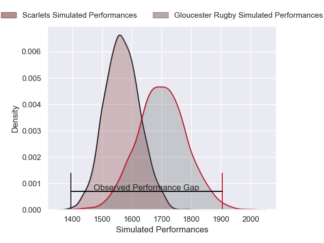
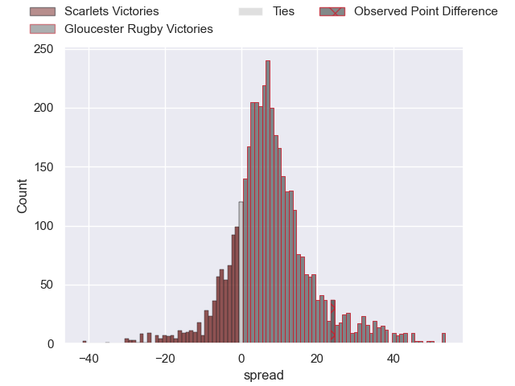
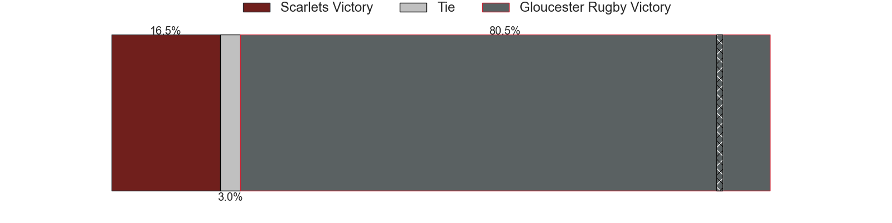
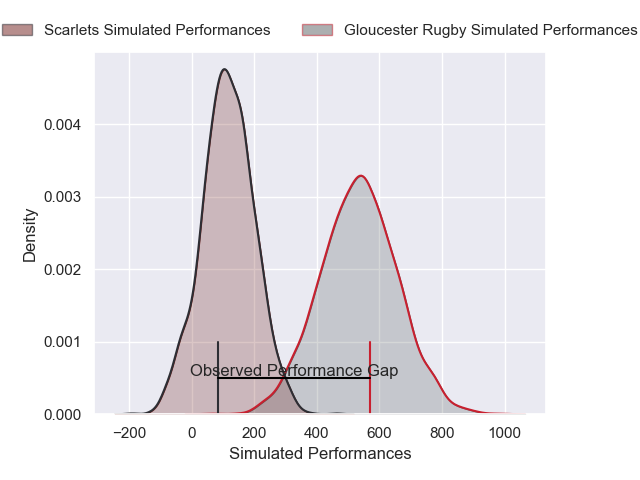
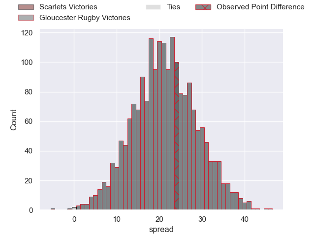
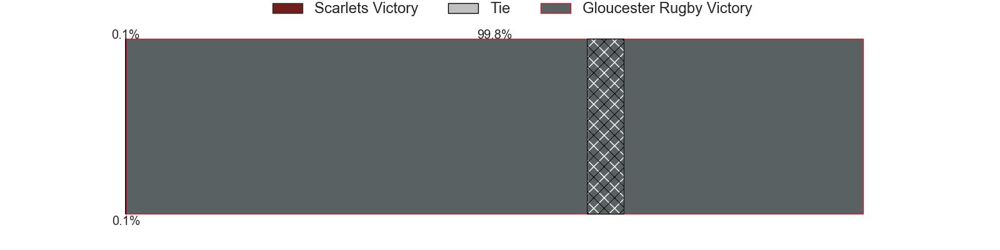

---  
layout: page  
title: Scarlets at Gloucester Rugby; 7-31  
date: 2025-01-10 18:00:00 -0500  
categories: "European Rugby Challenge Cup 2024" match review  
---
# Scarlets at Gloucester Rugby; 7-31

# Club Level Predictions

The first set of predictions treats a club as the smallest object, as the club develops its members, organizes a gameplan, and deploys its players as needed for each match. This club model has a prediction of 0.684, which translates to predicting Gloucester Rugby to win by 6.8.

Our Over/Under is 47.5 - and combined with the spread above, we have a predicted scoreline of 21 to 27

Each club has a rating and a rating deviation (similar to a Glicko rating), and expected performances can be generated. This allows for simulated matches and spreads like the ones below.
## Projected Performances - Club Model

## Projected Spreads - Club Model

## Projected Results - Club Model

# Player Level Predictions

Treating teams instead as an entity made up of the currently active players, I have ratings for each player in an altogether different system. These can be combined to form team ratings once teamsheets are announced, weighting starters a bit higher than the reserves. After the match is played, players can be weighted by their minutes on the field, allowing for an accurate measure of the team's composition. With these compiled team ratings, we can make predictions, measure inaccuracy, and update the individual player ratings.
## Prediction without Player Minutes: Gloucester Rugby by 17.7

Gloucester Rugby by 2.2 on a neutral pitch

## Projected Performances - Player Model

## Projected Spreads - Player Model

## Projected Results - Player Model

|   Away Minutes | Away Player          |   Away Percentile |   Number |   Home Percentile | Home Player         |   Home Minutes |
|---------------:|:---------------------|------------------:|---------:|------------------:|:--------------------|---------------:|
|             40 | Kemsley Mathias      |             81.83 |        1 |              9.34 | Mayco Vivas         |             80 |
|             30 | Marnus van der Merwe |             94.62 |        2 |             94.8  | Jack Singleton      |             80 |
|             10 | Henry Thomas         |             81.49 |        3 |             13.5  | Ciaran Knight       |             51 |
|             29 | Alex Craig           |             58.76 |        4 |             69.86 | Freddie Thomas      |             40 |
|             63 | Max Douglas          |             90.22 |        5 |             37.68 | Arthur Clark        |             40 |
|             17 | Taine Plumtree       |             92.6  |        6 |             37.42 | Jack Clement        |             59 |
|             63 | Josh MacLeod         |             65.92 |        7 |             11.66 | Lewis Ludlow        |             51 |
|             29 | Vaea Fifita          |             88.98 |        8 |             88.36 | Ruan Ackermann      |             19 |
|             29 | Archie Hughes        |             30.58 |        9 |             81.47 | Caolan Englefield   |             80 |
|             29 | Sam Costelow         |             43.45 |       10 |             87.34 | Santiago Carreras   |             17 |
|             29 | Blair Murray         |             29.9  |       11 |             74.02 | Josh Hathaway       |             25 |
|             29 | Eddie James          |             61.22 |       12 |             89    | Max Llewellyn       |             28 |
|             40 | Macs Page            |             19.78 |       13 |             31.78 | Chris Harris        |             80 |
|             23 | Ellis Mee            |             64.8  |       14 |             97.65 | Christian Wade      |             80 |
|             50 | Ioan Lloyd           |             18.12 |       15 |             82.97 | George Barton       |             55 |
|             13 | Alec Hepburn         |             88.12 |       16 |             51.25 | Sebastian Blake     |             53 |
|             77 | Shaun Evans          |              4.84 |       17 |             17.49 | Jamal Ford-Robinson |             52 |
|             31 | Sam Lousi            |             67.92 |       18 |             83.79 | Kirill Gotovtsev    |             80 |
|             31 | Gabe Hawley          |            nan    |       19 |             73.22 | Freddie Clarke      |             27 |
|             31 | Jarrod Taylor        |             55.78 |       20 |             92.93 | Albert Tuisue       |             53 |
|             18 | Gareth Davies        |             32.91 |       21 |             13.14 | Jake Morris         |             80 |
|             53 | Ioan Nicholas        |             11.14 |       22 |             17.56 | Sebastien Atkinson  |             80 |
|             13 | Joe Roberts          |             23    |       23 |            nan    | nan                 |            nan |

