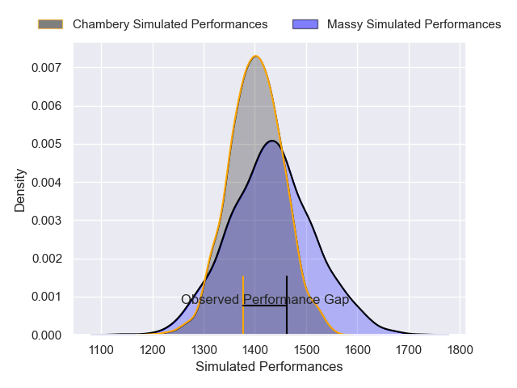
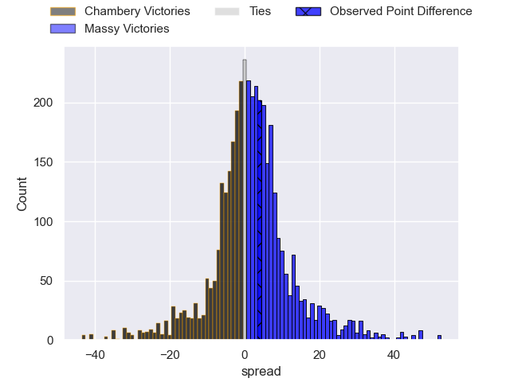
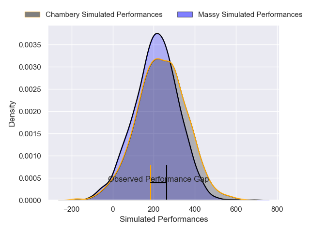
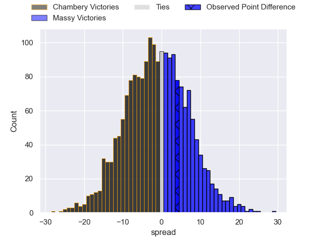

---  
layout: page  
title: Chambery at Massy; 13-17  
date: 2025-01-10 18:00:00 -0500  
categories: "Nationale 2024" match review  
---
# Chambery at Massy; 13-17

# Club Level Predictions

The first set of predictions treats a club as the smallest object, as the club develops its members, organizes a gameplan, and deploys its players as needed for each match. This club model has a prediction of 0.543, which translates to predicting Massy to win by 1.5.

Our Over/Under is 28.5 - and combined with the spread above, we have a predicted scoreline of 14 to 15

Each club has a rating and a rating deviation (similar to a Glicko rating), and expected performances can be generated. This allows for simulated matches and spreads like the ones below.
## Projected Performances - Club Model

## Projected Spreads - Club Model

## Projected Results - Club Model

# Player Level Predictions

Treating teams instead as an entity made up of the currently active players, I have ratings for each player in an altogether different system. These can be combined to form team ratings once teamsheets are announced, weighting starters a bit higher than the reserves. After the match is played, players can be weighted by their minutes on the field, allowing for an accurate measure of the team's composition. With these compiled team ratings, we can make predictions, measure inaccuracy, and update the individual player ratings.
## Prediction without Player Minutes: Chambery by 5.9

Chambery by 12.0 on a neutral pitch

## Projected Performances - Player Model

## Projected Spreads - Player Model

## Projected Results - Player Model

|   Away Minutes | Away Player          |   Away Percentile |   Number |   Home Percentile | Home Player            |   Home Minutes |
|---------------:|:---------------------|------------------:|---------:|------------------:|:-----------------------|---------------:|
|             54 | Enzo Segui           |             61.67 |        1 |              0.77 | Fernandez Correa       |             45 |
|             18 | Yan Tabarot          |             76.47 |        2 |             51.52 | Adrien Sonzogni        |             53 |
|              1 | Lasha Tabidze        |             89.18 |        3 |             80.32 | Nicolas Ferrer         |             41 |
|             58 | Ahmed Tidiane Kane   |             77.38 |        4 |             68.76 | Saba Pesvianidze       |             80 |
|             58 | Corentin Astier      |             70.69 |        5 |             36.11 | Andrei Mahu            |             28 |
|             55 | Jean-Baptiste Grenod |             93.8  |        6 |             42.6  | Clément Vidoni         |             28 |
|             15 | Colin Lebian         |             79.9  |        7 |             69.8  | Alexandre Loubiere     |             22 |
|             51 | Tui Uru              |             83.55 |        8 |             55.19 | Simon Cowley           |             22 |
|             14 | Mateo Guerret        |             68.87 |        9 |             32.38 | Lucas Rubio            |             22 |
|             11 | Thibault Moreno      |             74.34 |       10 |              5.97 | Christian Lacombe      |             27 |
|             55 | Arthur Nennig        |             88.65 |       11 |             77.59 | Martin Carre           |             80 |
|             45 | Mickael Blanc        |             36.44 |       12 |             70.39 | Luca Mignot            |             27 |
|             10 | Emmanuel Vaitulukina |             80.48 |       13 |             39.7  | Tom Cusson             |             62 |
|             58 | Paul Altier          |             77    |       14 |             12.83 | Giorgi Gogoladze       |             56 |
|             66 | Enzo Marzocca        |             60.4  |       15 |             18.81 | Alexandre Borie        |             80 |
|              3 | Fabien Witz          |             72.21 |       16 |             61.84 | Tijde Visser           |             33 |
|             60 | Youenn Floch         |             53.04 |       17 |             37.65 | Nolan Pienaar          |             80 |
|             56 | Nugzar Somkhishvili  |             85.18 |       18 |             83.98 | Yohann Gbizie          |             53 |
|             80 | Matheo Triki         |             82.3  |       19 |             92.51 | Pierre Trassoudaine    |             56 |
|             80 | Alessio Caiolo       |            nan    |       20 |             44.54 | Julien Blanc           |             46 |
|             80 | Aubin Eymeri         |             37.03 |       21 |            nan    | Ilian El Yahyaoui      |             58 |
|             80 | Arwel Robson         |             36.06 |       22 |              6.19 | Gonzalo Lopez Bontempo |             80 |
|             80 | Leonard Reis         |            nan    |       23 |             53.8  | Hilan Delbois Fontaine |             22 |

