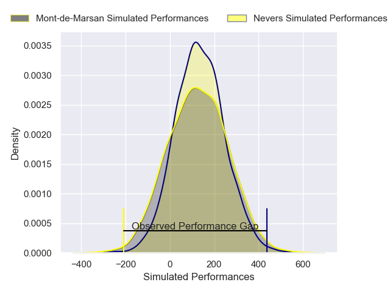
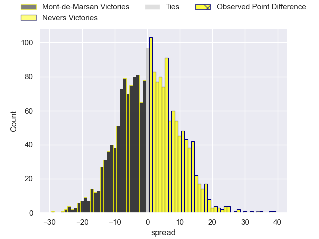

---  
layout: page  
title: Mont-de-Marsan at Nevers; 0-34  
date: 2025-01-10 18:00:00 -0500  
categories: "Pro D2 2024" match review  
---
# Mont-de-Marsan at Nevers; 0-34

# Club Level Predictions

The first set of predictions treats a club as the smallest object, as the club develops its members, organizes a gameplan, and deploys its players as needed for each match. This club model has a prediction of 0.558, which translates to predicting Nevers to win by 2.0.

Our Over/Under is 43.5 - and combined with the spread above, we have a predicted scoreline of 21 to 23

Each club has a rating and a rating deviation (similar to a Glicko rating), and expected performances can be generated. This allows for simulated matches and spreads like the ones below.
## Projected Performances - Club Model

## Projected Spreads - Club Model

## Projected Results - Club Model

# Player Level Predictions

Treating teams instead as an entity made up of the currently active players, I have ratings for each player in an altogether different system. These can be combined to form team ratings once teamsheets are announced, weighting starters a bit higher than the reserves. After the match is played, players can be weighted by their minutes on the field, allowing for an accurate measure of the team's composition. With these compiled team ratings, we can make predictions, measure inaccuracy, and update the individual player ratings.
## Prediction without Player Minutes: Nevers by 0.2

Mont-de-Marsan by 4.8 on a neutral pitch

## Projected Performances - Player Model

## Projected Spreads - Player Model

## Projected Results - Player Model

|   Away Minutes | Away Player           |   Away Percentile |   Number |   Home Percentile | Home Player                |   Home Minutes |
|---------------:|:----------------------|------------------:|---------:|------------------:|:---------------------------|---------------:|
|             27 | Luka Goginava         |             56.98 |        1 |             25.38 | Aitor Kitutu               |             17 |
|             80 | Florian Dufour        |              9.98 |        2 |             44.56 | Efi Ma'afu                 |             62 |
|             61 | Anthony Alves         |             13.29 |        3 |             58.69 | Lasha Pkhakadze            |             28 |
|             19 | Jules Dussutour       |             66.73 |        4 |             42.8  | Chris Gabriel              |             28 |
|             39 | Romain Durand         |             83.57 |        5 |             36.41 | Kevin Noah                 |             63 |
|             59 | Aurélien Laforgue     |             35.9  |        6 |             85.3  | Hugues Bastide             |             14 |
|             57 | Waël Ponpon           |             11.3  |        7 |             63    | Julien Kazubek             |             26 |
|             66 | Ioane Iashagashvili   |             90.91 |        8 |             67.1  | Steven David               |             80 |
|             25 | Nicolas Darquier      |             47.94 |        9 |              1.97 | Hugo Bouyssou              |             30 |
|             80 | Willie du Plessis     |             58.63 |       10 |             19.47 | Shaun Reynolds             |             22 |
|             80 | Alexandre de Nardi    |             24.19 |       11 |             41.76 | Arthur Mathiron            |             24 |
|             18 | Nacani Wakaya         |             70.28 |       12 |             46.85 | Noa Pommelet               |             24 |
|             27 | Gatien Masse          |             16.49 |       13 |             82.65 | Rudy Derrieux              |             53 |
|             80 | Simao Bento           |             13.13 |       14 |             21.62 | Gabin Rocher               |             68 |
|             27 | Théo Cortes           |             10.18 |       15 |             52.65 | Perry Mayo                 |             80 |
|             59 | Myles Edwards         |             10.24 |       16 |             68    | Luka Plataret              |             58 |
|             60 | Raphaël Darquier      |            nan    |       17 |             66.95 | Kamaliele Tufele           |             80 |
|             80 | Baptiste Canut        |             46.15 |       18 |             27.85 | Farai Mudariki             |             12 |
|             80 | Mosese Dawai          |            nan    |       19 |              3.9  | Charlie Francoz            |             58 |
|             80 | Yoann Laousse Azpiazu |             22.35 |       20 |             25.66 | Ugo Vignolles              |             80 |
|             80 | Samuel Lagrange       |             33.51 |       21 |             24.78 | Jean-Maxence Jules-Rosette |             80 |
|             80 | Mattéo Lalanne        |             28.88 |       22 |             35.06 | Simon Tarel                |             66 |
|             24 | Ali-Amjad Osman-Bosch |            nan    |       23 |             32.65 | Nicolas Ragoevi            |             66 |

