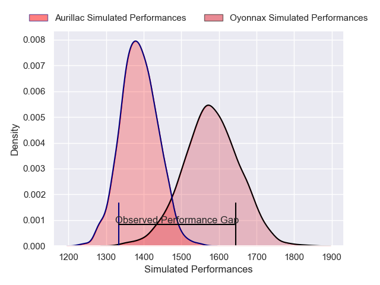
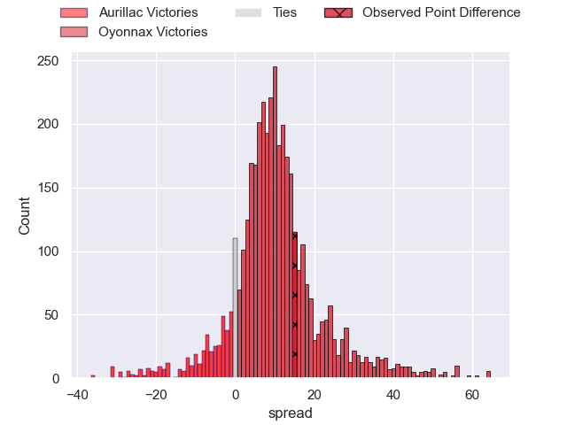
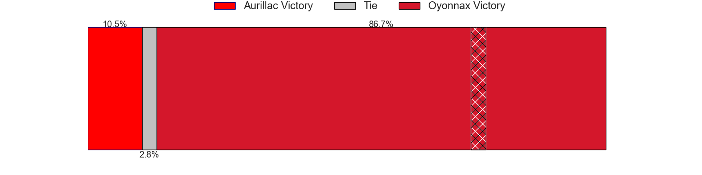
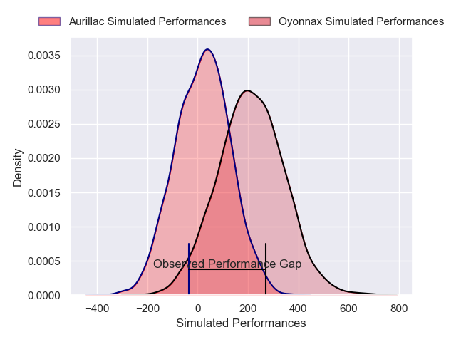
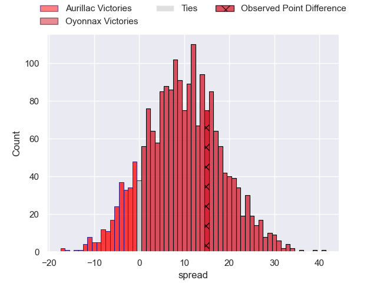
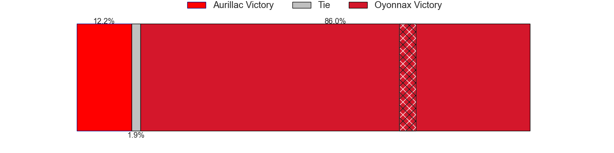

---  
layout: page  
title: Aurillac at Oyonnax; 10-25  
date: 2025-01-10 18:00:00 -0500  
categories: "Pro D2 2024" match review  
---
# Aurillac at Oyonnax; 10-25

# Club Level Predictions

The first set of predictions treats a club as the smallest object, as the club develops its members, organizes a gameplan, and deploys its players as needed for each match. This club model has a prediction of 0.746, which translates to predicting Oyonnax to win by 9.5.

Our Over/Under is 53.5 - and combined with the spread above, we have a predicted scoreline of 22 to 31

Each club has a rating and a rating deviation (similar to a Glicko rating), and expected performances can be generated. This allows for simulated matches and spreads like the ones below.
## Projected Performances - Club Model

## Projected Spreads - Club Model

## Projected Results - Club Model

# Player Level Predictions

Treating teams instead as an entity made up of the currently active players, I have ratings for each player in an altogether different system. These can be combined to form team ratings once teamsheets are announced, weighting starters a bit higher than the reserves. After the match is played, players can be weighted by their minutes on the field, allowing for an accurate measure of the team's composition. With these compiled team ratings, we can make predictions, measure inaccuracy, and update the individual player ratings.
## Prediction without Player Minutes: Oyonnax by 10.6

Aurillac by 2.5 on a neutral pitch

## Projected Performances - Player Model

## Projected Spreads - Player Model

## Projected Results - Player Model

|   Away Minutes | Away Player              |   Away Percentile |   Number |   Home Percentile | Home Player       |   Home Minutes |
|---------------:|:-------------------------|------------------:|---------:|------------------:|:------------------|---------------:|
|             58 | Robert Rodgers           |              4.6  |        1 |              7.16 | Adrien Bordenave  |             80 |
|             80 | Ronan Loughnane          |             15.51 |        2 |              8.02 | Benjamin Geledan  |             80 |
|             22 | Dominic Robertson-McCoy  |             20.02 |        3 |             59.97 | Paulo Tafili      |             51 |
|             22 | Louis Bruinsma           |             16.23 |        4 |              0.91 | Manuel Leindekar  |             51 |
|             27 | Mehdi Slamani            |             18.46 |        5 |             45.03 | Ewan Johnson      |             63 |
|             37 | Heath Backhouse          |             76.4  |        6 |             70.4  | Wandrille Picault |             29 |
|              4 | Lucas Oudard             |             44.1  |        7 |             11.6  | Hugo Hermet       |             80 |
|             21 | Didier Tison             |              4.76 |        8 |              1.95 | Loic Godener      |             57 |
|             11 | Boris Hadinegoro         |             38.1  |        9 |             92.13 | Jonathan Ruru     |             40 |
|             21 | Jean-Luc Alewyn Cilliers |             58.19 |       10 |             69.91 | Zack Holmes       |             80 |
|             21 | Simeli Yabaki            |              4.15 |       11 |             45.8  | Karim Qadiri      |             22 |
|              4 | Karsen Talalua           |             43.49 |       12 |             13.02 | Lucas Mensa       |             80 |
|             21 | Hugo Bastard             |             37.74 |       13 |             48.59 | Maelan Rabut      |             16 |
|             80 | Juun Pieters             |             42.94 |       14 |              2.47 | Gavin Stark       |             59 |
|             79 | Dachi Papunashvili       |              8.85 |       15 |              5.97 | Martin Bogado     |             17 |
|             24 | David Delarue            |              6.44 |       16 |              2.5  | Teddy Durand      |             35 |
|             66 | Tim De Jong              |             39.9  |       17 |            nan    | Victor Lebas      |             59 |
|             80 | Mael Perrin              |             42.21 |       18 |             63.71 | Thibault Berthaud |             80 |
|             80 | Skip Jongejan            |            nan    |       19 |             72.12 | Chris Smith       |             80 |
|             80 | Basa Khonelidze          |             33.87 |       20 |              5.37 | Vasil Lobzhanidze |             76 |
|             80 | Gymael Jean-Jacques      |             41.48 |       21 |             10.56 | Maxime Salles     |             80 |
|             22 | Valentin Welsch          |             47.53 |       22 |             46    | Kevin Kornath     |             80 |
|             24 | Tedo Abzhandadze         |             59.73 |       23 |            nan    | Rémi Di Pietro    |             80 |

