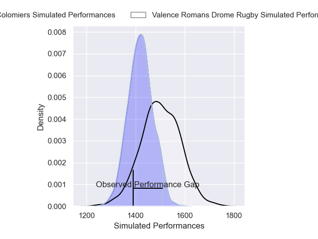
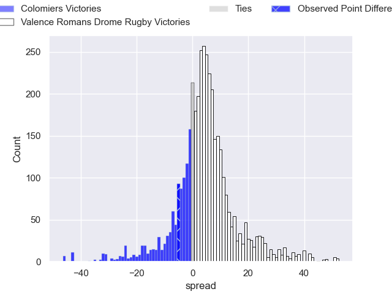
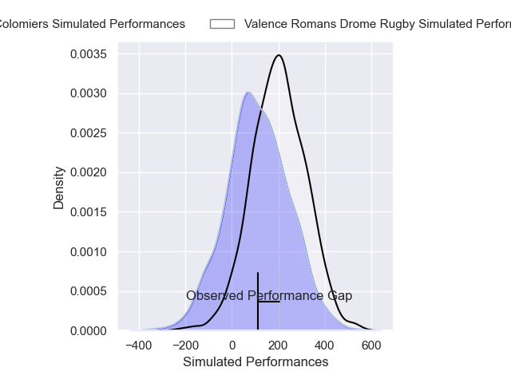
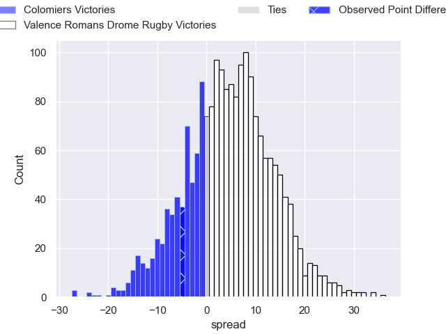
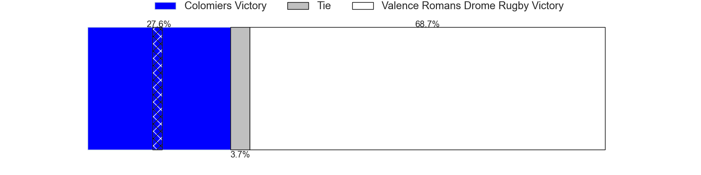

---  
layout: page  
title: Colomiers at Valence Romans Drome Rugby; 29-24  
date: 2025-01-10 18:00:00 -0500  
categories: "Pro D2 2024" match review  
---
# Colomiers at Valence Romans Drome Rugby; 29-24

# Club Level Predictions

The first set of predictions treats a club as the smallest object, as the club develops its members, organizes a gameplan, and deploys its players as needed for each match. This club model has a prediction of 0.618, which translates to predicting Valence Romans Drome Rugby to win by 4.2.

Our Over/Under is 50.5 - and combined with the spread above, we have a predicted scoreline of 23 to 28

Each club has a rating and a rating deviation (similar to a Glicko rating), and expected performances can be generated. This allows for simulated matches and spreads like the ones below.
## Projected Performances - Club Model

## Projected Spreads - Club Model

## Projected Results - Club Model

# Player Level Predictions

Treating teams instead as an entity made up of the currently active players, I have ratings for each player in an altogether different system. These can be combined to form team ratings once teamsheets are announced, weighting starters a bit higher than the reserves. After the match is played, players can be weighted by their minutes on the field, allowing for an accurate measure of the team's composition. With these compiled team ratings, we can make predictions, measure inaccuracy, and update the individual player ratings.
## Prediction without Player Minutes: Valence Romans Drome Rugby by 5.3

Valence Romans Drome Rugby by 1.7 on a neutral pitch

## Projected Performances - Player Model

## Projected Spreads - Player Model

## Projected Results - Player Model

|   Away Minutes | Away Player               |   Away Percentile |   Number |   Home Percentile | Home Player         |   Home Minutes |
|---------------:|:--------------------------|------------------:|---------:|------------------:|:--------------------|---------------:|
|             80 | Elias El Ansari           |             48.47 |        1 |             69.93 | Andrea Pontanier    |             15 |
|             65 | Thomas Larrieu            |             42.6  |        2 |              0.53 | Cyril Deligny       |             80 |
|             65 | Marco Fepulea'i           |             81.6  |        3 |             22.49 | Gareth Milasinovich |             22 |
|             80 | Jean Thomas               |             56.19 |        4 |             24.24 | Ryan McCauley       |             80 |
|             80 | Maxime Granouillet        |             53.85 |        5 |             37.22 | Florian Goumat      |             80 |
|             53 | Anthony Coletta           |             39.3  |        6 |             13    | Axel Bruchet        |             80 |
|             80 | Aldric Lescure            |             81.4  |        7 |             26.9  | Adrien Roux         |             59 |
|             51 | Jeremy Bechu              |             25.97 |        8 |             65.37 | Mathieu Vachon      |             76 |
|             19 | Mathis Galthié            |             55.99 |        9 |             70.66 | Thomas Lhusero      |             59 |
|             80 | Joaquin de la Vega Mendia |             47.79 |       10 |             23.23 | Lucas Meret         |             15 |
|             80 | Martin Alonso Munoz       |              9.38 |       11 |             80.16 | Mosese Mawalu       |             80 |
|             22 | Baptiste Serrano          |             23.54 |       12 |             82.75 | Louis Marrou        |             22 |
|             22 | Rodrigo Marta             |             95.44 |       13 |             73.54 | Anatole Pauvert     |             59 |
|             15 | Vincent Pinto             |             74.43 |       14 |             93.29 | Adam Vargas         |             80 |
|             22 | Ugo Pacome                |             52.88 |       15 |             77.43 | Joris De Moura      |             58 |
|             22 | Robin Bellemand           |            nan    |       16 |             10.91 | Mattéo Rodor        |             29 |
|             22 | Pablo Dimcheff            |            nan    |       17 |             89.95 | Kevin Goze          |             57 |
|             23 | Michael Simutoga          |             75.98 |       18 |              8.46 | Mathieu Guillomot   |             19 |
|             67 | Alexis Caumel             |             80    |       19 |            nan    | Esteban Chouteau    |             57 |
|             80 | Louis Descoux             |            nan    |       20 |             59    | Dorian Marco Pena   |             21 |
|             69 | Arthur Diaz               |            nan    |       21 |             66.5  | Thembelani Bholi    |             19 |
|             80 | Gregoire Bazin            |             54.6  |       22 |             48.99 | Nathan Huguen       |             15 |
|             80 | Martin Dulon              |              8.35 |       23 |              6.4  | Ilia Spanderashvili |             80 |

