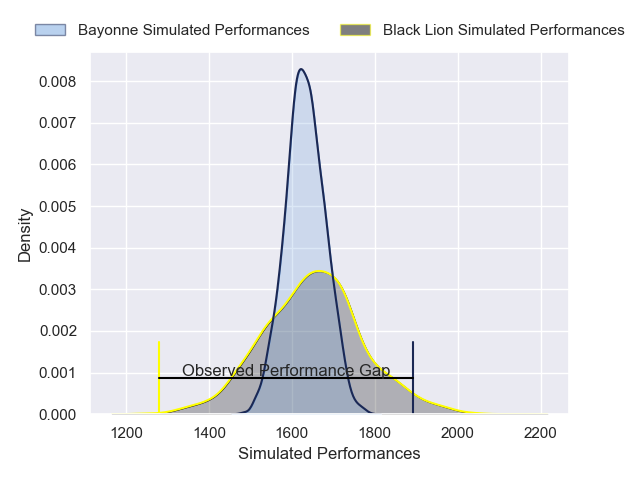
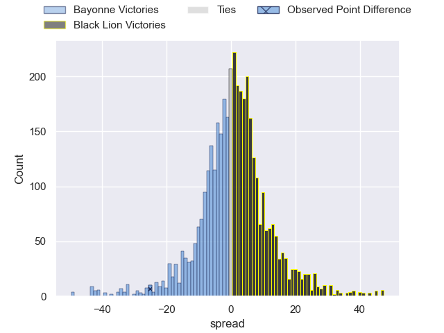
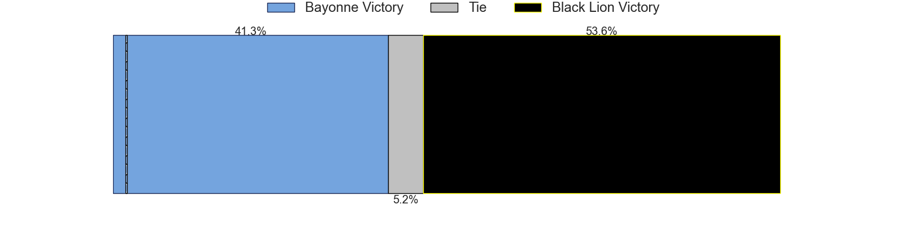
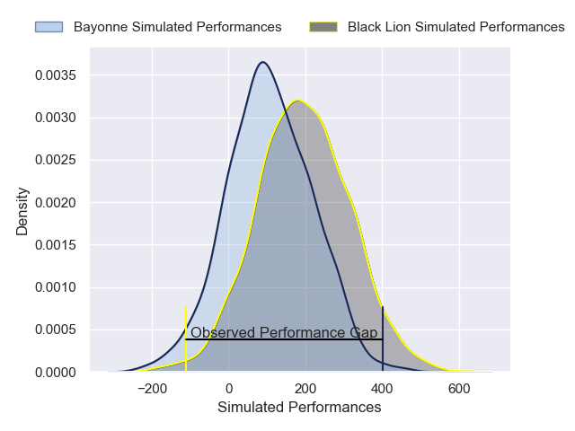
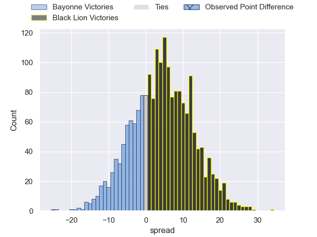

---  
layout: page  
title: Bayonne at Black Lion; 41-16  
date: 2025-01-11 18:00:00 -0500  
categories: "European Rugby Challenge Cup 2024" match review  
---
# Bayonne at Black Lion; 41-16

# Club Level Predictions

The first set of predictions treats a club as the smallest object, as the club develops its members, organizes a gameplan, and deploys its players as needed for each match. This club model has a prediction of 0.529, which translates to predicting Black Lion to win by 1.0.

Our Over/Under is 50.5 - and combined with the spread above, we have a predicted scoreline of 25 to 26

Each club has a rating and a rating deviation (similar to a Glicko rating), and expected performances can be generated. This allows for simulated matches and spreads like the ones below.
## Projected Performances - Club Model

## Projected Spreads - Club Model

## Projected Results - Club Model

# Player Level Predictions

Treating teams instead as an entity made up of the currently active players, I have ratings for each player in an altogether different system. These can be combined to form team ratings once teamsheets are announced, weighting starters a bit higher than the reserves. After the match is played, players can be weighted by their minutes on the field, allowing for an accurate measure of the team's composition. With these compiled team ratings, we can make predictions, measure inaccuracy, and update the individual player ratings.
## Prediction without Player Minutes: Black Lion by 1.4

Bayonne by 1.1 on a neutral pitch

## Projected Performances - Player Model

## Projected Spreads - Player Model

## Projected Results - Player Model

|   Away Minutes | Away Player            |   Away Percentile |   Number |   Home Percentile | Home Player             |   Home Minutes |
|---------------:|:-----------------------|------------------:|---------:|------------------:|:------------------------|---------------:|
|             48 | Martin Villar          |             65.1  |        1 |             31.71 | Dato Abdushelishvili    |             32 |
|             55 | Torsten van Jaarsveld  |             95.68 |        2 |             60.25 | Shalva Mamukashvili     |             65 |
|             48 | Pieter Scholtz         |              5.3  |        3 |             10.77 | Giorgi Chkhartishvili   |             25 |
|             67 | Denis Marchois         |             97.79 |        4 |             69.92 | Mikheil Babunashvili    |             80 |
|             56 | Veikoso Poloniati      |             43.86 |        5 |             37.53 | Guga Ganiashvili        |             26 |
|             17 | Rodrigo Bruni          |             99.49 |        6 |             70.13 | Sandro Mamamtavrishvili |             80 |
|             25 | Baptiste Heguy         |             85.58 |        7 |              0.1  | Mikheil Gachechiladze   |             67 |
|             13 | Manex Ariceta          |             15.5  |        8 |             36.31 | Luka Ivanishvili        |             80 |
|             80 | Baptiste Germain       |             49.28 |        9 |             84.24 | Tengiz Peranidze        |             19 |
|             68 | Tom Spring             |             21.19 |       10 |             69.32 | Luka Matkava            |             54 |
|             44 | Nadir Megdoud          |             71.06 |       11 |             15.36 | Amiran Shvangiradze     |             80 |
|             48 | Guillaume Martocq      |             29.99 |       12 |             32.08 | Tornike Kakhoidze       |             26 |
|             19 | Arnaud Erbinartegaray  |             30.32 |       13 |             68.8  | Demur Tapladze          |             80 |
|              2 | Victor Hannoun         |             58.37 |       14 |             87.22 | Aka Tabutsadze          |             26 |
|             15 | Xan Mousques           |             77.36 |       15 |             29.67 | Luka Tsirekidze         |             80 |
|             55 | Lucas Martin           |             94.24 |       16 |             33.81 | Irakli Kvatadze         |              7 |
|             80 | Noa Traversier         |            nan    |       17 |            nan    | Bachuki Tchumbadze      |             80 |
|             80 | Lucas Paulos           |              7.34 |       18 |            nan    | Nikoloz Khatiashvili    |             25 |
|             55 | Baptiste Tilloles      |            nan    |       19 |             19.42 | Lado Chachanidze        |             80 |
|             65 | Gabriel Lapegue Lafaye |            nan    |       20 |            nan    | Giorgi Sinauridze       |             54 |
|             80 | Cheikh Tiberghien      |              4.84 |       21 |            nan    | Davit Khuroshvili       |             48 |
|            nan | nan                    |            nan    |       22 |             92.96 | Sandro Todua            |             48 |
|            nan | nan                    |            nan    |       23 |            nan    | Ioane Metreveli         |             54 |

