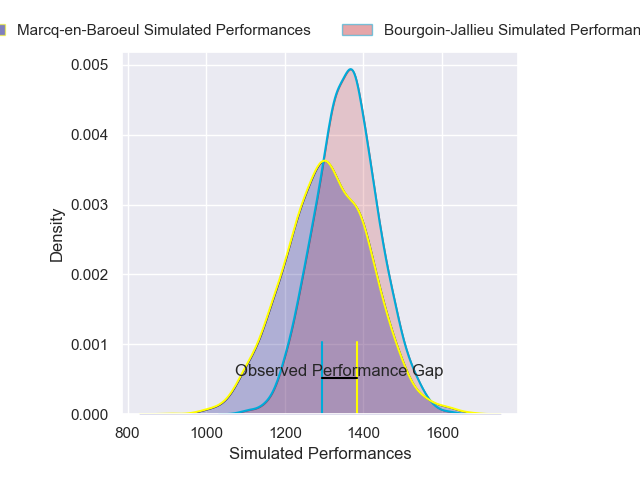
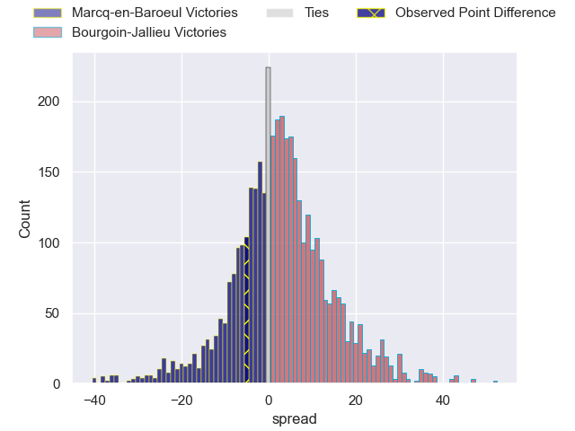
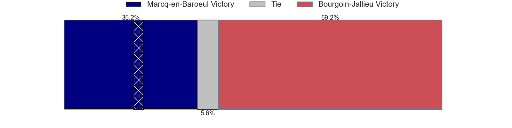
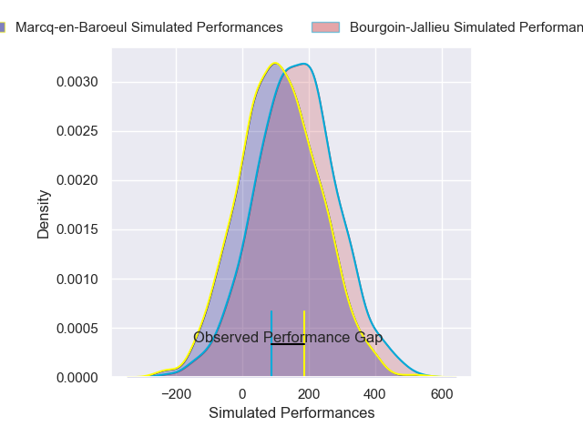
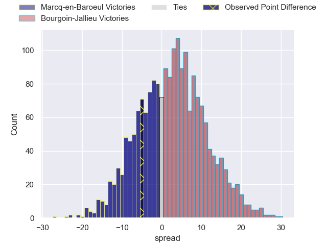
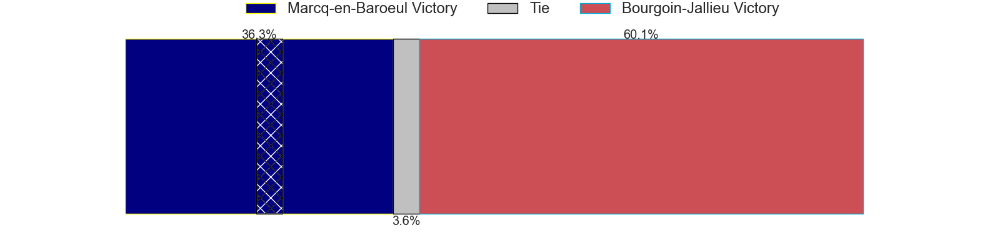

---  
layout: page  
title: Marcq-en-Baroeul at Bourgoin-Jallieu; 23-18  
date: 2025-01-11 18:00:00 -0500  
categories: "Nationale 2024" match review  
---
# Marcq-en-Baroeul at Bourgoin-Jallieu; 23-18

# Club Level Predictions

The first set of predictions treats a club as the smallest object, as the club develops its members, organizes a gameplan, and deploys its players as needed for each match. This club model has a prediction of 0.568, which translates to predicting Bourgoin-Jallieu to win by 2.5.

Our Over/Under is 32.5 - and combined with the spread above, we have a predicted scoreline of 15 to 18

Each club has a rating and a rating deviation (similar to a Glicko rating), and expected performances can be generated. This allows for simulated matches and spreads like the ones below.
## Projected Performances - Club Model

## Projected Spreads - Club Model

## Projected Results - Club Model

# Player Level Predictions

Treating teams instead as an entity made up of the currently active players, I have ratings for each player in an altogether different system. These can be combined to form team ratings once teamsheets are announced, weighting starters a bit higher than the reserves. After the match is played, players can be weighted by their minutes on the field, allowing for an accurate measure of the team's composition. With these compiled team ratings, we can make predictions, measure inaccuracy, and update the individual player ratings.
## Prediction without Player Minutes: Bourgoin-Jallieu by 3.3

Marcq-en-Baroeul by 9.6 on a neutral pitch

## Projected Performances - Player Model

## Projected Spreads - Player Model

## Projected Results - Player Model

|   Away Minutes | Away Player              |   Away Percentile |   Number |   Home Percentile | Home Player       |   Home Minutes |
|---------------:|:-------------------------|------------------:|---------:|------------------:|:------------------|---------------:|
|             58 | Eli Serra-Miglietti      |             61.63 |        1 |             19.52 | Romain Favaretto  |             10 |
|             75 | Santiago Iglesias Valdez |             55.2  |        2 |             26.34 | Julien Ratajczak  |             52 |
|             28 | Victor-Fy Balas Burel    |             36.33 |        3 |             73.94 | Dimitri Tchapnga  |             64 |
|             29 | Antoine Delaporte        |             61.3  |        4 |              1.32 | Léandre Cotte     |             80 |
|             28 | Lucio Anconetani         |             38.7  |        5 |              1.83 | Morgan Eames      |             51 |
|             64 | Joachim Beaumont         |             57.2  |        6 |             21.4  | Theophile Cotte   |             19 |
|             70 | Arthur Bruges            |             61.16 |        7 |             10.24 | Sam Daly          |             80 |
|             80 | Maxime Danton            |             67.98 |        8 |              3.33 | Poutasi Luafutu   |             80 |
|             80 | Geoffrey Cazanave        |             65.83 |        9 |             80.4  | Jeremy Gondrand   |             10 |
|              5 | Paul Decavel             |             51.53 |       10 |             15.94 | Tom Danovaro      |             22 |
|             57 | Hugues Crespo            |             54.51 |       11 |             13.43 | Paul-Hugo Champ   |             80 |
|             52 | Louis Decavel            |             64    |       12 |              2.89 | Aviata Silago     |             80 |
|             80 | Hugo Detre               |             10.78 |       13 |              0.67 | Christopher Bosch |             51 |
|             15 | Dany Antunes             |              7.35 |       14 |             23.43 | Pierre Mignot     |             80 |
|             34 | Patrick Fleming Dewhirst |             54.15 |       15 |              4.59 | Remi Bouet        |             80 |
|              9 | Cedric Yonkeu            |             44.83 |       16 |             20.68 | Martin Doan       |             40 |
|              5 | Joseph Reynaud           |             41.58 |       17 |             44.23 | Adrien Mallet     |              7 |
|             61 | Lewys Jones              |             56.62 |       18 |             20.28 | Kevin Chaudouard  |             80 |
|             80 | Thomas Simonet           |             52.13 |       19 |             15.72 | Nicolas Cachet    |             29 |
|             80 | Jean-Baptiste Rende      |             55.7  |       20 |             70.07 | Maxime Castant    |             29 |
|             80 | Dylan Nocete             |             57.19 |       21 |             15.2  | Maxime Calliet    |             15 |
|             64 | Mathias Ortiz            |             55.88 |       22 |             47.36 | Kamil Bouregba    |             80 |
|             16 | Bruno Vliegen            |             26.15 |       23 |             17.85 | Matteo Broeders   |             80 |

