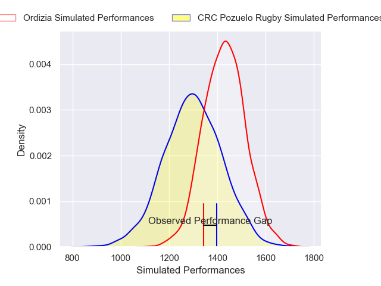
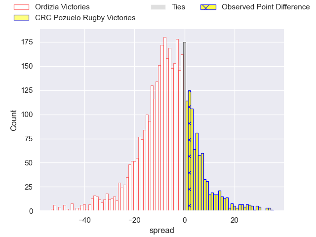
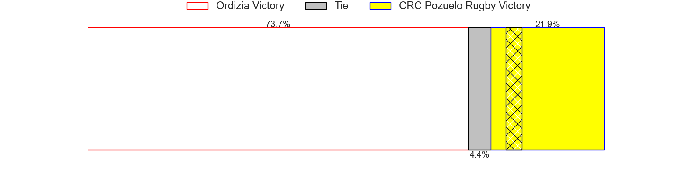
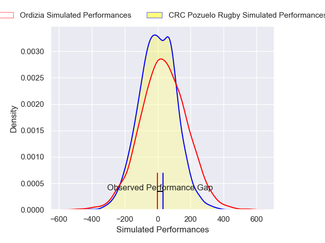
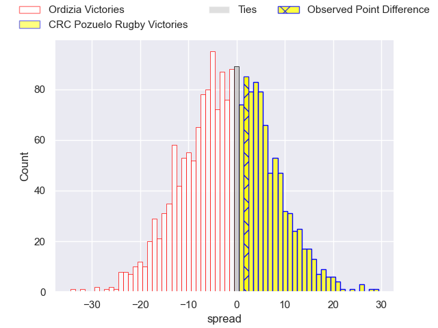
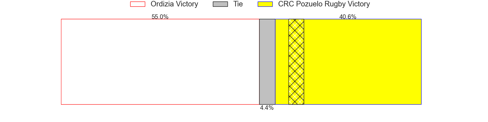

---  
layout: page  
title: Ordizia at CRC Pozuelo Rugby; 36-38  
date: 2025-01-11 18:00:00 -0500  
categories: "Division de Honor de Rugby 2024" match review  
---
# Ordizia at CRC Pozuelo Rugby; 36-38

# Club Level Predictions

The first set of predictions treats a club as the smallest object, as the club develops its members, organizes a gameplan, and deploys its players as needed for each match. This club model has a prediction of 0.325, which translates to predicting Ordizia to win by 6.6.

Our Over/Under is 47.5 - and combined with the spread above, we have a predicted scoreline of 27 to 20

Each club has a rating and a rating deviation (similar to a Glicko rating), and expected performances can be generated. This allows for simulated matches and spreads like the ones below.
## Projected Performances - Club Model

## Projected Spreads - Club Model

## Projected Results - Club Model

# Player Level Predictions

Treating teams instead as an entity made up of the currently active players, I have ratings for each player in an altogether different system. These can be combined to form team ratings once teamsheets are announced, weighting starters a bit higher than the reserves. After the match is played, players can be weighted by their minutes on the field, allowing for an accurate measure of the team's composition. With these compiled team ratings, we can make predictions, measure inaccuracy, and update the individual player ratings.
## Prediction without Player Minutes: Ordizia by 2.0

Ordizia by 4.4 on a neutral pitch

## Projected Performances - Player Model

## Projected Spreads - Player Model

## Projected Results - Player Model

|   Away Minutes | Away Player              |   Away Percentile |   Number |   Home Percentile | Home Player                      |   Home Minutes |
|---------------:|:-------------------------|------------------:|---------:|------------------:|:---------------------------------|---------------:|
|             34 | Tulio Sosa               |             17.46 |        1 |              4    | Cristian Moreno                  |             80 |
|             28 | Tomas Pais               |             23.17 |        2 |             21.57 | Marcelo Marina                   |             75 |
|             28 | Bryan Daniel Gonzalez    |             11.93 |        3 |             72.06 | Liviu Florentin Fertu            |             20 |
|             65 | Antxon Iriondo           |              9.63 |        4 |              9.74 | Tomeu Fluxa                      |              5 |
|             80 | Manuel Mora Ruiz         |              3.25 |        5 |             15.42 | Freyder Julian Velandia Fontalvo |             15 |
|             80 | Griff Evans              |             22    |        6 |              9.1  | David Gallego Gonzalez           |              5 |
|             80 | Aitor Olasagasti         |             83    |        7 |             51.4  | Tomas Moraza                     |             80 |
|             80 | Mikel Perez              |              3.25 |        8 |             15.8  | Borja Ibanez                     |             17 |
|             68 | Alain Arana              |             63.33 |        9 |              7.69 | Miguel Ibanez                    |             46 |
|             60 | Mateo Arruti             |             30.31 |       10 |             13.94 | Hugo Douglas Ventosa             |              5 |
|             68 | Julen Goia Iriberri      |             75.42 |       11 |             27.34 | Jorge Elvira                     |              5 |
|             80 | Jesse Lowe               |             35.57 |       12 |             10.52 | Jorge Ochoa                      |             80 |
|             80 | Erlantz Garmendia        |             16.7  |       13 |             27.33 | Luis Montoro                     |             80 |
|             59 | Liher Sarriegi Zubeldia  |             37.41 |       14 |             18.26 | Javier Arraiza Arribas           |             20 |
|             67 | Lander Mujika            |             21.46 |       15 |             17.48 | Jorge Garreta                    |             46 |
|             80 | Ibon Zeberio             |             25.31 |       16 |              6.71 | Adrian Sotomayor                 |             52 |
|             21 | Aitor Lasa               |            nan    |       17 |            nan    | Josu Altuna                      |             80 |
|             59 | Gorka Elosua             |            nan    |       18 |             20.68 | Rodrigo Del Campo                |             80 |
|             59 | Bernie Muaiava Taulealo  |             22.94 |       19 |             28.52 | Inigo Mazariegos                 |             80 |
|             59 | Matias Jabase            |             30.09 |       20 |             12.78 | Pedro Gonzalez                   |             60 |
|             75 | Miqueas Nahun Abel Nunez |            nan    |       21 |            nan    | Aratz De Goicochea               |             15 |
|             10 | Xiker Larrea             |            nan    |       22 |            nan    | Alvaro Perez Conejero            |             80 |

