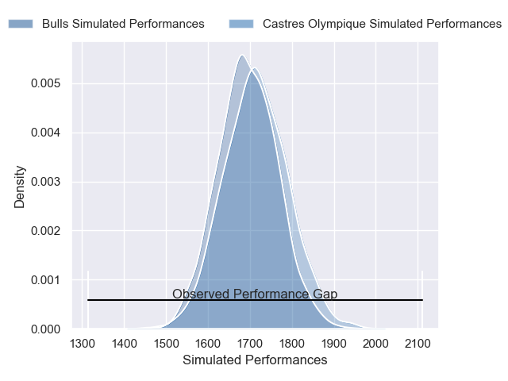
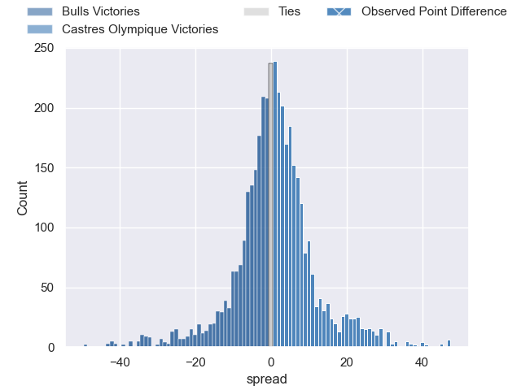
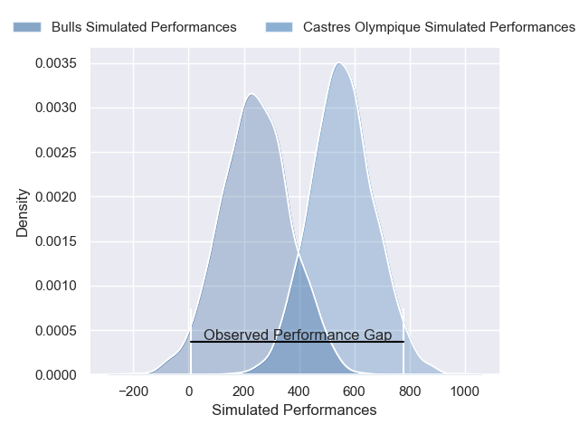
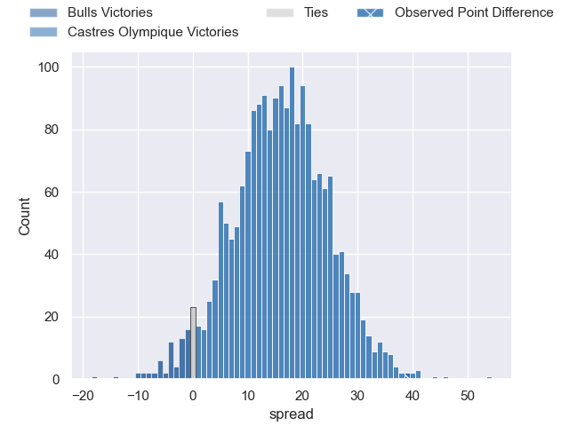

---  
layout: page  
title: Bulls at Castres Olympique; 10-49  
date: 2025-01-11 18:00:00 -0500  
categories: "European Rugby Champions Cup 2024" match review  
---
# Bulls at Castres Olympique; 10-49

# Club Level Predictions

The first set of predictions treats a club as the smallest object, as the club develops its members, organizes a gameplan, and deploys its players as needed for each match. This club model has a prediction of 0.526, which translates to predicting Castres Olympique to win by 0.9.

Our Over/Under is 41.5 - and combined with the spread above, we have a predicted scoreline of 20 to 21

Each club has a rating and a rating deviation (similar to a Glicko rating), and expected performances can be generated. This allows for simulated matches and spreads like the ones below.
## Projected Performances - Club Model

## Projected Spreads - Club Model

## Projected Results - Club Model

# Player Level Predictions

Treating teams instead as an entity made up of the currently active players, I have ratings for each player in an altogether different system. These can be combined to form team ratings once teamsheets are announced, weighting starters a bit higher than the reserves. After the match is played, players can be weighted by their minutes on the field, allowing for an accurate measure of the team's composition. With these compiled team ratings, we can make predictions, measure inaccuracy, and update the individual player ratings.
## Prediction without Player Minutes: Castres Olympique by 17.4

Castres Olympique by 3.2 on a neutral pitch

## Projected Performances - Player Model

## Projected Spreads - Player Model

## Projected Results - Player Model

|   Away Minutes | Away Player             |   Away Percentile |   Number |   Home Percentile | Home Player           |   Home Minutes |
|---------------:|:------------------------|------------------:|---------:|------------------:|:----------------------|---------------:|
|             48 | Alulutho Tshakweni      |             79.05 |        1 |             80.24 | Antoine Tichit        |             14 |
|             40 | Jan-Hendrik Wessels     |             34.4  |        2 |             90.55 | Gaetan Barlot         |             80 |
|             32 | Mornay Smith            |             80.49 |        3 |             82.37 | Levan Chilachava      |             62 |
|             21 | JF van Heerden          |             32.86 |        4 |             14.4  | Guillaume Ducat       |             64 |
|             59 | Sintu Manjezi           |             89.96 |        5 |             87.02 | Florent Vanverberghe  |             47 |
|             16 | Nama Xaba               |              5.2  |        6 |             21.5  | Mathieu Babillot      |             10 |
|             80 | Celimpilo Gumede        |             75.5  |        7 |             77.5  | Tyler Ardron          |             21 |
|             30 | Nizaam Carr             |             96.54 |        8 |             34.42 | Abraham Papali'i      |             48 |
|             32 | Bernard van der Linde   |             66.19 |        9 |             74.24 | Jeremy Fernandez      |             70 |
|             23 | Boeta Chamberlain       |             73.89 |       10 |             53.54 | Pierre Popelin        |             80 |
|             80 | Aphiwe Dyantyi          |             13.03 |       11 |             89.04 | Remy Baget            |             48 |
|              8 | Chris Smit              |             85.36 |       12 |             97.18 | Jack Goodhue          |             64 |
|             80 | Katlego Letebele        |             36.77 |       13 |             72.45 | Vilimoni Botitu       |             50 |
|             63 | Sibongile Vukile Novuka |             63.87 |       14 |             97.93 | Geoffrey Palis        |             80 |
|             23 | Henry Immelman          |             82.08 |       15 |             69.47 | Julien Dumora         |             80 |
|             80 | Dylan Smith             |             93.44 |       16 |             62.27 | Lois Guerois-Galisson |             80 |
|             80 | Joe van Zyl             |             83.78 |       17 |             49.55 | Pierre Colonna        |             66 |
|             80 | Sebastian Lombard       |            nan    |       18 |              8.94 | Nicolas Corato        |             48 |
|             77 | Deon Slabbert           |             86.8  |       19 |             97.36 | Leone Nakarawa        |             32 |
|             67 | Corne Beets             |             61.6  |       20 |             60.82 | Santiago Arata        |             11 |
|             72 | Keagan Johannes         |             29.2  |       21 |             54.9  | Simon Meka            |             21 |
|             17 | Jaco van der Walt       |             89.82 |       22 |              6.72 | Adrien Seguret        |             47 |
|             52 | Cornel Smit             |            nan    |       23 |             48.01 | Theo Chabouni         |             62 |

