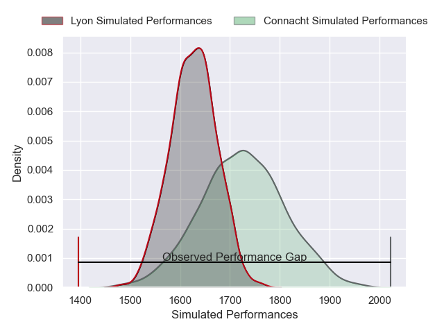
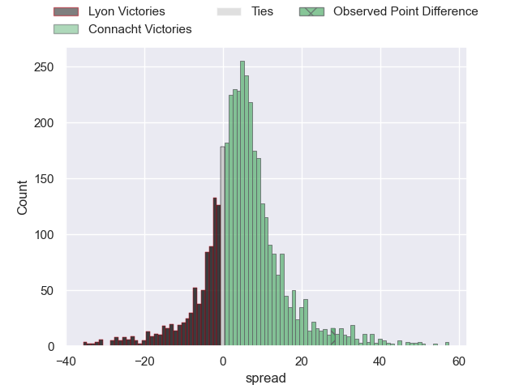
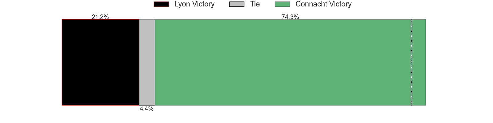
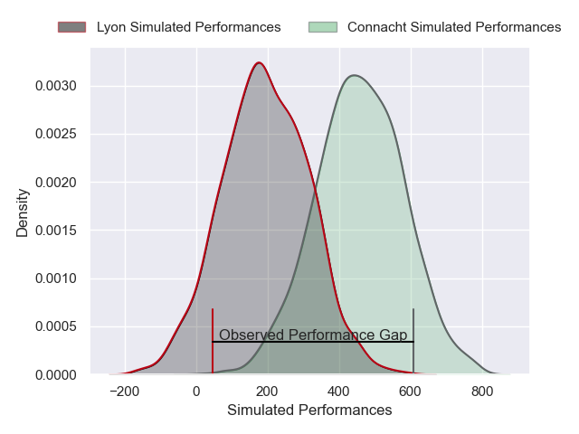
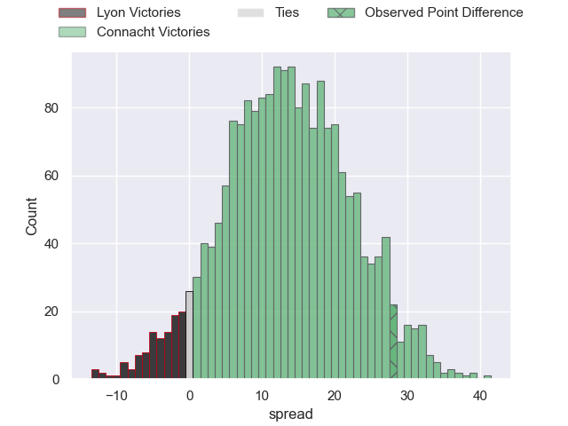
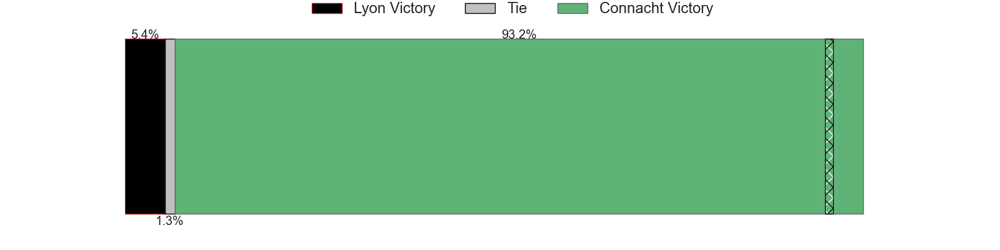

---  
layout: page  
title: Lyon at Connacht; 24-52  
date: 2025-01-11 18:00:00 -0500  
categories: "European Rugby Challenge Cup 2024" match review  
---
# Lyon at Connacht; 24-52

# Club Level Predictions

The first set of predictions treats a club as the smallest object, as the club develops its members, organizes a gameplan, and deploys its players as needed for each match. This club model has a prediction of 0.639, which translates to predicting Connacht to win by 5.0.

Our Over/Under is 52.5 - and combined with the spread above, we have a predicted scoreline of 24 to 29

Each club has a rating and a rating deviation (similar to a Glicko rating), and expected performances can be generated. This allows for simulated matches and spreads like the ones below.
## Projected Performances - Club Model

## Projected Spreads - Club Model

## Projected Results - Club Model

# Player Level Predictions

Treating teams instead as an entity made up of the currently active players, I have ratings for each player in an altogether different system. These can be combined to form team ratings once teamsheets are announced, weighting starters a bit higher than the reserves. After the match is played, players can be weighted by their minutes on the field, allowing for an accurate measure of the team's composition. With these compiled team ratings, we can make predictions, measure inaccuracy, and update the individual player ratings.
## Prediction without Player Minutes: Connacht by 14.6

Connacht by 6.2 on a neutral pitch

## Projected Performances - Player Model

## Projected Spreads - Player Model

## Projected Results - Player Model

|   Away Minutes | Away Player           |   Away Percentile |   Number |   Home Percentile | Home Player           |   Home Minutes |
|---------------:|:----------------------|------------------:|---------:|------------------:|:----------------------|---------------:|
|             59 | Hamza Kaabeche        |             10.02 |        1 |             96.6  | Peter Dooley          |             70 |
|             80 | Sam Matavesi          |             80.29 |        2 |             37.99 | Dave Heffernan        |             80 |
|             80 | Irakli Aptsiauri      |             58.83 |        3 |             93.8  | Finlay Bealham        |             19 |
|             80 | Felix Lambey          |             53.56 |        4 |             77.7  | Oisin Dowling         |             21 |
|             80 | Tomas Lavanini        |             93.79 |        5 |             95.32 | Joe Joyce             |             80 |
|             48 | Steeve Blanc-Mappaz   |             14.91 |        6 |             40.57 | Cian Prendergast      |             80 |
|             80 | Marvin Okuya          |             49.59 |        7 |             51.22 | Shamus Hurley-Langton |             80 |
|             61 | Maxime Gouzou         |              9.98 |        8 |              8.11 | Sean Jansen           |             10 |
|             80 | Martin Page-Relo      |             66.01 |        9 |             85.61 | Ben Murphy            |             47 |
|             21 | Fletcher Smith        |             25.11 |       10 |             80.35 | Josh Ioane            |             59 |
|             55 | Vincent Rattez        |             80.78 |       11 |             68.14 | Shane Jennings        |             40 |
|             25 | Thibault Regard       |             94    |       12 |             99.33 | Bundee Aki            |             80 |
|             49 | Josiah Maraku         |              2.33 |       13 |             54.11 | Piers O'Conor         |             28 |
|             18 | Semi Radradra         |             99.22 |       14 |             56.96 | Chay Mullins          |             47 |
|             31 | Alexandre Tchaptchet  |             63.97 |       15 |             98.69 | Santiago Cordero      |             18 |
|             40 | Jermaine Ainsley      |             13.84 |       16 |             41.09 | Jordan Duggan         |             59 |
|             26 | Guillaume Marchand    |             29.03 |       17 |            nan    | Dylan Tierney-Martin  |             55 |
|             62 | Killian Geraci        |             41.96 |       18 |             22.92 | Jack Aungier          |             80 |
|             21 | Lyan Pakihivatau      |            nan    |       19 |             93.89 | Josh Murphy           |             62 |
|             80 | Pierre-Samuel Pacheco |             75.98 |       20 |             33.68 | Paul Boyle            |             80 |
|             49 | Charlie Cassang       |             79.68 |       21 |             83.09 | Caolin Blade          |             80 |
|             52 | Martin Meliande       |             12.01 |       22 |             67.89 | David Hawkshaw        |             28 |
|             40 | Alfred Parisien       |             71.22 |       23 |              8.56 | Cathal Forde          |             58 |

