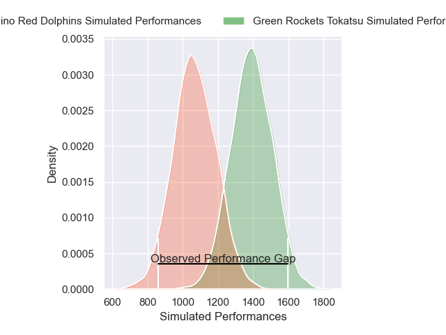
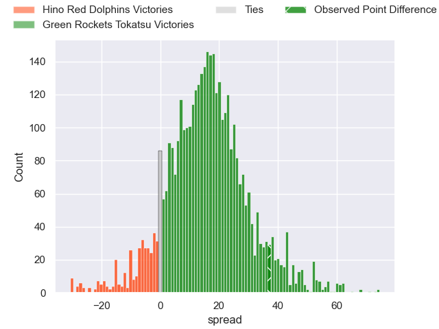
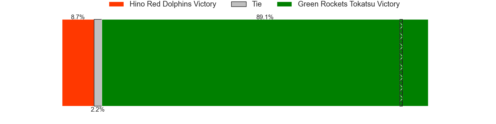
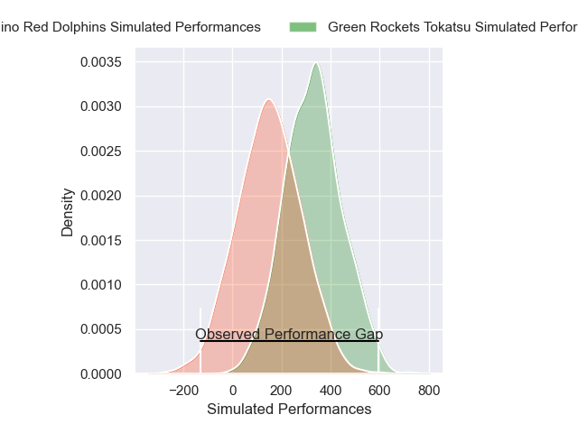
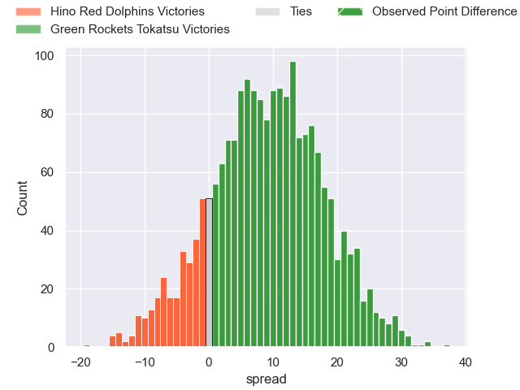
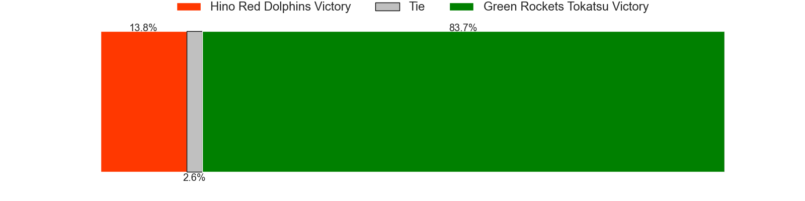

---  
layout: page  
title: Hino Red Dolphins at Green Rockets Tokatsu; 19-56  
date: 2025-01-11 18:00:00 -0500  
categories: "Japan Rugby League One D2 2024" match review  
---
# Hino Red Dolphins at Green Rockets Tokatsu; 19-56

# Club Level Predictions

The first set of predictions treats a club as the smallest object, as the club develops its members, organizes a gameplan, and deploys its players as needed for each match. This club model has a prediction of 0.848, which translates to predicting Green Rockets Tokatsu to win by 16.0.

Our Over/Under is 40.5 - and combined with the spread above, we have a predicted scoreline of 12 to 28

Each club has a rating and a rating deviation (similar to a Glicko rating), and expected performances can be generated. This allows for simulated matches and spreads like the ones below.
## Projected Performances - Club Model

## Projected Spreads - Club Model

## Projected Results - Club Model

# Player Level Predictions

Treating teams instead as an entity made up of the currently active players, I have ratings for each player in an altogether different system. These can be combined to form team ratings once teamsheets are announced, weighting starters a bit higher than the reserves. After the match is played, players can be weighted by their minutes on the field, allowing for an accurate measure of the team's composition. With these compiled team ratings, we can make predictions, measure inaccuracy, and update the individual player ratings.
## Prediction without Player Minutes: Green Rockets Tokatsu by 11.6

Green Rockets Tokatsu by 7.2 on a neutral pitch

## Projected Performances - Player Model

## Projected Spreads - Player Model

## Projected Results - Player Model

|   Away Minutes | Away Player      |   Away Percentile |   Number |   Home Percentile | Home Player           |   Home Minutes |
|---------------:|:-----------------|------------------:|---------:|------------------:|:----------------------|---------------:|
|             19 | Yuto Tokuda      |             50.71 |        1 |             88.48 | Kosei Yamamoto        |             12 |
|             19 | Towa Taniguchi   |             36.51 |        2 |             47.84 | Ren Osawa             |             80 |
|             80 | Motoki Yamazaki  |             76.53 |        3 |             92.94 | Keisuke Kikuta        |             80 |
|             40 | Noah Tovio       |             31.69 |        4 |             81.39 | Daiki Yamagiwa        |             80 |
|             33 | Rory Arnold      |             95.07 |        5 |             97.38 | Pari Pari Parkinson   |              6 |
|             59 | Shun Nakashika   |             31.62 |        6 |             81.98 | Viliami Lutua Ahofono |             58 |
|             62 | Shun Tomonaga    |             54.99 |        7 |             77.24 | Ryoi Kamei            |             59 |
|             74 | Josh Fenner      |              3.82 |        8 |             85.35 | Aseri Masivou         |             68 |
|             69 | Kotaro Hatada    |             32.43 |        9 |             94.38 | Nick Phipps           |             61 |
|             72 | Keita Doi        |             23.84 |       10 |             97.79 | Rhys Patchell         |             61 |
|             80 | Moeki Fukushi    |             39.35 |       11 |              3.27 | Hiroyuki Miyajima     |              6 |
|             80 | Murray Koster    |             30.76 |       12 |              9.04 | Orbyn Leger           |             47 |
|             62 | Taroma Togo      |             53.91 |       13 |              8.05 | Maritino Nemani       |             75 |
|             47 | Ko Kojima        |             58.28 |       14 |             88.21 | Kenta Omata           |             27 |
|             53 | Kyoji Takano     |             15.16 |       15 |             57.58 | Keagan Faria          |              8 |
|             80 | Kazuma Yoshimura |            nan    |       16 |            nan    | Keita Kobayashi       |             80 |
|             70 | Shohei Ijima     |             74.1  |       17 |             80.84 | Mitieli Tuinakauvadra |             80 |
|             21 | Yuki Kagoshima   |             71.56 |       18 |            nan    | Suguru Kubo           |              6 |
|             18 | Kyosuke Horie    |             72.61 |       19 |             83.52 | Kanta Higashionna     |             47 |
|             80 | Yutaro Danno     |            nan    |       20 |            nan    | Ko Yoshimura          |             80 |
|             14 | AJ Wolf          |             39.92 |       21 |             66.85 | Yusuke Maruo          |             40 |
|             10 | Sora Ohchi       |             14.17 |       22 |            nan    | Masaki Obata          |             33 |
|             80 | Kousei Tamaki    |            nan    |       23 |            nan    | Ika Motulalr Takau    |             33 |

