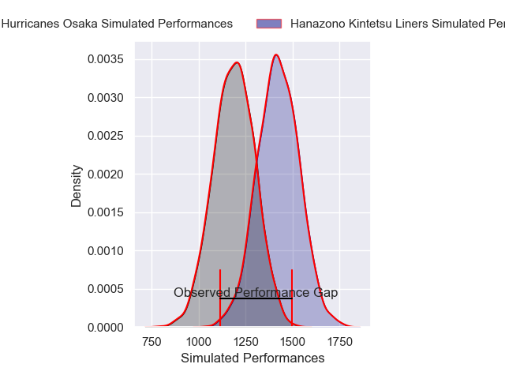
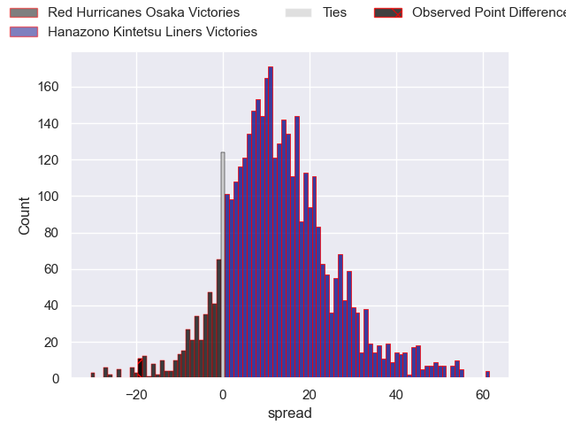
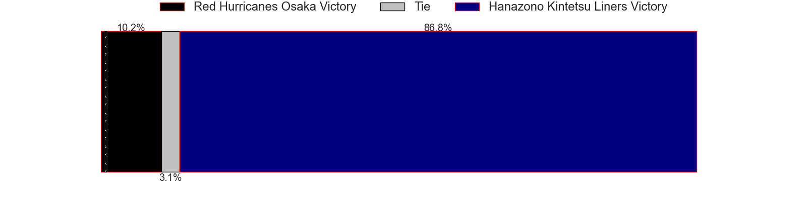
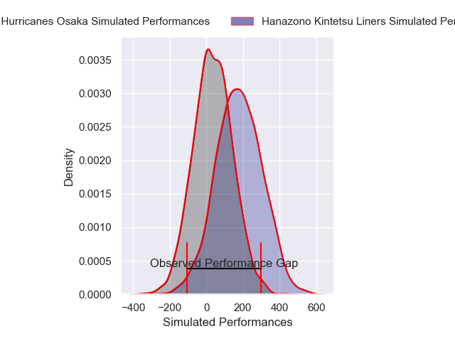
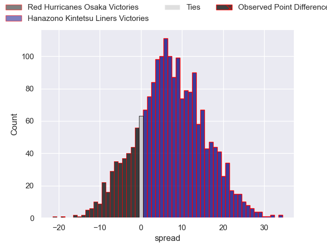
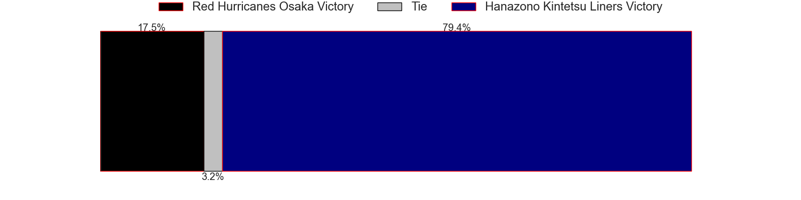

---  
layout: page  
title: Red Hurricanes Osaka at Hanazono Kintetsu Liners; 36-17  
date: 2025-01-11 18:00:00 -0500  
categories: "Japan Rugby League One D2 2024" match review  
---
# Red Hurricanes Osaka at Hanazono Kintetsu Liners; 36-17

# Club Level Predictions

The first set of predictions treats a club as the smallest object, as the club develops its members, organizes a gameplan, and deploys its players as needed for each match. This club model has a prediction of 0.785, which translates to predicting Hanazono Kintetsu Liners to win by 11.9.

Our Over/Under is 51.5 - and combined with the spread above, we have a predicted scoreline of 20 to 32

Each club has a rating and a rating deviation (similar to a Glicko rating), and expected performances can be generated. This allows for simulated matches and spreads like the ones below.
## Projected Performances - Club Model

## Projected Spreads - Club Model

## Projected Results - Club Model

# Player Level Predictions

Treating teams instead as an entity made up of the currently active players, I have ratings for each player in an altogether different system. These can be combined to form team ratings once teamsheets are announced, weighting starters a bit higher than the reserves. After the match is played, players can be weighted by their minutes on the field, allowing for an accurate measure of the team's composition. With these compiled team ratings, we can make predictions, measure inaccuracy, and update the individual player ratings.
## Prediction without Player Minutes: Hanazono Kintetsu Liners by 4.7

Hanazono Kintetsu Liners by 0.1 on a neutral pitch

## Projected Performances - Player Model

## Projected Spreads - Player Model

## Projected Results - Player Model

|   Away Minutes | Away Player          |   Away Percentile |   Number |   Home Percentile | Home Player      |   Home Minutes |
|---------------:|:---------------------|------------------:|---------:|------------------:|:-----------------|---------------:|
|             75 | Hiromichi Sakamoto   |             17.29 |        1 |              1.45 | Kenta Tanaka     |             80 |
|             40 | Hisamitsu Shimada    |             62.21 |        2 |             24.96 | Reiya Ueyama     |             33 |
|             53 | Munekata Sashida     |             44.12 |        3 |             12.44 | Kota Mitake      |             18 |
|             51 | Michael Allardice    |             14.2  |        4 |             93.71 | Sam Jeffries     |             14 |
|             47 | Elliott Stooke       |             89.55 |        5 |             16.63 | Sanaila Waqa     |             80 |
|             80 | Taro Sato            |             74.5  |        6 |              7    | James Blackwell  |             80 |
|             47 | Blake Gibson         |             83.8  |        7 |              2.7  | Daiki Miyashita  |             15 |
|             80 | Jack O'Sullivan      |             91.77 |        8 |              6.49 | Shohei Nonaka    |             47 |
|             62 | Tatsuya Hamano       |             74.96 |        9 |             86.23 | Will Genia       |              6 |
|             47 | Fumiya Dobashi       |             66.37 |       10 |             96.9  | Quade Cooper     |             80 |
|             62 | Yuki Ishii           |             60.81 |       11 |              3.36 | Tomoya Kimura    |             80 |
|             80 | Mifiposeti Paea      |             15.73 |       12 |              0.87 | Koji Okamura     |             66 |
|             14 | Kaoru Tsuruta        |             13.88 |       13 |             13.12 | Tom Hendrickson  |             80 |
|             40 | Kouki Shigeno        |             21.72 |       14 |             26.16 | Takehito Ekawa   |             62 |
|             18 | Taiki Yamaguchi      |             53.54 |       15 |             20.13 | Hiroki Kumoyama  |             80 |
|             18 | Shota Takai          |            nan    |       16 |            nan    | Simeone Schmidt  |             61 |
|             18 | Toshihiro Yamamouchi |             25.22 |       17 |             98.2  | Akira Ioane      |             40 |
|             10 | Yo Sato              |            nan    |       18 |             27.73 | Keitaro Hitora   |             80 |
|              5 | Yuma Fujino          |            nan    |       19 |              5.53 | Keiichi Kaneko   |             80 |
|              6 | Daisuke Iba          |             22.45 |       20 |            nan    | Shintaro Okamoto |             47 |
|             18 | Hiroki Hanada        |             28.14 |       21 |              9.45 | Yuchol Mun       |             61 |
|             18 | Tatsunari Fujita     |              7.4  |       22 |              2.21 | Will Harrison    |              6 |
|             80 | Taichi Yoshizawa     |              0.88 |       23 |             82.82 | Takahiro Hayashi |             69 |

