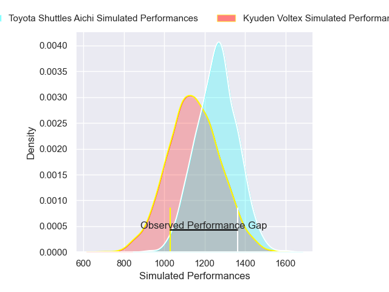
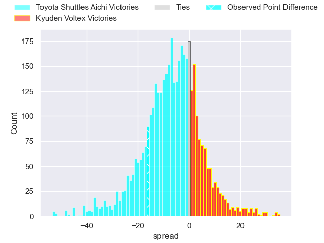
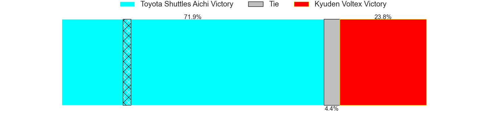
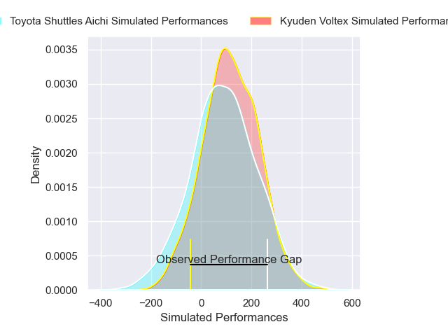
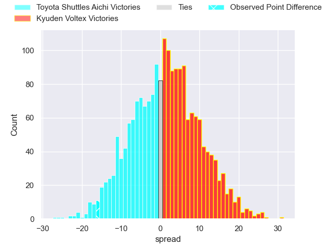
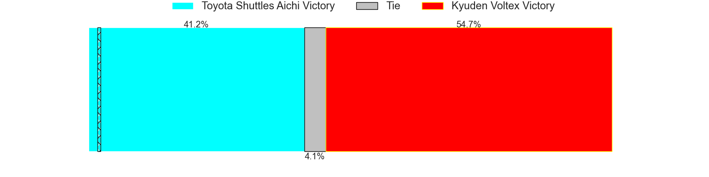

---  
layout: page  
title: Toyota Shuttles Aichi at Kyuden Voltex; 26-10  
date: 2025-01-11 18:00:00 -0500  
categories: "Japan Rugby League One D2 2024" match review  
---
# Toyota Shuttles Aichi at Kyuden Voltex; 26-10

# Club Level Predictions

The first set of predictions treats a club as the smallest object, as the club develops its members, organizes a gameplan, and deploys its players as needed for each match. This club model has a prediction of 0.347, which translates to predicting Toyota Shuttles Aichi to win by 5.8.

Our Over/Under is 47.5 - and combined with the spread above, we have a predicted scoreline of 27 to 21

Each club has a rating and a rating deviation (similar to a Glicko rating), and expected performances can be generated. This allows for simulated matches and spreads like the ones below.
## Projected Performances - Club Model

## Projected Spreads - Club Model

## Projected Results - Club Model

# Player Level Predictions

Treating teams instead as an entity made up of the currently active players, I have ratings for each player in an altogether different system. These can be combined to form team ratings once teamsheets are announced, weighting starters a bit higher than the reserves. After the match is played, players can be weighted by their minutes on the field, allowing for an accurate measure of the team's composition. With these compiled team ratings, we can make predictions, measure inaccuracy, and update the individual player ratings.
## Prediction without Player Minutes: Kyuden Voltex by 2.2

Toyota Shuttles Aichi by 0.9 on a neutral pitch

## Projected Performances - Player Model

## Projected Spreads - Player Model

## Projected Results - Player Model

|   Away Minutes | Away Player          |   Away Percentile |   Number |   Home Percentile | Home Player            |   Home Minutes |
|---------------:|:---------------------|------------------:|---------:|------------------:|:-----------------------|---------------:|
|             62 | Tomoki Yamaguchi     |             51.53 |        1 |             10.22 | Yasuo Saruwatari       |              6 |
|             80 | Akito Fujinami       |             45.1  |        2 |              1.07 | Kyungmun Wang          |             80 |
|             80 | Ryota Fukamura       |             46.08 |        3 |             26.49 | Kosuke Oike            |             11 |
|             52 | Taishi Nakamura      |             63.49 |        4 |             84.48 | Aaron Carroll          |             80 |
|             37 | James Gaskell        |             30.02 |        5 |             12.47 | Ray Tatafu             |             18 |
|             43 | Tama Kapene          |             73.6  |        6 |             47.5  | Masahiro Eriguchi      |             21 |
|             80 | Chang Chao Yi        |             67.9  |        7 |             39.4  | Keisuke Yamzoe         |             21 |
|             69 | Taleni Seu           |             89.18 |        8 |             35.5  | Alex Takuya Walker     |             21 |
|             34 | Atsushi Yumoto       |             32.02 |        9 |             49.02 | Spencer Jeans          |             59 |
|             28 | Freddie Burns        |             93.81 |       10 |             34.51 | Kohei Kire             |             30 |
|             80 | Go Nakano            |             19.55 |       11 |             15    | Ren Hagiwara           |             33 |
|             29 | Tiaan Thomas-Wheeler |              0.54 |       12 |             17.25 | Hayato Kojo            |             33 |
|             53 | Keita Ichikawa       |             15.29 |       13 |             25.27 | Sione Likuata Teaupa   |             80 |
|             22 | Hiroaki Saito        |              7.6  |       14 |             18.66 | Naoki Takaya           |             46 |
|             27 | Josua Kerevi         |             71.24 |       15 |             15.71 | Charlie Worthington    |             51 |
|             40 | Takuma Oyama         |             59.89 |       16 |              4.8  | Colby Fainga'a         |             28 |
|             80 | Nobuyuki Takahashi   |             69.42 |       17 |             54.65 | Yusuke Aramaki         |             52 |
|             45 | Isi Manu             |              4.7  |       18 |             28.02 | Samuel Nozomu Faialaga |             35 |
|             80 | James Mollentze      |              8.41 |       19 |            nan    | Taro Uesugi            |             80 |
|             58 | Ken Tonobe           |             40.78 |       20 |            nan    | Sam Vaka               |             72 |
|             80 | Keita Fujiwara       |             91.41 |       21 |             41.5  | Shunta Takenouchi      |             80 |
|             52 | Suguru Igarashi      |            nan    |       22 |            nan    | Hayato Yoshida         |             53 |
|             80 | Shoma Makinouchi     |             52.84 |       23 |             24.2  | Yuuki Yamada           |             80 |

