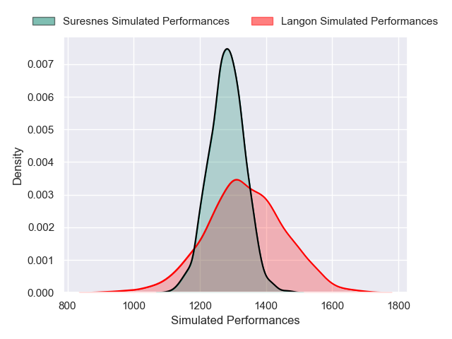
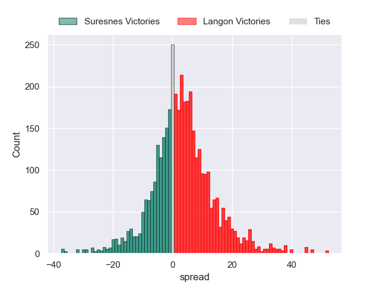
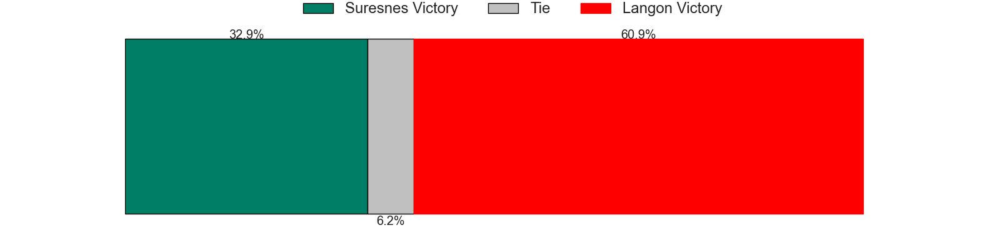
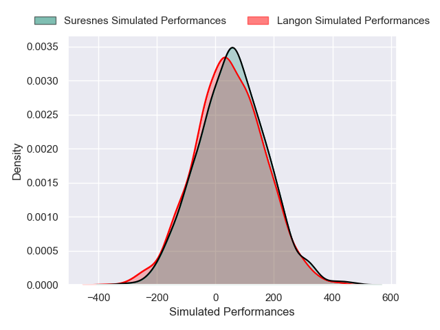
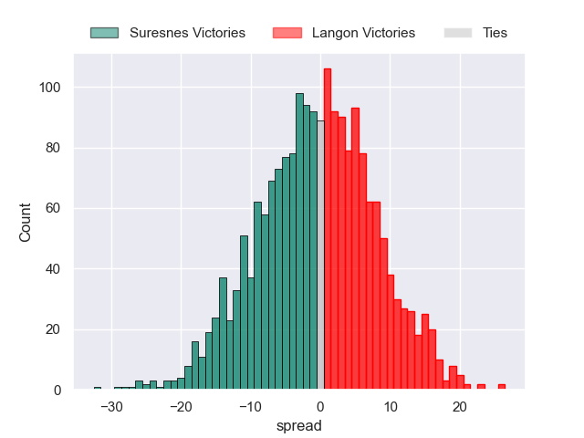

---  
layout: page  
title: Suresnes at Langon; 27-27  
date: 2025-01-11 18:00:00 -0500  
categories: "Nationale 2024" match review  
---
# Suresnes at Langon; 27-27

# Club Level Predictions

The first set of predictions treats a club as the smallest object, as the club develops its members, organizes a gameplan, and deploys its players as needed for each match. This club model has a prediction of 0.578, which translates to predicting Langon to win by 2.8.

Our Over/Under is 35.5 - and combined with the spread above, we have a predicted scoreline of 17 to 19

Each club has a rating and a rating deviation (similar to a Glicko rating), and expected performances can be generated. This allows for simulated matches and spreads like the ones below.
## Projected Performances - Club Model

## Projected Spreads - Club Model

## Projected Results - Club Model

# Player Level Predictions

Treating teams instead as an entity made up of the currently active players, I have ratings for each player in an altogether different system. These can be combined to form team ratings once teamsheets are announced, weighting starters a bit higher than the reserves. After the match is played, players can be weighted by their minutes on the field, allowing for an accurate measure of the team's composition. With these compiled team ratings, we can make predictions, measure inaccuracy, and update the individual player ratings.
## Prediction without Player Minutes: Suresnes by 0.3

Suresnes by 2.6 on a neutral pitch

## Projected Performances - Player Model

## Projected Spreads - Player Model

## Projected Results - Player Model

|   Away Minutes | Away Player             |   Away Percentile |   Number |   Home Percentile | Home Player              |   Home Minutes |
|---------------:|:------------------------|------------------:|---------:|------------------:|:-------------------------|---------------:|
|             67 | Elias Coulibaly         |             78.01 |        1 |             26.83 | Lucas Hernandez          |             80 |
|             80 | Jean-Étienne Lesueur    |             16.85 |        2 |             18.46 | Clement Renaud           |             21 |
|             33 | Guiterembi Vickos       |             26.99 |        3 |             35.99 | Loïc Clave               |             80 |
|             40 | Damien Bozic            |             53.26 |        4 |             82.69 | Kemueli Lavetanakoroi    |             21 |
|             48 | Marvin Woki             |             73.63 |        5 |             15.38 | Isikili Seva Davetawalu  |             26 |
|             80 | Florian Desbordes       |             11.16 |        6 |             45.13 | Thomas Bishop            |             26 |
|             61 | Wian Vosloo             |             63.69 |        7 |             16.23 | Thomas Geffré            |             25 |
|             19 | Lakisipone Lee          |             71.73 |        8 |             20.17 | Thomas Mendy             |             21 |
|             26 | Théo Bachiri            |             16.91 |        9 |             11.87 | Baptiste Tisne Cardeneau |             59 |
|             25 | Jean Chezeau            |             65.28 |       10 |              6.77 | Vincent Debladis         |             68 |
|             19 | Yohan Fournier          |             11.37 |       11 |             17.55 | Christel Bertrand        |             59 |
|             26 | Petero Tuwai            |             70.11 |       12 |             70.67 | Sionasa Vunisa           |             59 |
|             26 | Victor Barnier          |             81.33 |       13 |             62.11 | Guillaume Christophe     |             80 |
|             16 | Alexis Clement          |             10.49 |       14 |             29.41 | Maxime Lartigue          |             59 |
|              7 | Goulwen Gueho           |              4.8  |       15 |             39.74 | Nathan Gagnac            |             19 |
|             68 | Thibaud Sebire          |             62.14 |       16 |             10.87 | Ratu Nailoma Vatubua     |             21 |
|             80 | Gauthier Brute de Remur |             73.12 |       17 |              2.33 | Maxime Gau               |             61 |
|             80 | Nail Audoire            |             29.71 |       18 |             44.09 | Julien Graffouillère     |             80 |
|             80 | Yakine Mohamed Djebarri |             37.37 |       19 |             30.24 | Helmi Mimouna            |             80 |
|             55 | Simon Veyrac            |             27.99 |       20 |            nan    | Max Ribaudeau            |             50 |
|             80 | Thomas Lacroix          |             10.25 |       21 |              5.68 | Thomas De Molder         |             80 |
|             65 | Tanguy Lacoste          |             36.03 |       22 |             28.96 | Paul Castera             |             80 |
|             40 | JJ Taulagi              |              1.22 |       23 |             27.11 | Aurelien Tamagnan        |             68 |

