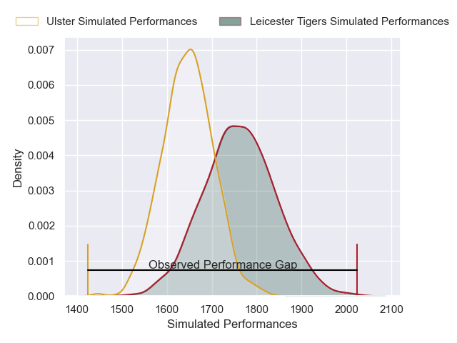
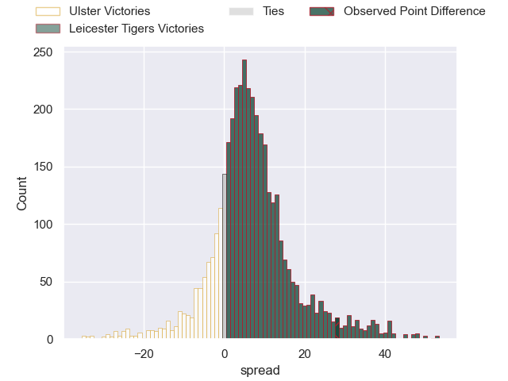
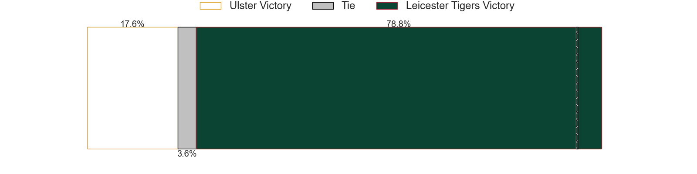
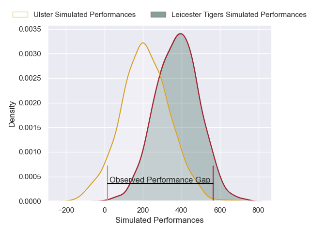
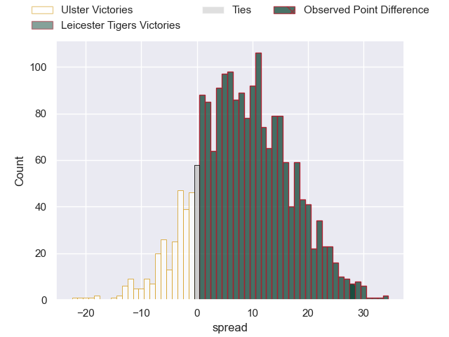
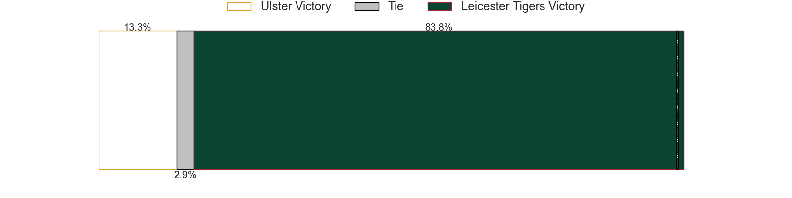

---  
layout: page  
title: Ulster at Leicester Tigers; 10-38  
date: 2025-01-11 18:00:00 -0500  
categories: "European Rugby Champions Cup 2024" match review  
---
# Ulster at Leicester Tigers; 10-38

# Club Level Predictions

The first set of predictions treats a club as the smallest object, as the club develops its members, organizes a gameplan, and deploys its players as needed for each match. This club model has a prediction of 0.658, which translates to predicting Leicester Tigers to win by 5.8.

Our Over/Under is 46.5 - and combined with the spread above, we have a predicted scoreline of 20 to 26

Each club has a rating and a rating deviation (similar to a Glicko rating), and expected performances can be generated. This allows for simulated matches and spreads like the ones below.
## Projected Performances - Club Model

## Projected Spreads - Club Model

## Projected Results - Club Model

# Player Level Predictions

Treating teams instead as an entity made up of the currently active players, I have ratings for each player in an altogether different system. These can be combined to form team ratings once teamsheets are announced, weighting starters a bit higher than the reserves. After the match is played, players can be weighted by their minutes on the field, allowing for an accurate measure of the team's composition. With these compiled team ratings, we can make predictions, measure inaccuracy, and update the individual player ratings.
## Prediction without Player Minutes: Leicester Tigers by 12.9

Ulster by 2.3 on a neutral pitch

## Projected Performances - Player Model

## Projected Spreads - Player Model

## Projected Results - Player Model

|   Away Minutes | Away Player        |   Away Percentile |   Number |   Home Percentile | Home Player           |   Home Minutes |
|---------------:|:-------------------|------------------:|---------:|------------------:|:----------------------|---------------:|
|             28 | Andrew Warwick     |             18.33 |        1 |             64    | Nicky Smith           |             80 |
|             58 | John Andrew        |              5.22 |        2 |             93.17 | Julian Montoya        |             21 |
|             33 | Scott Wilson       |             26.66 |        3 |             90.83 | Joe Heyes             |             26 |
|             80 | Iain Henderson     |             75.75 |        4 |             79.78 | Cameron Henderson     |             59 |
|             80 | Cormac Izuchukwu   |             61.77 |        5 |             21.03 | Jed Holloway          |             52 |
|             80 | James McNabney     |             19.05 |        6 |             89.29 | Finn Carnduff         |             47 |
|             62 | Nick Timoney       |             94.13 |        7 |             63.44 | Tommy Reffell         |             21 |
|             48 | David McCann       |             77.92 |        8 |             23.57 | Olly Cracknell        |             49 |
|             80 | Nathan Doak        |             36.96 |        9 |             32.79 | Jack van Poortvliet   |             21 |
|             62 | Aidan Morgan       |             40.84 |       10 |             90.29 | Handre Pollard        |             68 |
|             10 | Zac Ward           |             24.68 |       11 |             53.72 | Ollie Hassell-Collins |             48 |
|             80 | Jude Postlethwaite |             21.83 |       12 |              5.84 | Solomone Kata         |             55 |
|             40 | Ben Carson         |             57.99 |       13 |             21.5  | Izaia Perese          |             66 |
|             48 | Werner Kok         |             52.73 |       14 |             76.61 | Josh Bassett          |             25 |
|             32 | Ethan McIlroy      |             62.2  |       15 |              4.4  | Freddie Steward       |             80 |
|             22 | Eric O'Sullivan    |             83.43 |       16 |             53.74 | James Whitcombe       |             52 |
|             80 | James McCormick    |             45.14 |       17 |             21.4  | Charlie Clare         |             59 |
|             80 | Kieran Treadwell   |             74.04 |       18 |             33.73 | Dan Cole              |             59 |
|             40 | Corrie Barrett     |             35.16 |       19 |             84.21 | Harry Wells           |             52 |
|             59 | Harry Sheridan     |             66    |       20 |             74.25 | Emeka Ilione          |             48 |
|             55 | John Cooney        |             93.3  |       21 |             34.42 | Ben Youngs            |             80 |
|             80 | Jack Murphy        |             60.49 |       22 |              8.61 | James Shillcock       |             80 |
|             33 | Rory Telfer        |             21.21 |       23 |             60.86 | Joseph Woodward       |             61 |

