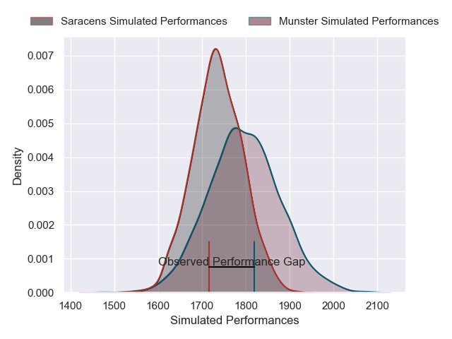
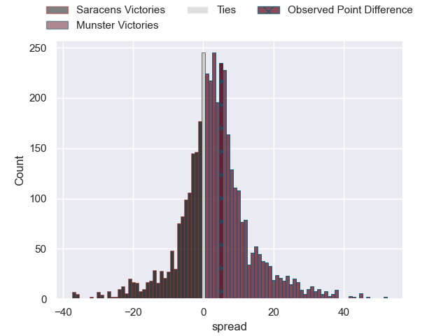
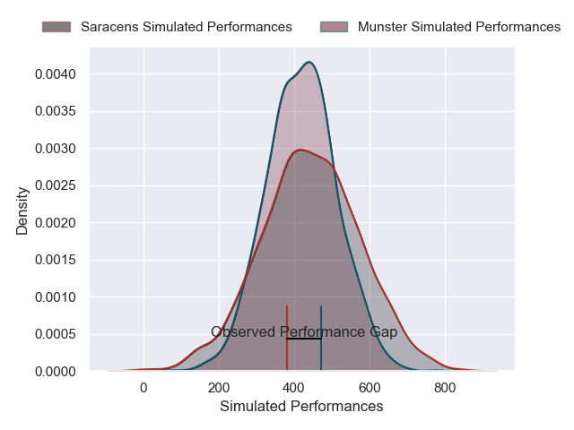
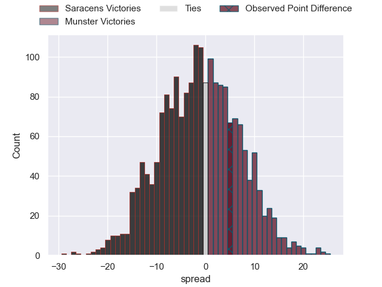

---  
layout: page  
title: Saracens at Munster; 12-17  
date: 2025-01-11 18:00:00 -0500  
categories: "European Rugby Champions Cup 2024" match review  
---
# Saracens at Munster; 12-17

# Club Level Predictions

The first set of predictions treats a club as the smallest object, as the club develops its members, organizes a gameplan, and deploys its players as needed for each match. This club model has a prediction of 0.583, which translates to predicting Munster to win by 3.0.

Our Over/Under is 35.5 - and combined with the spread above, we have a predicted scoreline of 16 to 19

Each club has a rating and a rating deviation (similar to a Glicko rating), and expected performances can be generated. This allows for simulated matches and spreads like the ones below.
## Projected Performances - Club Model

## Projected Spreads - Club Model

## Projected Results - Club Model

# Player Level Predictions

Treating teams instead as an entity made up of the currently active players, I have ratings for each player in an altogether different system. These can be combined to form team ratings once teamsheets are announced, weighting starters a bit higher than the reserves. After the match is played, players can be weighted by their minutes on the field, allowing for an accurate measure of the team's composition. With these compiled team ratings, we can make predictions, measure inaccuracy, and update the individual player ratings.
## Prediction without Player Minutes: Munster by 3.2

Saracens by 6.7 on a neutral pitch

## Projected Performances - Player Model

## Projected Spreads - Player Model

## Projected Results - Player Model

|   Away Minutes | Away Player          |   Away Percentile |   Number |   Home Percentile | Home Player      |   Home Minutes |
|---------------:|:---------------------|------------------:|---------:|------------------:|:-----------------|---------------:|
|             71 | Phil Brantingham     |             13.12 |        1 |             26.49 | Dian Bleurer     |             80 |
|             16 | Jamie George         |             99.64 |        2 |             92.45 | Niall Scannell   |             52 |
|              7 | Marco Riccioni       |             74.35 |        3 |             89.91 | Oli Jager        |             29 |
|             80 | Maro Itoje           |             98.19 |        4 |             21.83 | Fineen Wycherley |             29 |
|             80 | Harry Wilson         |             51.51 |        5 |             98.99 | Tadhg Beirne     |             29 |
|             46 | Juan Martin Gonzalez |             98.56 |        6 |             78.06 | Jack O'Donoghue  |             71 |
|             80 | Ben Earl             |             98.87 |        7 |             81.67 | Alex Kendellen   |             11 |
|             64 | Tom Willis           |             56.9  |        8 |             64.54 | Gavin Coombes    |             55 |
|             64 | Ivan van Zyl         |             83.88 |        9 |             99.46 | Conor Murray     |             25 |
|             52 | Fergus Burke         |             57.17 |       10 |             53.2  | Jack Crowley     |             80 |
|             71 | Lucio Cinti          |             85.43 |       11 |             94.25 | Shane Daly       |             58 |
|              9 | Nick Tompkins        |            100    |       12 |             96.25 | Rory Scannell    |              9 |
|             15 | Alex Lozowski        |             84.12 |       13 |             76.41 | Tom Farrell      |             80 |
|             34 | Liam Williams        |             99.31 |       14 |             95.84 | Calvin Nash      |             19 |
|             80 | Elliot Daly          |             82.2  |       15 |             69.45 | Mike Haley       |             19 |
|             80 | Eroni Mawi           |             94.7  |       16 |             87.13 | John Ryan        |             19 |
|             80 | Theo Dan             |             72.3  |       17 |             89.39 | Diarmuid Barron  |             15 |
|             80 | Alec Clarey          |             35.83 |       18 |             99.16 | Stephen Archer   |             52 |
|             69 | Nathan Michelow      |             83.23 |       19 |             27.81 | Thomas Ahern     |              9 |
|             80 | Tobias Elliott       |             65.11 |       20 |             24.72 | John Hodnett     |             69 |
|             80 | Olly Hartley         |             31.86 |       21 |             16.35 | Brian Gleeson    |              2 |
|            nan | nan                  |            nan    |       22 |             76.16 | Billy Burns      |             10 |

