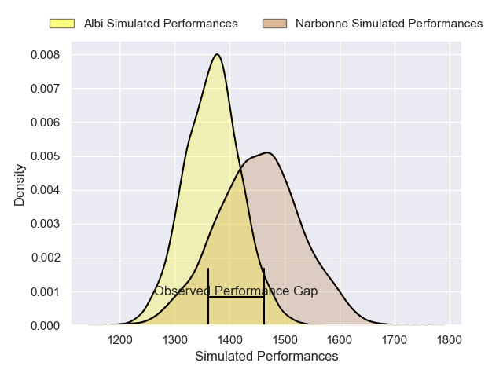
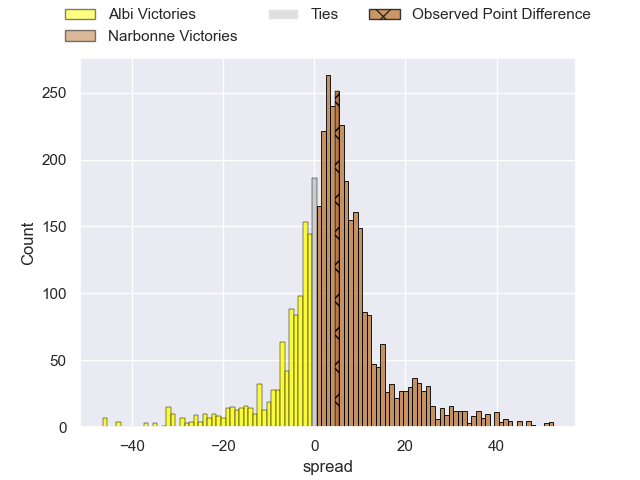
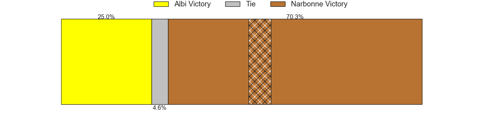
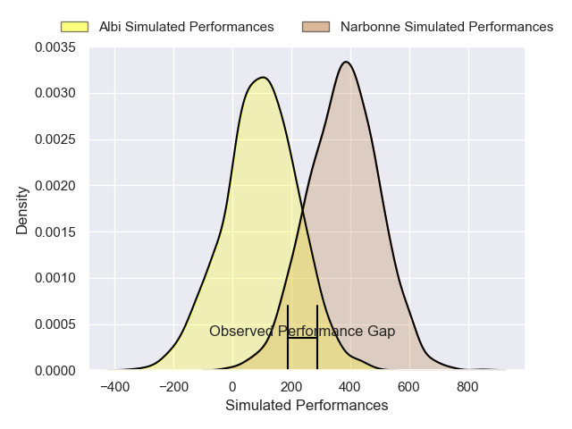
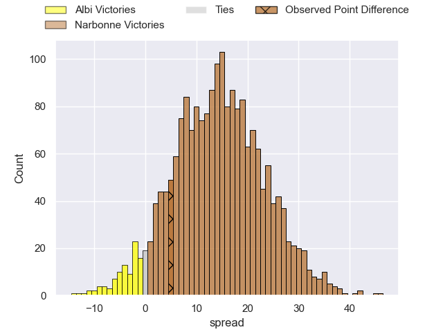
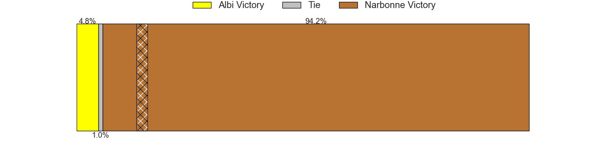

---  
layout: page  
title: Albi at Narbonne; 17-22  
date: 2025-01-11 18:00:00 -0500  
categories: "Nationale 2024" match review  
---
# Albi at Narbonne; 17-22

# Club Level Predictions

The first set of predictions treats a club as the smallest object, as the club develops its members, organizes a gameplan, and deploys its players as needed for each match. This club model has a prediction of 0.62, which translates to predicting Narbonne to win by 4.3.

Our Over/Under is 45.5 - and combined with the spread above, we have a predicted scoreline of 21 to 25

Each club has a rating and a rating deviation (similar to a Glicko rating), and expected performances can be generated. This allows for simulated matches and spreads like the ones below.
## Projected Performances - Club Model

## Projected Spreads - Club Model

## Projected Results - Club Model

# Player Level Predictions

Treating teams instead as an entity made up of the currently active players, I have ratings for each player in an altogether different system. These can be combined to form team ratings once teamsheets are announced, weighting starters a bit higher than the reserves. After the match is played, players can be weighted by their minutes on the field, allowing for an accurate measure of the team's composition. With these compiled team ratings, we can make predictions, measure inaccuracy, and update the individual player ratings.
## Prediction without Player Minutes: Narbonne by 12.1

Albi by 0.8 on a neutral pitch

## Projected Performances - Player Model

## Projected Spreads - Player Model

## Projected Results - Player Model

|   Away Minutes | Away Player             |   Away Percentile |   Number |   Home Percentile | Home Player       |   Home Minutes |
|---------------:|:------------------------|------------------:|---------:|------------------:|:------------------|---------------:|
|             16 | Kevin Tougne            |             18.48 |        1 |             14.4  | Gregory Fichten   |             42 |
|             54 | Arthur Castant          |             39.04 |        2 |              9.8  | Clément Esteriola |             80 |
|             35 | Esteban Talalua         |             41.65 |        3 |             23.51 | Mohammed Loukia   |             17 |
|             24 | Yanis Horvat            |             62.47 |        4 |             58.22 | Marius Antonescu  |             12 |
|             27 | Dion Evrard Oulai       |             14.81 |        5 |              7.71 | Leva Fifita       |             40 |
|             80 | Mattéo Coustalat        |             17.8  |        6 |             75.6  | Luke Nakobukobua  |             80 |
|             27 | Theo Mercadier          |             50    |        7 |              8.6  | Paul Belzons      |             63 |
|             80 | Guillem Calmon          |             36.15 |        8 |              6.06 | Charles Malet     |             80 |
|             80 | Ruben Courties          |             53.31 |        9 |             27.55 | Pierrick Nova     |             12 |
|             80 | Thibault Olender        |             65.71 |       10 |              3.76 | Gilles Bosch      |             53 |
|             59 | Theo Reinard            |             39.88 |       11 |             79.47 | Clément Clavières |              7 |
|             80 | Gabriel Aviragnet       |             57.7  |       12 |             99.78 | Peter Betham      |             68 |
|             55 | Nasoni Naqiri Kunavore  |             93.6  |       13 |             10.09 | Pierre-Hugo Ducom |             80 |
|             40 | Simon Hartmann          |             67.92 |       14 |             14.91 | Étienne Ducom     |             56 |
|             27 | Matis Pacchiana         |             51.77 |       15 |             43.36 | Thibault Santoro  |             80 |
|             52 | Antoine Soave           |             60.14 |       16 |             69.76 | Théo Castinel     |             80 |
|             55 | Jean Baptiste De Clercq |             22.66 |       17 |             30.84 | Gabriel Atlan     |             64 |
|             52 | Camille Jarreau         |             35.28 |       18 |             21.29 | Chris Talakai     |             53 |
|             52 | Vincent Mutel           |             74.44 |       19 |             91.38 | Darrell Dyer      |             64 |
|             80 | Titouan Pouzoullic      |             33.45 |       20 |             44.02 | Morgan Maga       |             80 |
|             40 | Reinach Venter          |             13.55 |       21 |             83.12 | Lopeti Timani     |             45 |
|             80 | Leo Treilles            |             15.4  |       22 |             74.6  | Erwan Nicolas     |             34 |
|            nan | nan                     |            nan    |       23 |             35.62 | Tom Chauvet       |             16 |

