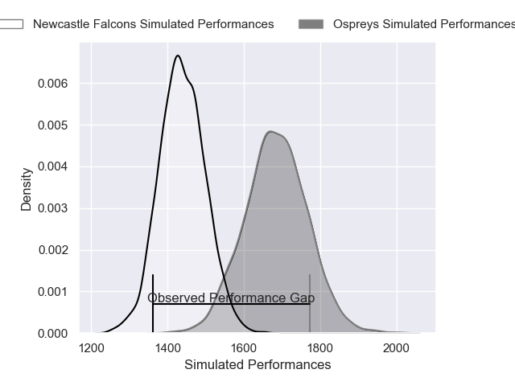
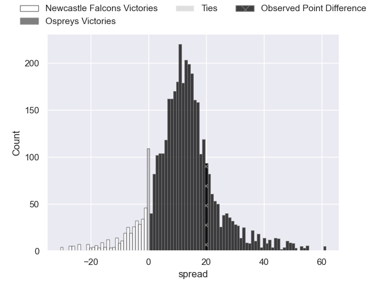
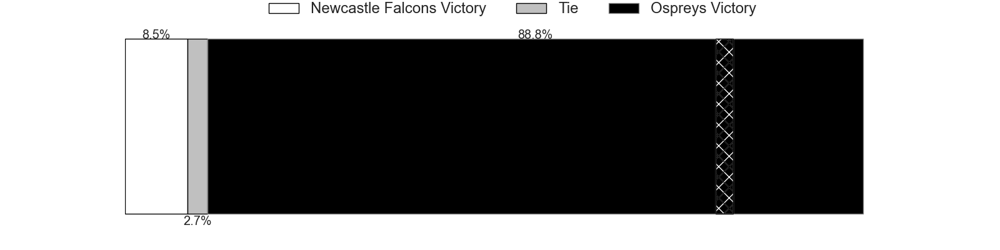
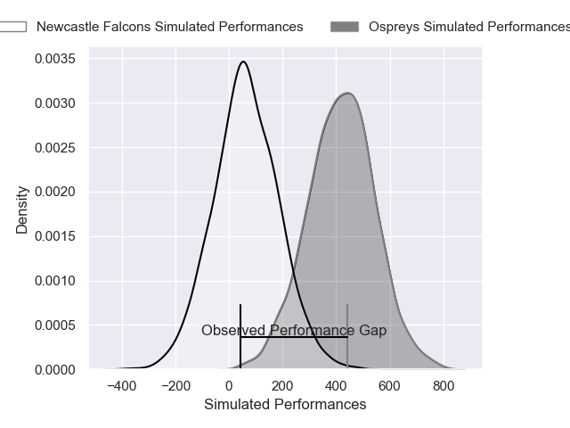
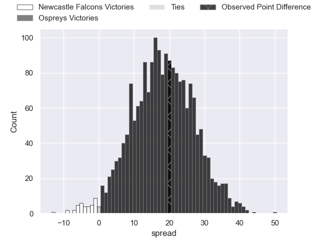
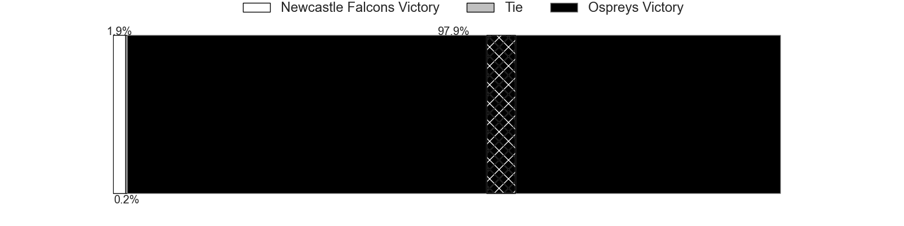

---  
layout: page  
title: Newcastle Falcons at Ospreys; 15-35  
date: 2025-01-11 18:00:00 -0500  
categories: "European Rugby Challenge Cup 2024" match review  
---
# Newcastle Falcons at Ospreys; 15-35

# Club Level Predictions

The first set of predictions treats a club as the smallest object, as the club develops its members, organizes a gameplan, and deploys its players as needed for each match. This club model has a prediction of 0.8, which translates to predicting Ospreys to win by 12.3.

Our Over/Under is 53.5 - and combined with the spread above, we have a predicted scoreline of 21 to 33

Each club has a rating and a rating deviation (similar to a Glicko rating), and expected performances can be generated. This allows for simulated matches and spreads like the ones below.
## Projected Performances - Club Model

## Projected Spreads - Club Model

## Projected Results - Club Model

# Player Level Predictions

Treating teams instead as an entity made up of the currently active players, I have ratings for each player in an altogether different system. These can be combined to form team ratings once teamsheets are announced, weighting starters a bit higher than the reserves. After the match is played, players can be weighted by their minutes on the field, allowing for an accurate measure of the team's composition. With these compiled team ratings, we can make predictions, measure inaccuracy, and update the individual player ratings.
## Prediction without Player Minutes: Ospreys by 19.4

Ospreys by 9.8 on a neutral pitch

## Projected Performances - Player Model

## Projected Spreads - Player Model

## Projected Results - Player Model

|   Away Minutes | Away Player         |   Away Percentile |   Number |   Home Percentile | Home Player            |   Home Minutes |
|---------------:|:--------------------|------------------:|---------:|------------------:|:-----------------------|---------------:|
|             11 | Mike Rewcastle      |             19.27 |        1 |             41.85 | Gareth Thomas          |             47 |
|             58 | Ollie Fletcher      |             18.28 |        2 |             31.36 | Sam Parry              |             80 |
|             18 | Callum Hancock      |             13.67 |        3 |             87.27 | Rhys Henry             |             40 |
|             70 | John Hawkins        |              6.82 |        4 |             63.34 | Will Spencer           |             47 |
|             80 | Adam Scott          |             61    |        5 |             31.57 | William Griffiths      |             62 |
|             58 | Philip van der Walt |              1.52 |        6 |             91.58 | Jac Morgan             |             80 |
|             47 | Josh Bainbridge     |             78.19 |        7 |             98.07 | Justin Tipuric         |             21 |
|             80 | Ollie Leatherbarrow |             28.9  |        8 |              5.41 | Morgan Morris          |             27 |
|             78 | James Elliott       |              1.26 |        9 |             89.21 | Reuben Morgan-Williams |             80 |
|             40 | Kieran Wilkinson    |             66.81 |       10 |             70.31 | Dan Edwards            |             23 |
|             69 | Nathan Greenwood    |             37.16 |       11 |             48.43 | Keelan Giles           |             68 |
|             80 | Connor Doherty      |             62.44 |       12 |             92.67 | Keiran Williams        |             80 |
|             22 | Oliver Spencer      |             60.22 |       13 |             98    | Owen Watkin            |             80 |
|             69 | Max Pepper          |             37.45 |       14 |             95.78 | Daniel Kasende         |             11 |
|             23 | Louis Brown         |             84.28 |       15 |             56.33 | Jack Walsh             |             80 |
|             80 | Bryan Byrne         |             71.86 |       16 |             68    | Ben Warren             |             40 |
|             33 | Murray McCallum     |             11.8  |       17 |             62.37 | Lewis Lloyd            |             51 |
|             22 | Connor Hancock      |            nan    |       18 |             63.33 | Garyn Phillips         |             58 |
|             22 | Finn Baker          |            nan    |       19 |             68.43 | James Ratti            |             80 |
|             22 | Reuben Parsons      |            nan    |       20 |             37.63 | Morgan Morse           |             57 |
|             13 | Hugh O'Sullivan     |             21.4  |       21 |             55.94 | Kieran Hardy           |             80 |
|             80 | Rhys Beeckmans      |            nan    |       22 |              8    | Evardi Boshoff         |             53 |
|             16 | Jack Metcalf        |             14.41 |       23 |            nan    | Harri Houston          |             80 |

