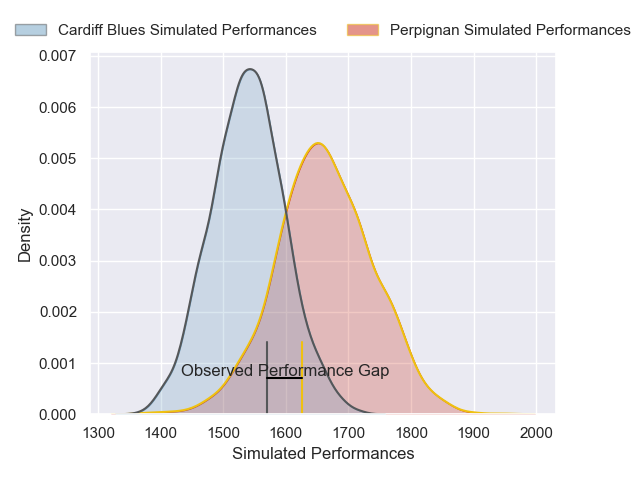
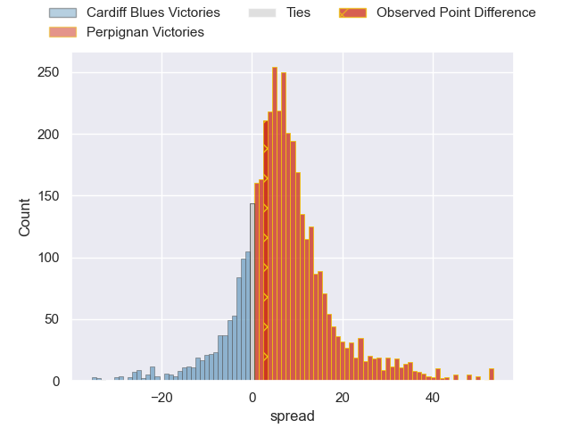
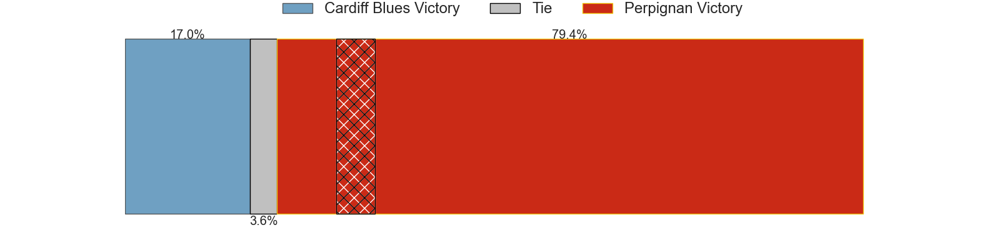
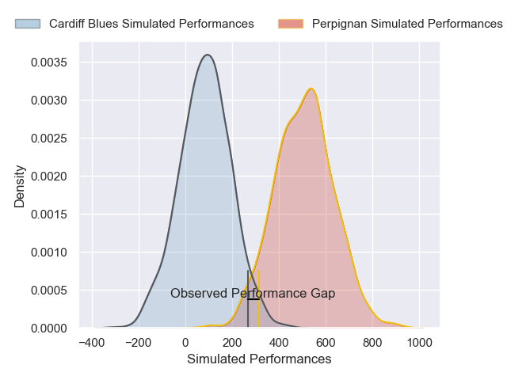
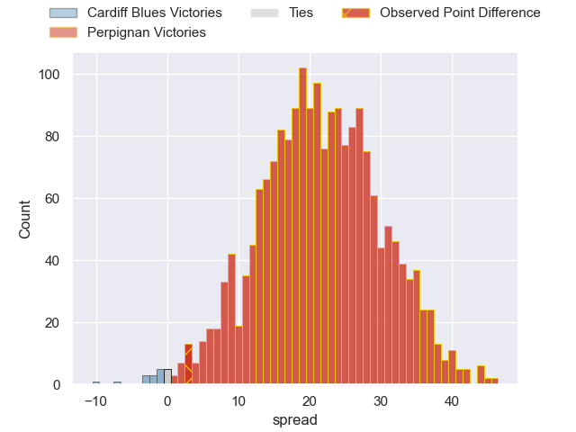

---  
layout: page  
title: Cardiff Blues at Perpignan; 20-23  
date: 2025-01-11 18:00:00 -0500  
categories: "European Rugby Challenge Cup 2024" match review  
---
# Cardiff Blues at Perpignan; 20-23

# Club Level Predictions

The first set of predictions treats a club as the smallest object, as the club develops its members, organizes a gameplan, and deploys its players as needed for each match. This club model has a prediction of 0.667, which translates to predicting Perpignan to win by 6.1.

Our Over/Under is 50.5 - and combined with the spread above, we have a predicted scoreline of 22 to 28

Each club has a rating and a rating deviation (similar to a Glicko rating), and expected performances can be generated. This allows for simulated matches and spreads like the ones below.
## Projected Performances - Club Model

## Projected Spreads - Club Model

## Projected Results - Club Model

# Player Level Predictions

Treating teams instead as an entity made up of the currently active players, I have ratings for each player in an altogether different system. These can be combined to form team ratings once teamsheets are announced, weighting starters a bit higher than the reserves. After the match is played, players can be weighted by their minutes on the field, allowing for an accurate measure of the team's composition. With these compiled team ratings, we can make predictions, measure inaccuracy, and update the individual player ratings.
## Prediction without Player Minutes: Perpignan by 19.5

Perpignan by 4.9 on a neutral pitch

## Projected Performances - Player Model

## Projected Spreads - Player Model

## Projected Results - Player Model

|   Away Minutes | Away Player      |   Away Percentile |   Number |   Home Percentile | Home Player            |   Home Minutes |
|---------------:|:-----------------|------------------:|---------:|------------------:|:-----------------------|---------------:|
|             66 | Rhys Barratt     |             62.24 |        1 |             82.67 | Giorgi Beria           |             80 |
|             59 | Evan Lloyd       |             35.43 |        2 |              4.14 | Victor Montgaillard    |             80 |
|             22 | Keiron Assiratti |             12.2  |        3 |             72.58 | Nemo Roelofse          |             80 |
|             21 | Josh McNally     |             88.23 |        4 |             90.95 | Marvin Orie            |             29 |
|             80 | Teddy Williams   |             37.73 |        5 |             71.93 | Mathieu Tanguy         |             27 |
|             42 | Alex Mann        |              8.96 |        6 |             32.23 | Noe Della Schiava      |             21 |
|             21 | Daniel Thomas    |             81.87 |        7 |             41.81 | Alessandro Ortombina   |             32 |
|             18 | Alun Lawrence    |             88.32 |        8 |             14.86 | Lucas Velarte          |             22 |
|             80 | Aled Davies      |             88.77 |        9 |             28.26 | Gela Aprasidze         |             59 |
|             21 | Tinus de Beer    |             70.42 |       10 |             87.86 | Jake McIntyre          |             62 |
|             24 | Tom Bowen        |             54.81 |       11 |             42.22 | Setareki Toganiyadrava |             59 |
|             80 | Rory Jennings    |             59.98 |       12 |             98.9  | Jeronimo de la Fuente  |             51 |
|             21 | Rey Lee-Lo       |             92.72 |       13 |             32.41 | Job Poulet             |             59 |
|             14 | Regan Grace      |             51.54 |       14 |             74.43 | Tavite Veredamu        |             80 |
|             34 | Cameron Winnett  |             18.24 |       15 |             71.65 | Tommaso Allan          |             80 |
|             32 | Danny Southworth |             55.59 |       16 |             70.5  | Seilala Lam            |             80 |
|             75 | Dafydd Hughes    |             57.73 |       17 |             21.11 | Bruce Devaux           |             58 |
|             80 | Will Davies-King |             14.97 |       18 |            nan    | Akato Fakatika         |             22 |
|             80 | Seb Davies       |             12.17 |       19 |             13.48 | Tristan Labouteley     |             80 |
|             28 | Johan Mulder     |            nan    |       20 |             94.23 | Patrick Sobela         |             14 |
|             60 | Mackenzie Martin |             32.48 |       21 |             65.49 | Apisai Naqalevu        |             80 |
|             10 | Ben Thomas       |             60.97 |       22 |             68.66 | Tom Ecochard           |             56 |
|             28 | Jacob Beetham    |             12.97 |       23 |             19.87 | Antoine Aucagne        |             59 |

