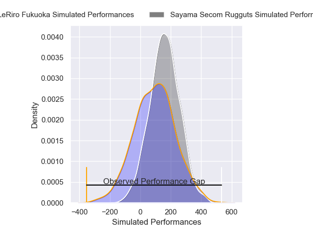
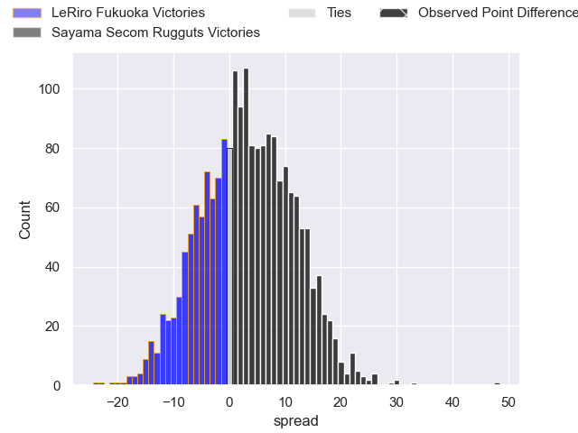
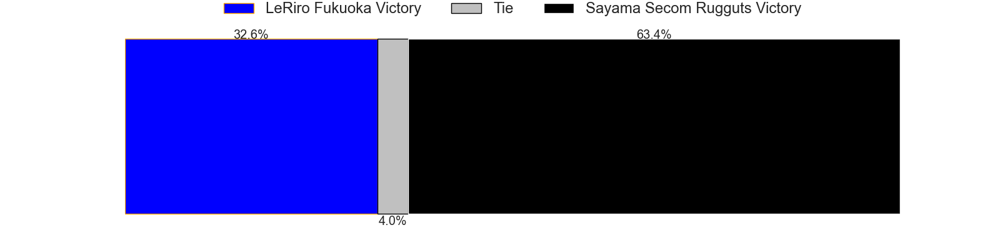

---  
layout: page  
title: LeRiro Fukuoka at Sayama Secom Rugguts; 10-58  
date: 2025-01-11 18:00:00 -0500  
categories: "Japan Rugby League One D3 2024" match review  
---
# LeRiro Fukuoka at Sayama Secom Rugguts; 10-58

# Club Level Predictions

The first set of predictions treats a club as the smallest object, as the club develops its members, organizes a gameplan, and deploys its players as needed for each match. This club model has a prediction of 0.008, which translates to predicting LeRiro Fukuoka to win by 62.9.

Our Over/Under is 51.5 - and combined with the spread above, we have a predicted scoreline of 57 to -6

Each club has a rating and a rating deviation (similar to a Glicko rating), and expected performances can be generated. This allows for simulated matches and spreads like the ones below.
## Projected Performances - Club Model

## Projected Spreads - Club Model

## Projected Results - Club Model

# Player Level Predictions

Treating teams instead as an entity made up of the currently active players, I have ratings for each player in an altogether different system. These can be combined to form team ratings once teamsheets are announced, weighting starters a bit higher than the reserves. After the match is played, players can be weighted by their minutes on the field, allowing for an accurate measure of the team's composition. With these compiled team ratings, we can make predictions, measure inaccuracy, and update the individual player ratings.
## Prediction without Player Minutes: Sayama Secom Rugguts by 4.6

Sayama Secom Rugguts by 2.5 on a neutral pitch

## Projected Performances - Player Model

## Projected Spreads - Player Model

## Projected Results - Player Model

|   Away Minutes | Away Player         |   Away Percentile |   Number |   Home Percentile | Home Player       |   Home Minutes |
|---------------:|:--------------------|------------------:|---------:|------------------:|:------------------|---------------:|
|             33 | Tomoki Nobeta       |             13.46 |        1 |             57.58 | Kentaro Ueno      |             80 |
|             80 | Shota Hirono        |              4.1  |        2 |             57.22 | Tatsuki Tanina    |             80 |
|             18 | Shun Terawaki       |              3.49 |        3 |             44.21 | Motoki Kaneko     |             40 |
|             62 | Masahito Tonomoto   |             23.02 |        4 |             98.78 | Cory Hill         |             40 |
|             80 | Keita Terada        |             13.79 |        5 |             74.54 | Troy Callander    |             28 |
|             80 | Karne Hesketh       |              3.6  |        6 |              5.5  | Ash Parker        |              8 |
|             80 | Yuusuke Hisada      |             11.7  |        7 |             58.8  | Koki Iida         |             53 |
|             67 | Kouta Nishimura     |              9.31 |        8 |             72.51 | Whetu Douglas     |             50 |
|             80 | Hisanori Mimata     |             72.09 |        9 |             58.86 | Rikuya Takashima  |             80 |
|             80 | Shotaro Matsuo      |             10.62 |       10 |             50.66 | Shota Kutsuna     |             18 |
|             55 | Yuki Kono           |              2.96 |       11 |             53.5  | Yoshihiro Noguchi |             55 |
|             80 | Issei Shige         |             14.32 |       12 |             28.96 | Haruya Nakasu     |             29 |
|             30 | Masakazu Yatsumonji |             49.67 |       13 |             16.92 | Daniel Waite      |             40 |
|             25 | Amanaki Lisala      |             15.2  |       14 |             56.07 | Yushi Okuda       |             40 |
|             25 | Hibiki Nakazawa     |             35.84 |       15 |             65.04 | Chase Tiatia      |             40 |
|             18 | Naoki Yasuda        |            nan    |       16 |            nan    | Kento Mizutani    |             62 |
|             37 | Masafumi Tanabe     |            nan    |       17 |            nan    | Ayumu Sawada      |              5 |
|             58 | Haruto Sugisaki     |            nan    |       18 |            nan    | Shogo Murakami    |             62 |
|              5 | Wataru Furuya       |            nan    |       19 |            nan    | Toshiki Sato      |             27 |
|             80 | Kanta Hasegawa      |            nan    |       20 |            nan    | Eito Tsutsumi     |             17 |
|             73 | Taiyou Minami       |            nan    |       21 |            nan    | Yuki Tsujioka     |             19 |
|             54 | Iosefatu Mareko     |            nan    |       22 |            nan    | Shota Okuno       |             10 |
|             80 | Kentaro Kamata      |              9.98 |       23 |             96.1  | TJ Faiane         |             50 |

