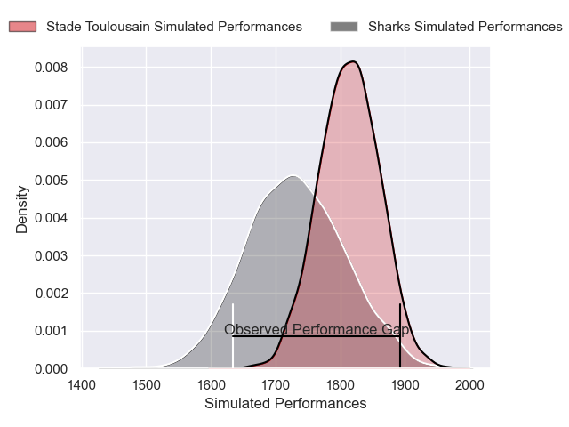
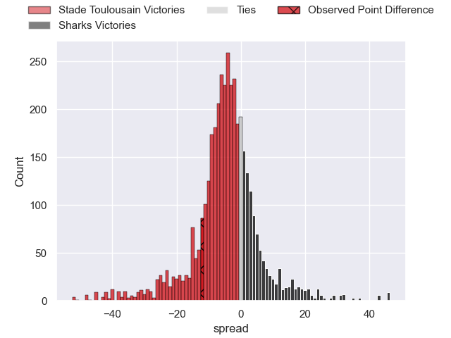
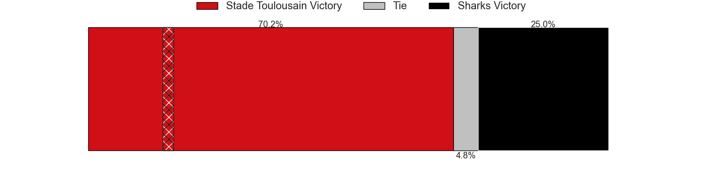
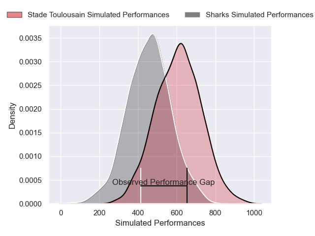
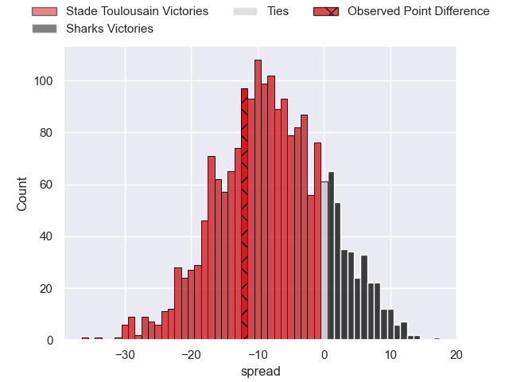

---  
layout: page  
title: Stade Toulousain at Sharks; 20-8  
date: 2025-01-11 18:00:00 -0500  
categories: "European Rugby Champions Cup 2024" match review  
---
# Stade Toulousain at Sharks; 20-8

# Club Level Predictions

The first set of predictions treats a club as the smallest object, as the club develops its members, organizes a gameplan, and deploys its players as needed for each match. This club model has a prediction of 0.386, which translates to predicting Stade Toulousain to win by 4.1.

Our Over/Under is 50.5 - and combined with the spread above, we have a predicted scoreline of 27 to 23

Each club has a rating and a rating deviation (similar to a Glicko rating), and expected performances can be generated. This allows for simulated matches and spreads like the ones below.
## Projected Performances - Club Model

## Projected Spreads - Club Model

## Projected Results - Club Model

# Player Level Predictions

Treating teams instead as an entity made up of the currently active players, I have ratings for each player in an altogether different system. These can be combined to form team ratings once teamsheets are announced, weighting starters a bit higher than the reserves. After the match is played, players can be weighted by their minutes on the field, allowing for an accurate measure of the team's composition. With these compiled team ratings, we can make predictions, measure inaccuracy, and update the individual player ratings.
## Prediction without Player Minutes: Stade Toulousain by 11.4

Stade Toulousain by 19.7 on a neutral pitch

## Projected Performances - Player Model

## Projected Spreads - Player Model

## Projected Results - Player Model

|   Away Minutes | Away Player          |   Away Percentile |   Number |   Home Percentile | Home Player         |   Home Minutes |
|---------------:|:---------------------|------------------:|---------:|------------------:|:--------------------|---------------:|
|             80 | Rodrigue Neti        |             34.23 |        1 |             99.75 | Ox Nche             |             80 |
|             80 | Peato Mauvaka        |             91.55 |        2 |             94.78 | Bongi Mbonambi      |             47 |
|             59 | Dorian Aldegheri     |             94.37 |        3 |             65.52 | Vincent Koch        |             63 |
|             33 | Thibaud Flament      |             89.84 |        4 |             11.67 | Corne Rahl          |             59 |
|             26 | Emmanuel Meafou      |             69.32 |        5 |             32.49 | Jason Jenkins       |             57 |
|             25 | Francois Cros        |             95.88 |        6 |             52.11 | Phepsi Buthelezi    |             22 |
|             25 | Anthony Jelonch      |             99.07 |        7 |             60.45 | Emmanuel Tshituka   |             23 |
|             20 | Jack Willis          |             97.45 |        8 |             82.8  | Siya Kolisi         |             40 |
|             16 | Antoine Dupont       |             99.64 |        9 |             86.96 | Jaden Hendrikse     |             59 |
|             63 | Romain Ntamack       |             96.03 |       10 |             79.69 | Jordan Hendrikse    |             80 |
|             80 | Matthis Lebel        |             98.51 |       11 |             98.61 | Makazole Mapimpi    |             80 |
|             40 | Santiago Chocobares  |             51.71 |       12 |             33.85 | Francois Venter     |             80 |
|             23 | Pierre-Louis Barassi |             94.38 |       13 |             52.7  | Ethan Hooker        |             80 |
|             80 | Blair Kinghorn       |             99.9  |       14 |              2.78 | Yaw Penxe           |             57 |
|             22 | Thomas Ramos         |             95.6  |       15 |             67.47 | Hakeem Kunene       |             21 |
|             80 | Julien Marchand      |             98.02 |       16 |             28.42 | Dylan Richardson    |             17 |
|             70 | Joel Merkler         |             81.67 |       17 |             99.07 | Ruan Dreyer         |             12 |
|             23 | Cyril Baille         |             97.31 |       18 |             88.23 | Trevor Nyakane      |             23 |
|             68 | Joshua Brennan       |             90.11 |       19 |             83.01 | Vincent Tshituka    |             80 |
|             80 | Leo Banos            |             87.02 |       20 |             22.55 | Jeandre Labuschagne |             30 |
|             68 | Ange Capuozzo        |             97.42 |       21 |             63.22 | Bradley Davids      |             23 |
|             26 | Juan Cruz Mallia     |             99.6  |       22 |             74.97 | Jurenzo Julius      |             80 |
|             13 | Paul Graou           |             24.82 |       23 |             59.24 | Nick Hatton         |             57 |

