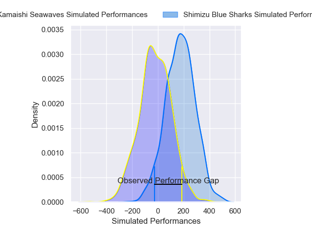
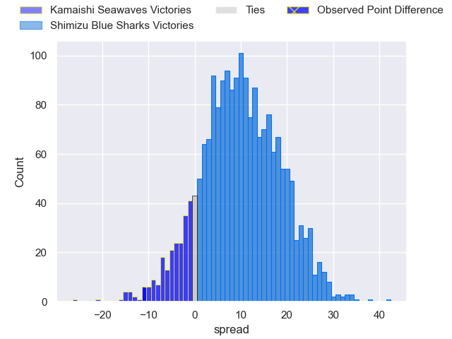
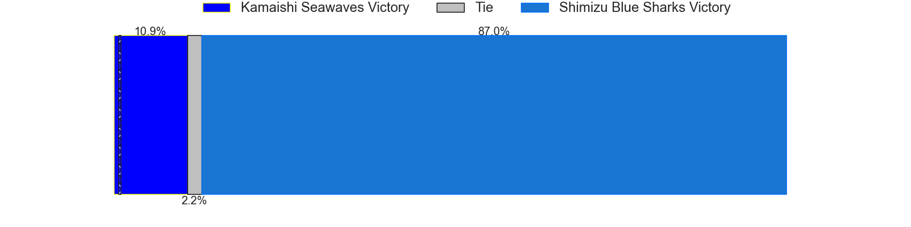

---  
layout: page  
title: Kamaishi Seawaves at Shimizu Blue Sharks; 35-24  
date: 2025-01-11 18:00:00 -0500  
categories: "Japan Rugby League One D2 2024" match review  
---
# Kamaishi Seawaves at Shimizu Blue Sharks; 35-24

# Club Level Predictions

The first set of predictions treats a club as the smallest object, as the club develops its members, organizes a gameplan, and deploys its players as needed for each match. This club model has a prediction of 0.739, which translates to predicting Shimizu Blue Sharks to win by 9.6.

Our Over/Under is 66.5 - and combined with the spread above, we have a predicted scoreline of 28 to 38

Each club has a rating and a rating deviation (similar to a Glicko rating), and expected performances can be generated. This allows for simulated matches and spreads like the ones below.
## Projected Performances - Club Model

## Projected Spreads - Club Model

## Projected Results - Club Model

# Player Level Predictions

Treating teams instead as an entity made up of the currently active players, I have ratings for each player in an altogether different system. These can be combined to form team ratings once teamsheets are announced, weighting starters a bit higher than the reserves. After the match is played, players can be weighted by their minutes on the field, allowing for an accurate measure of the team's composition. With these compiled team ratings, we can make predictions, measure inaccuracy, and update the individual player ratings.
## Prediction without Player Minutes: Shimizu Blue Sharks by 10.0

Shimizu Blue Sharks by 7.3 on a neutral pitch

## Projected Performances - Player Model

## Projected Spreads - Player Model

## Projected Results - Player Model

|   Away Minutes | Away Player         |   Away Percentile |   Number |   Home Percentile | Home Player         |   Home Minutes |
|---------------:|:--------------------|------------------:|---------:|------------------:|:--------------------|---------------:|
|             27 | Yusuke Yamada       |             36.5  |        1 |             55.42 | Sanshiro Nomura     |             80 |
|             21 | Daiki Ito           |              4.68 |        2 |             50.9  | Naomichi Tatekawa   |             47 |
|             80 | Satoshi Ueda        |             84.27 |        3 |             79.39 | Uha Lee             |             40 |
|             14 | Satoshi Hatazawa    |             54.93 |        4 |             49.6  | Ed Holmes           |             75 |
|             62 | Hamish Dalzell      |             15.19 |        5 |             28.87 | Tom Rowe            |             80 |
|             70 | Ben Nee Nee         |             35.74 |        6 |             61.17 | Koyo Adachi         |             11 |
|             33 | Ryota Kono          |             43.87 |        7 |             36.56 | Josh Basham         |             37 |
|             47 | Sam Henwood         |              7.01 |        8 |              7.64 | Michael Va'a Toloke |             80 |
|             80 | Youhei Murakami     |             10.87 |        9 |             39.31 | Tatsuya Kanetsuki   |             10 |
|             47 | Mitch Hunt          |             69.76 |       10 |             93.6  | Lima Sopoaga        |             80 |
|             80 | Jamie Henry         |             89.1  |       11 |              2.87 | Naoki Moriya        |             80 |
|             59 | Gerdus van der Walt |             27.23 |       12 |              5.73 | Soichiro Kuwata     |             75 |
|             62 | Katsuto Hatanaka    |             63.29 |       13 |             74.42 | Siale Piutau        |              5 |
|             80 | Ryuji Abe           |             26.96 |       14 |              3.37 | Tatsuhiro Ozaki     |             40 |
|             33 | Kaisei Takai        |             55.82 |       15 |             67.69 | Coenie van Wyk      |             53 |
|             33 | Taiki Noguchi       |             13.54 |       16 |            nan    | Essendon Tuitupou   |             40 |
|             59 | Kazuki Ochi         |             40.18 |       17 |             13.85 | Kaito Tamori        |             62 |
|             80 | Dallas Tatana       |              4.83 |       18 |             53.91 | Fumiyake Mato       |             80 |
|             80 | Atsushi Minami      |             21.2  |       19 |              3.09 | Yutaro Shirako      |             53 |
|             80 | Naoki Ouno          |             11.51 |       20 |            nan    | Ryota Saito         |             10 |
|             59 | Mosese Tonga        |             10.58 |       21 |             13.59 | Ryo Sato            |             29 |
|            nan | nan                 |            nan    |       22 |             66.12 | Kayne Hammington    |             27 |
|            nan | nan                 |            nan    |       23 |             73.29 | Hayden Cripps       |             80 |

