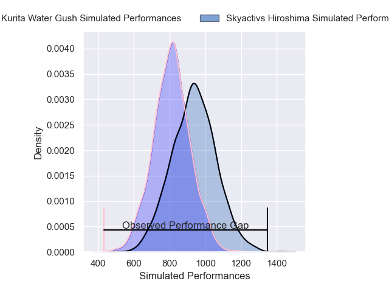
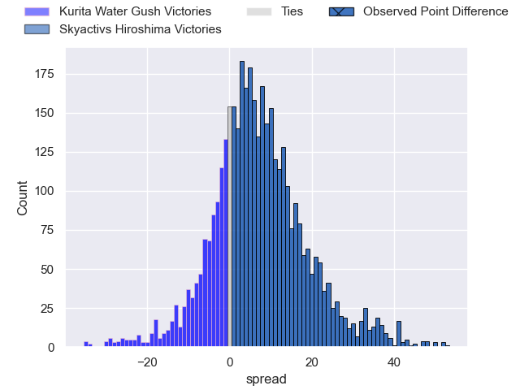
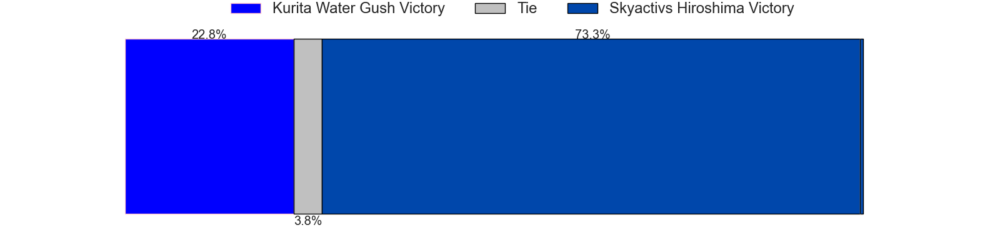
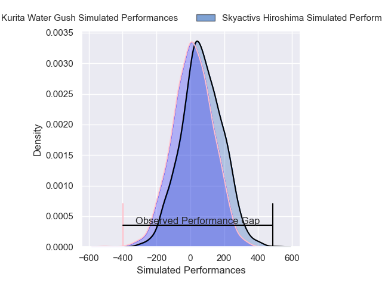
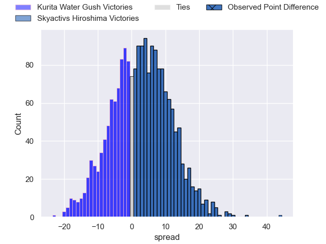
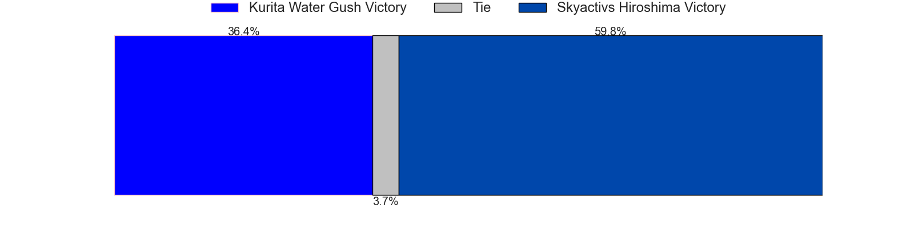

---  
layout: page  
title: Kurita Water Gush at Skyactivs Hiroshima; 13-57  
date: 2025-01-11 18:00:00 -0500  
categories: "Japan Rugby League One D3 2024" match review  
---
# Kurita Water Gush at Skyactivs Hiroshima; 13-57

# Club Level Predictions

The first set of predictions treats a club as the smallest object, as the club develops its members, organizes a gameplan, and deploys its players as needed for each match. This club model has a prediction of 0.66, which translates to predicting Skyactivs Hiroshima to win by 6.1.

Our Over/Under is 55.5 - and combined with the spread above, we have a predicted scoreline of 25 to 31

Each club has a rating and a rating deviation (similar to a Glicko rating), and expected performances can be generated. This allows for simulated matches and spreads like the ones below.
## Projected Performances - Club Model

## Projected Spreads - Club Model

## Projected Results - Club Model

# Player Level Predictions

Treating teams instead as an entity made up of the currently active players, I have ratings for each player in an altogether different system. These can be combined to form team ratings once teamsheets are announced, weighting starters a bit higher than the reserves. After the match is played, players can be weighted by their minutes on the field, allowing for an accurate measure of the team's composition. With these compiled team ratings, we can make predictions, measure inaccuracy, and update the individual player ratings.
## Prediction without Player Minutes: Skyactivs Hiroshima by 1.7

Kurita Water Gush by 0.9 on a neutral pitch

## Projected Performances - Player Model

## Projected Spreads - Player Model

## Projected Results - Player Model

|   Away Minutes | Away Player      |   Away Percentile |   Number |   Home Percentile | Home Player        |   Home Minutes |
|---------------:|:-----------------|------------------:|---------:|------------------:|:-------------------|---------------:|
|             30 | Kei Shibuya      |              8.41 |        1 |              8.33 | Koshi Kato         |             80 |
|             30 | Kota Hojo        |             16.37 |        2 |              3.06 | Tomohiro Takeda    |             80 |
|             25 | Rui Kuriyama     |             38.44 |        3 |              2.35 | Tomoya Otake       |             26 |
|             40 | Kota Nakamura    |              1.51 |        4 |             77.06 | Tye Nash           |             62 |
|             55 | Yoji Shiina      |             26.56 |        5 |             58.35 | Andrew Davidson    |             22 |
|             62 | Ryutaro Iguchi   |             25.75 |        6 |             77.86 | Iori Suzuki        |             80 |
|             54 | Taisei Nakao     |             15.86 |        7 |             62.31 | Rame Sato          |             40 |
|             59 | Kengo Nakamura   |              2.97 |        8 |             27.18 | Tevin Ferris       |             56 |
|             80 | Ren Shinwada     |             17.39 |        9 |             75.54 | Syoya Maeda        |              7 |
|             63 | Hiroki Handa     |             25.17 |       10 |             60.71 | Issen Kano         |             10 |
|             73 | King Maxwell     |             77.11 |       11 |             13.88 | Kouhei Kamei       |             80 |
|             80 | Leo Gordon       |             19.63 |       12 |              9.7  | Clinton Knox       |             54 |
|             20 | Katsuki Ishizuka |             29.55 |       13 |             71.55 | Kaito Sasaoka      |             63 |
|             59 | Yuta Sugiyama    |             20.91 |       14 |             30.53 | Yuto Nakamura      |             80 |
|             50 | Kentaro Sugimori |              2.64 |       15 |              0.22 | Ginjiro Sakiguchi  |             73 |
|             30 | Shohei Tsujimura |            nan    |       16 |             85.61 | Taichi Yoko        |             80 |
|             29 | Ryo Hosomoto     |             33.5  |       17 |             77.9  | Taiyo Fukuyama     |             29 |
|             68 | Kei Takusagawa   |            nan    |       18 |             66.69 | Tadatsugu Kanayama |             18 |
|             80 | Jun Kaneko       |            nan    |       19 |             64.72 | Jacob Abel         |             21 |
|             51 | So Matsushima    |             29.22 |       20 |            nan    | Haruki Umemoto     |             80 |
|             80 | Sho Nakamura     |              8.51 |       21 |             62.47 | Hitaka Inoue       |             75 |
|             58 | Daiki Yokota     |             33.19 |       22 |             58.75 | Yutaro Tanaka      |             53 |
|             13 | Yujin Ikezawa    |            nan    |       23 |            nan    | Kaiha Noda         |             70 |

