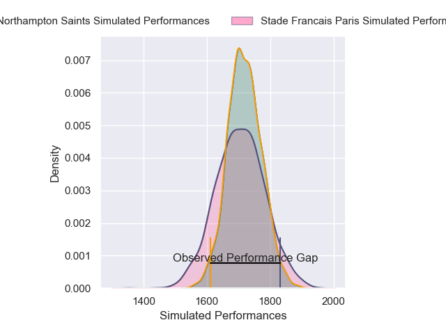
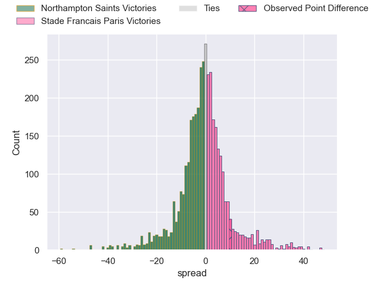
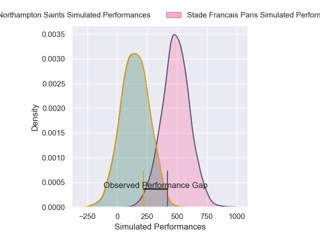
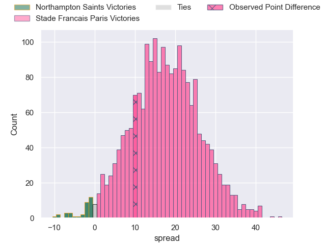
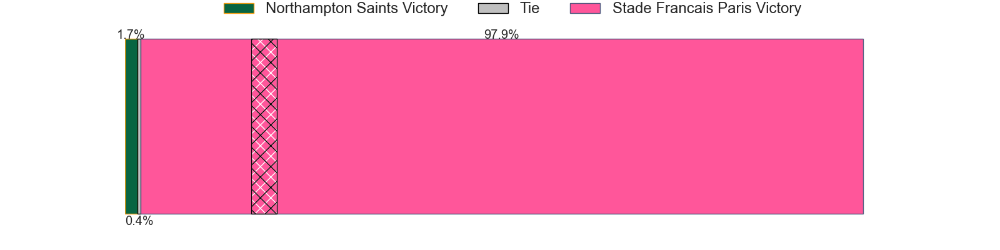

---  
layout: page  
title: Northampton Saints at Stade Francais Paris; 35-45  
date: 2025-01-11 18:00:00 -0500  
categories: "European Rugby Champions Cup 2024" match review  
---
# Northampton Saints at Stade Francais Paris; 35-45

# Club Level Predictions

The first set of predictions treats a club as the smallest object, as the club develops its members, organizes a gameplan, and deploys its players as needed for each match. This club model has a prediction of 0.488, which translates to predicting Northampton Saints to win by 0.4.

Our Over/Under is 44.5 - and combined with the spread above, we have a predicted scoreline of 22 to 22

Each club has a rating and a rating deviation (similar to a Glicko rating), and expected performances can be generated. This allows for simulated matches and spreads like the ones below.
## Projected Performances - Club Model

## Projected Spreads - Club Model

## Projected Results - Club Model

# Player Level Predictions

Treating teams instead as an entity made up of the currently active players, I have ratings for each player in an altogether different system. These can be combined to form team ratings once teamsheets are announced, weighting starters a bit higher than the reserves. After the match is played, players can be weighted by their minutes on the field, allowing for an accurate measure of the team's composition. With these compiled team ratings, we can make predictions, measure inaccuracy, and update the individual player ratings.
## Prediction without Player Minutes: Stade Francais Paris by 18.0

Stade Francais Paris by 2.8 on a neutral pitch

## Projected Performances - Player Model

## Projected Spreads - Player Model

## Projected Results - Player Model

|   Away Minutes | Away Player             |   Away Percentile |   Number |   Home Percentile | Home Player              |   Home Minutes |
|---------------:|:------------------------|------------------:|---------:|------------------:|:-------------------------|---------------:|
|             27 | Tarek Haffar            |             63.92 |        1 |             23.26 | Moses Alo-Emile          |              9 |
|              2 | Henry Walker            |             70.61 |        2 |             97.31 | Giacomo Nicotera         |             80 |
|             80 | Trevor Davison          |              0.34 |        3 |             91.94 | Francisco Gomez Kodela   |             12 |
|             80 | Ed Prowse               |             70.47 |        4 |              2.65 | Paul Gabrillagues        |             80 |
|             80 | Tom Lockett             |             11.51 |        5 |             82.99 | JJ van der Mescht        |             57 |
|             12 | Josh Kemeny             |              4.97 |        6 |              9.74 | Tanginoa Halaifonua      |             57 |
|             12 | Angus Scott-Young       |             16.94 |        7 |             18.26 | Romain Briatte           |             80 |
|             58 | Henry Pollock           |             87.32 |        8 |             61.33 | Yoan Tanga               |             53 |
|             47 | Alex Mitchell           |             96.4  |        9 |             16.55 | Louis Foursans-Bourdette |             59 |
|             80 | Fin Smith               |             71.62 |       10 |             49.56 | Zack Henry               |             80 |
|             58 | Tom Seabrook            |              1.47 |       11 |             72.94 | Lester Etien             |             80 |
|             69 | Charlie Savala          |             28.67 |       12 |             91    | Julien Delbouis          |             22 |
|             22 | Tom Litchfield          |             52    |       13 |             10.44 | Samuel Ezeala            |             21 |
|             22 | Tommy Freeman           |             95.1  |       14 |             61.47 | Peniasi Dakuwaqa         |             68 |
|             24 | James Ramm              |             56.77 |       15 |             65.07 | Joe Jonas                |             80 |
|             80 | Tom West                |             16.21 |       16 |             46.52 | Hugo Ndiaye              |             23 |
|             64 | Curtis Langdon          |             92.65 |       17 |            nan    | Alvaro Garcia Albo       |             60 |
|             64 | Luke Green              |             72.67 |       18 |             47.03 | Isaac Koffi              |             11 |
|             80 | Tom Pearson             |             96.25 |       19 |             79.72 | Sekou Macalou            |             62 |
|             16 | Fyn Brown               |             36.11 |       20 |             58.15 | Baptiste Pesenti         |             80 |
|             46 | Callum Hunter-Hill      |            nan    |       21 |             95.86 | Brad Weber               |             62 |
|             35 | Archie McParland        |             59.35 |       22 |             69.67 | Joe Marchant             |             33 |
|             16 | George Makepeace-Cubitt |             67.03 |       23 |            nan    | nan                      |            nan |

