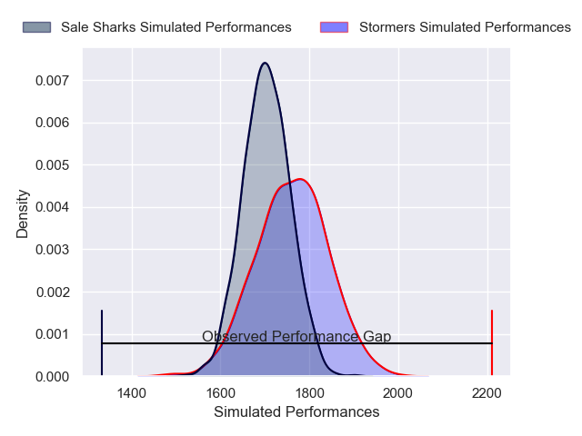
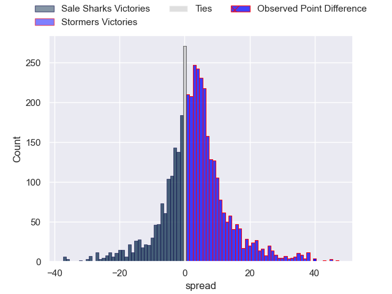
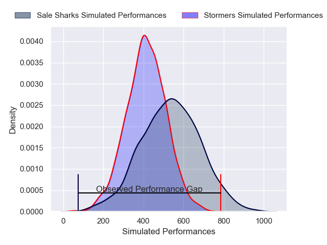
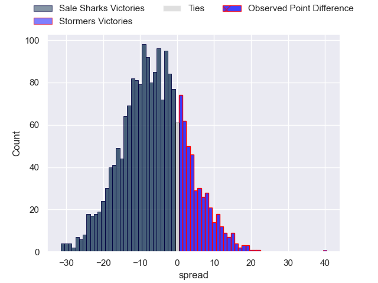

---  
layout: page  
title: Sale Sharks at Stormers; 0-40  
date: 2025-01-11 18:00:00 -0500  
categories: "European Rugby Champions Cup 2024" match review  
---
# Sale Sharks at Stormers; 0-40

# Club Level Predictions

The first set of predictions treats a club as the smallest object, as the club develops its members, organizes a gameplan, and deploys its players as needed for each match. This club model has a prediction of 0.58, which translates to predicting Stormers to win by 2.9.

Our Over/Under is 50.5 - and combined with the spread above, we have a predicted scoreline of 24 to 27

Each club has a rating and a rating deviation (similar to a Glicko rating), and expected performances can be generated. This allows for simulated matches and spreads like the ones below.
## Projected Performances - Club Model

## Projected Spreads - Club Model

## Projected Results - Club Model

# Player Level Predictions

Treating teams instead as an entity made up of the currently active players, I have ratings for each player in an altogether different system. These can be combined to form team ratings once teamsheets are announced, weighting starters a bit higher than the reserves. After the match is played, players can be weighted by their minutes on the field, allowing for an accurate measure of the team's composition. With these compiled team ratings, we can make predictions, measure inaccuracy, and update the individual player ratings.
## Prediction without Player Minutes: Stormers by 0.7

Sale Sharks by 7.9 on a neutral pitch

## Projected Performances - Player Model

## Projected Spreads - Player Model

## Projected Results - Player Model

|   Away Minutes | Away Player          |   Away Percentile |   Number |   Home Percentile | Home Player          |   Home Minutes |
|---------------:|:---------------------|------------------:|---------:|------------------:|:---------------------|---------------:|
|             80 | Bevan Rodd           |             90.15 |        1 |             68.85 | Sti Sithole          |             59 |
|             66 | Luke Cowan-Dickie    |             85.48 |        2 |              3.41 | JJ Kotze             |             22 |
|             23 | WillGriff John       |             86.25 |        3 |             86.08 | Frans Malherbe       |             38 |
|             48 | Ernst van Rhyn       |             88.29 |        4 |             80.14 | Salmaan Moerat       |             27 |
|             80 | Hyron Andrews        |             26.27 |        5 |              3.46 | JD Schickerling      |             24 |
|             80 | Jean-Luc du Preez    |             99.7  |        6 |             95.44 | Deon Fourie          |             23 |
|             80 | Tom Curry            |             79.11 |        7 |             98.68 | Dave Ewers           |             51 |
|             80 | Daniel du Preez      |             81.5  |        8 |             39.5  | Marcel Theunissen    |             59 |
|             61 | Gus Warr             |             48.92 |        9 |             51.08 | Stefan Ungerer       |             59 |
|             51 | Robert du Preez      |             67.25 |       10 |             87.12 | Manie Libbok         |             35 |
|             80 | Robert du Preez      |             67.25 |       10 |             87.12 | Manie Libbok         |             35 |
|             66 | Arron Reed           |             94.61 |       11 |             91.96 | Ben Loader           |             53 |
|             26 | Sam Bedlow           |             75.33 |       12 |             73.11 | Jonathan Roche       |             80 |
|             61 | Luke James           |             66.89 |       13 |             76.33 | Wandisile Simelane   |             35 |
|             80 | Tom Roebuck          |             45.88 |       14 |             70.1  | Suleiman Hartzenberg |             27 |
|             46 | Joe Carpenter        |              7.86 |       15 |             99.56 | Warrick Gelant       |             80 |
|             80 | Simon McIntyre       |             91.68 |       16 |             84.97 | Alistair Vermaak     |             27 |
|             66 | Tadgh McElroy        |             48.39 |       17 |             49.28 | Andre-Hugo Venter    |             14 |
|             80 | Asher Opoku-Fordjour |             88.62 |       18 |             80.22 | Neethling Fouche     |             42 |
|             53 | Ben Bamber           |             29.12 |       19 |             87.98 | Ruben van Heerden    |             14 |
|             48 | Josh Beaumont        |             81.16 |       20 |             10.55 | Paul De Villiers     |             34 |
|             80 | Ben Curry            |             56.59 |       21 |             86.9  | Evan Roos            |             80 |
|              5 | Rekeiti Ma'asi-White |             15.22 |       22 |             78.06 | Paul de Wet          |             31 |
|             14 | Anerin (Nye) Thomas  |            nan    |       23 |             65.44 | Jean-Luc du Plessis  |             59 |

