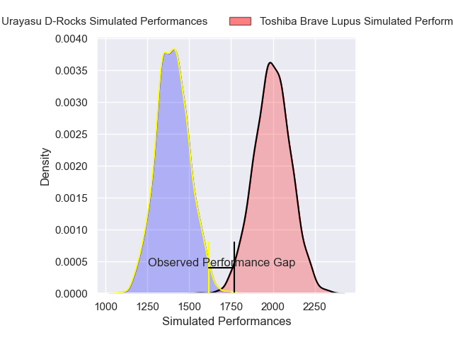
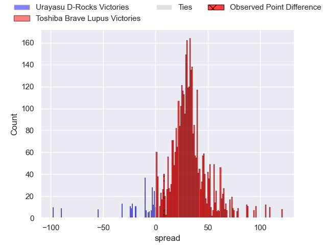
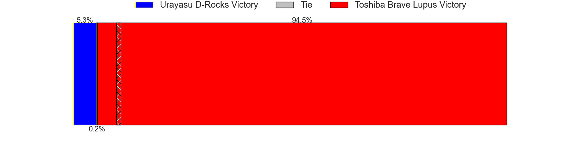
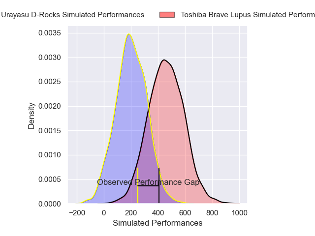
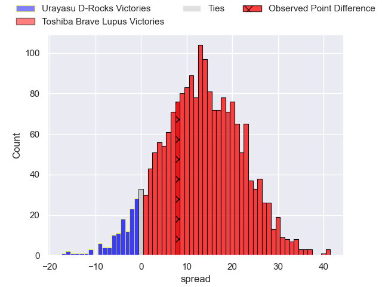
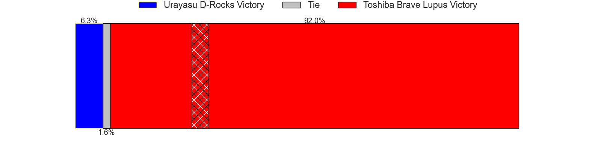

---  
layout: page  
title: Urayasu D-Rocks at Toshiba Brave Lupus; 14-22  
date: 2025-01-11 18:00:00 -0500  
categories: "Japan Rugby League One 2024" match review  
---
# Urayasu D-Rocks at Toshiba Brave Lupus; 14-22

# Club Level Predictions

The first set of predictions treats a club as the smallest object, as the club develops its members, organizes a gameplan, and deploys its players as needed for each match. This club model has a prediction of 0.963, which translates to predicting Toshiba Brave Lupus to win by 29.6.

Our Over/Under is 67.5 - and combined with the spread above, we have a predicted scoreline of 19 to 49

Each club has a rating and a rating deviation (similar to a Glicko rating), and expected performances can be generated. This allows for simulated matches and spreads like the ones below.
## Projected Performances - Club Model

## Projected Spreads - Club Model

## Projected Results - Club Model

# Player Level Predictions

Treating teams instead as an entity made up of the currently active players, I have ratings for each player in an altogether different system. These can be combined to form team ratings once teamsheets are announced, weighting starters a bit higher than the reserves. After the match is played, players can be weighted by their minutes on the field, allowing for an accurate measure of the team's composition. With these compiled team ratings, we can make predictions, measure inaccuracy, and update the individual player ratings.
## Prediction without Player Minutes: Toshiba Brave Lupus by 15.2

Toshiba Brave Lupus by 11.0 on a neutral pitch

## Projected Performances - Player Model

## Projected Spreads - Player Model

## Projected Results - Player Model

|   Away Minutes | Away Player          |   Away Percentile |   Number |   Home Percentile | Home Player        |   Home Minutes |
|---------------:|:---------------------|------------------:|---------:|------------------:|:-------------------|---------------:|
|              9 | Hidetomo Nabeshima   |             10.43 |        1 |             84.36 | Sena Kimura        |             17 |
|             55 | Ryuji Fujimura       |             53.42 |        2 |             74.82 | Mamoru Harada      |              7 |
|             12 | Kim Ryom             |             54.92 |        3 |             88.9  | Yuta Kokaji        |             80 |
|             68 | Lourens Erasmus      |             76.06 |        4 |             98.79 | Jacob Pierce       |             80 |
|             68 | Tom Parsons          |             78.87 |        5 |             88.93 | Warner Dearns      |             17 |
|             18 | Shingo Nakashima     |             92.58 |        6 |             75.39 | Shin Ito           |             20 |
|             18 | Shin Takeuchi        |             72.61 |        7 |             83.32 | Takeshi Sasaki     |             21 |
|             62 | Jasper Wiese         |             69.21 |        8 |             92.14 | Michael Leitch     |             28 |
|             28 | Norifumi Hashimoto   |              1.63 |        9 |             38.77 | Shotaro Ikedo      |             80 |
|             12 | Yu Tamura            |             88.08 |       10 |             91.61 | Takuro Matsunaga   |             80 |
|             10 | Caleb Cavubati       |             19.72 |       11 |             79.09 | Atsuki Kuwayama    |             62 |
|             80 | Otere Black          |             63.84 |       12 |             73.54 | Taichi Mano        |             80 |
|             73 | Tana Tuhakaraina     |             74.31 |       13 |             96.36 | Seta Tamanivalu    |             80 |
|             48 | Junya Matsumoto      |             31.12 |       14 |             58.08 | Jone Naikabula     |             71 |
|             80 | Takuhei Yasuda       |             86.37 |       15 |             94.29 | Michael Collins    |             52 |
|             32 | Shuhei Takeuchi      |             19.51 |       16 |             65.31 | Yuto Mori          |             80 |
|             80 | Yang Jung Soo        |            nan    |       17 |             85.14 | Yuhei Sugiyama     |             80 |
|             25 | Tone Tukufuka        |             95.48 |       18 |             36.82 | Rob Thompson       |             80 |
|             48 | Junichiro Matsushita |            nan    |       19 |             57.19 | Daigo Hashimoto    |             68 |
|             32 | Ren Iinuma           |             52.17 |       20 |             25.85 | Yoshitaka Tokunaga |             70 |
|             62 | Israel Folau         |             22.86 |       21 |             81.41 | Masataka Mikami    |             80 |
|             62 | Wimpie van der Walt  |             83.2  |       22 |             85.53 | Teruo Makabe       |             62 |
|             80 | Taiga Ishida         |            nan    |       23 |             40.74 | Samuela Anise      |             12 |

