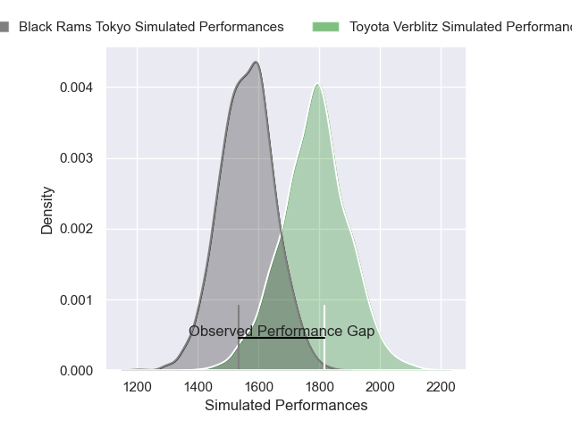
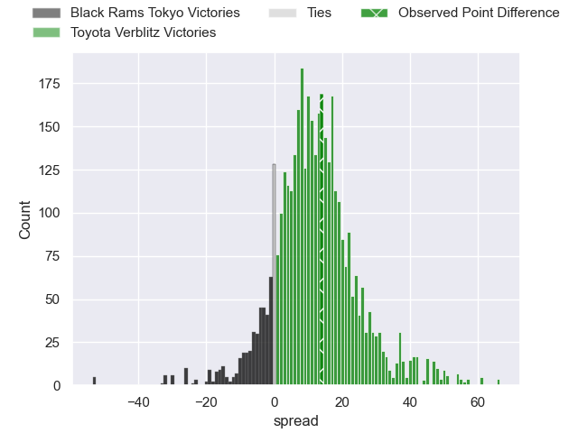
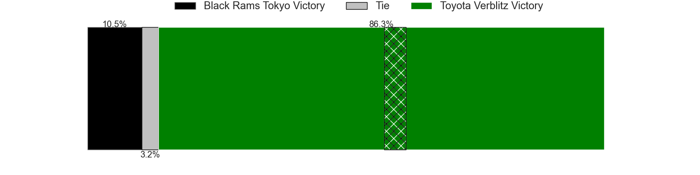
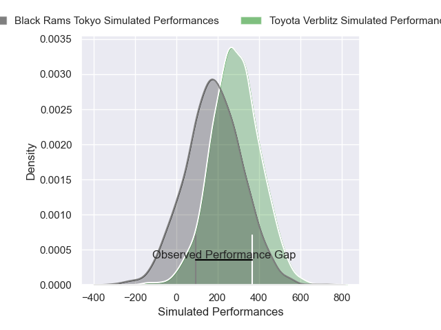
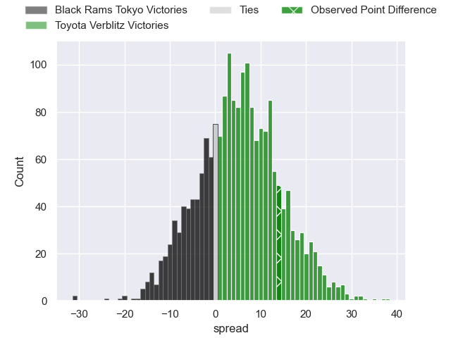
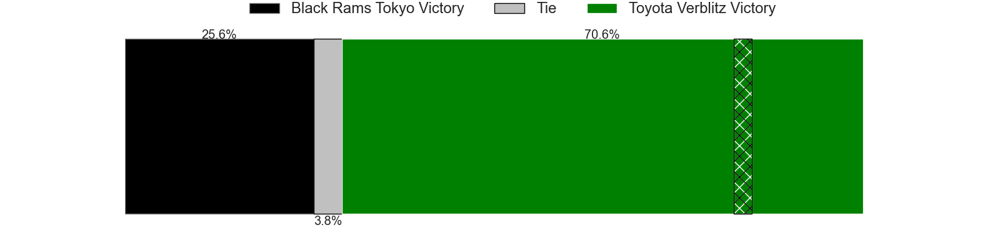

---  
layout: page  
title: Black Rams Tokyo at Toyota Verblitz; 18-32  
date: 2025-01-11 18:00:00 -0500  
categories: "Japan Rugby League One 2024" match review  
---
# Black Rams Tokyo at Toyota Verblitz; 18-32

# Club Level Predictions

The first set of predictions treats a club as the smallest object, as the club develops its members, organizes a gameplan, and deploys its players as needed for each match. This club model has a prediction of 0.768, which translates to predicting Toyota Verblitz to win by 10.8.

Our Over/Under is 51.5 - and combined with the spread above, we have a predicted scoreline of 20 to 31

Each club has a rating and a rating deviation (similar to a Glicko rating), and expected performances can be generated. This allows for simulated matches and spreads like the ones below.
## Projected Performances - Club Model

## Projected Spreads - Club Model

## Projected Results - Club Model

# Player Level Predictions

Treating teams instead as an entity made up of the currently active players, I have ratings for each player in an altogether different system. These can be combined to form team ratings once teamsheets are announced, weighting starters a bit higher than the reserves. After the match is played, players can be weighted by their minutes on the field, allowing for an accurate measure of the team's composition. With these compiled team ratings, we can make predictions, measure inaccuracy, and update the individual player ratings.
## Prediction without Player Minutes: Toyota Verblitz by 11.4

Toyota Verblitz by 7.1 on a neutral pitch

## Projected Performances - Player Model

## Projected Spreads - Player Model

## Projected Results - Player Model

|   Away Minutes | Away Player       |   Away Percentile |   Number |   Home Percentile | Home Player         |   Home Minutes |
|---------------:|:------------------|------------------:|---------:|------------------:|:--------------------|---------------:|
|             52 | Kazuma Nishi      |             35.41 |        1 |             89.07 | Shogo Miura         |             10 |
|             80 | Hinata Takei      |             20.86 |        2 |             92.81 | Yoshikatsu Hikosaka |             40 |
|             28 | Paddy Ryan        |             79.48 |        3 |             82.09 | Genki Sudo          |             11 |
|             26 | Harrison Fox      |             40.34 |        4 |             59.86 | Josh Dickson        |             58 |
|             28 | Pohiva Lotoahea   |             82.19 |        5 |             70.42 | Daichi Akiyama      |             40 |
|             26 | Mike Stolberg     |              1.54 |        6 |             84.86 | Isaiah Mapusua      |             80 |
|             51 | Shuhei Matsuhashi |             59.63 |        7 |             23.38 | Will Tupou          |             22 |
|             11 | Liam Gill         |             74.95 |        8 |             69    | Kazuki Himeno       |              8 |
|             61 | TJ Perenara       |             96.38 |        9 |             96.74 | Aaron Smith         |             40 |
|             80 | Ichigo Nakakusu   |             27.15 |       10 |             97.57 | Rikiya Matsuda      |             48 |
|             51 | Netani Vakayalia  |             64.22 |       11 |             75.12 | Yuichiro Wada       |             40 |
|             80 | Yuki Ikeda        |             40.02 |       12 |             80.93 | Nicholas McCurran   |              4 |
|             66 | Ryohei Isoda      |             61.19 |       13 |             31.09 | Joseph Manu         |             54 |
|             80 | Siope Lolo Tavo   |             19.92 |       14 |             88.5  | Taichi Takahashi    |             69 |
|             80 | Kotaro Ito        |             23.96 |       15 |             86.15 | Tiaan Falcon        |             80 |
|             59 | Semisi Tupou      |             30.11 |       16 |             81.92 | Matt McGahan        |             80 |
|             80 | Samuel Waqabaca   |             48.62 |       17 |            nan    | Shunsuke Asaoka     |             69 |
|             80 | Ko Sato           |             77.34 |       18 |             33.7  | Kaito Shigeno       |             70 |
|             14 | Penieli Jr Latu   |            nan    |       19 |             38.72 | Kosei Miki          |             54 |
|             80 | Shohei Oyama      |             16.23 |       20 |              0.33 | Siosaia Fifita      |             80 |
|             61 | Amato Fakatava    |              7.83 |       21 |             79.86 | Ryusei Kato         |             80 |
|             80 | Daiki Yanagawa    |             35.12 |       22 |             29.68 | Toby McPherson      |             11 |
|             80 | Toshiya Takahashi |             66.49 |       23 |            nan    | Ryunosuke Momoji    |             80 |

