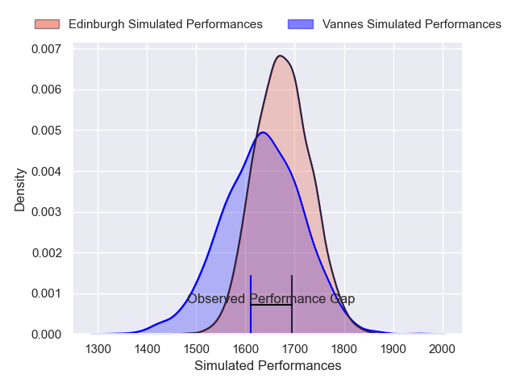
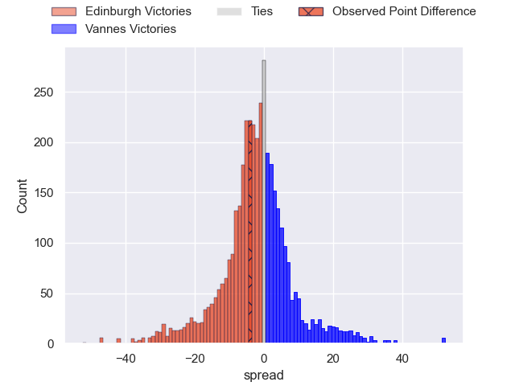
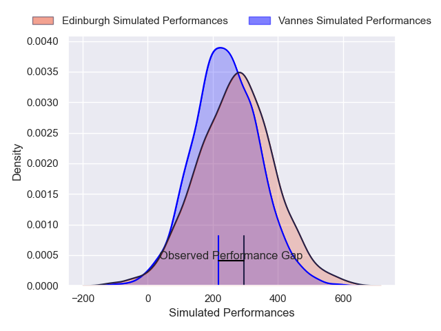
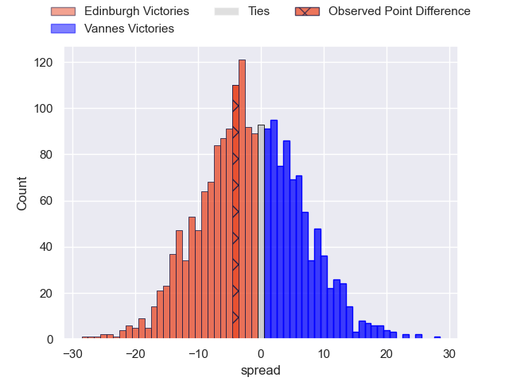

---  
layout: page  
title: Edinburgh at Vannes; 29-25  
date: 2025-01-11 18:00:00 -0500  
categories: "European Rugby Challenge Cup 2024" match review  
---
# Edinburgh at Vannes; 29-25

# Club Level Predictions

The first set of predictions treats a club as the smallest object, as the club develops its members, organizes a gameplan, and deploys its players as needed for each match. This club model has a prediction of 0.441, which translates to predicting Edinburgh to win by 2.1.

Our Over/Under is 42.5 - and combined with the spread above, we have a predicted scoreline of 22 to 20

Each club has a rating and a rating deviation (similar to a Glicko rating), and expected performances can be generated. This allows for simulated matches and spreads like the ones below.
## Projected Performances - Club Model

## Projected Spreads - Club Model

## Projected Results - Club Model

# Player Level Predictions

Treating teams instead as an entity made up of the currently active players, I have ratings for each player in an altogether different system. These can be combined to form team ratings once teamsheets are announced, weighting starters a bit higher than the reserves. After the match is played, players can be weighted by their minutes on the field, allowing for an accurate measure of the team's composition. With these compiled team ratings, we can make predictions, measure inaccuracy, and update the individual player ratings.
## Prediction without Player Minutes: Edinburgh by 1.8

Edinburgh by 7.1 on a neutral pitch

## Projected Performances - Player Model

## Projected Spreads - Player Model

## Projected Results - Player Model

|   Away Minutes | Away Player         |   Away Percentile |   Number |   Home Percentile | Home Player              |   Home Minutes |
|---------------:|:--------------------|------------------:|---------:|------------------:|:-------------------------|---------------:|
|             21 | Pierre Schoeman     |             75.89 |        1 |             23.6  | Thomas Moukoro           |             80 |
|             18 | Dave Cherry         |             74.91 |        2 |             59.14 | Theo Beziat              |             29 |
|             19 | Javan Sebastian     |             70.71 |        3 |             92.78 | Pagakalasio Tafili       |             66 |
|             22 | Marshall Sykes      |             54.38 |        4 |              7.23 | Christiaan van der Merwe |             27 |
|             62 | Sam Skinner         |             92.46 |        5 |             45.21 | Timothe Mezou            |             80 |
|             58 | Jamie Ritchie       |             99.8  |        6 |             23.83 | Leon Boulier             |             80 |
|             53 | Luke Crosbie        |             91.48 |        7 |             53.25 | Matthieu Uhila           |             54 |
|             80 | Ben Muncaster       |             60.29 |        8 |             92.1  | Joe Edwards              |             22 |
|             80 | Ali Price           |             90.65 |        9 |             30.94 | Jules Le Bail            |             49 |
|             21 | Ben Healy           |             63.97 |       10 |             43.67 | Jean Cotarmanac'h        |             21 |
|             34 | Duhan van der Merwe |             89.22 |       11 |             61.86 | Filipo Nakosi            |             19 |
|             80 | James Lang          |             72.67 |       12 |              4    | Francis Saili            |             29 |
|             80 | Matt Currie         |             78.89 |       13 |             80.56 | Robin Taccola            |             19 |
|             53 | Darcy Graham        |             49.9  |       14 |             87.16 | Salesi Rayasi            |             14 |
|             32 | Wes Goosen          |             87.12 |       15 |             99.34 | Gwenael Duplenne         |             51 |
|             27 | Boan Venter         |             64.94 |       16 |             62.73 | Hugo Djehi               |             61 |
|             80 | Patrick Harrison    |             14.87 |       17 |             84.95 | Pat Leafa                |             80 |
|             27 | D'Arcy Rae          |             21.65 |       18 |             24.36 | Simon Bourgeois          |             59 |
|             27 | Hamish Watson       |             78.9  |       19 |             16.09 | Matteo Desjeux           |             21 |
|             53 | Glen Young          |              3.36 |       20 |              6.8  | Jesse Parete             |             22 |
|             27 | Charlie Shiel       |            nan    |       21 |              0.9  | Stephen Varney           |             29 |
|             80 | Ross Thompson       |             79.48 |       22 |             51.22 | Tani Vili                |             21 |
|             80 | Mosese Tuipulotu    |             36.56 |       23 |             26.86 | Inaki Ayarza             |             80 |

