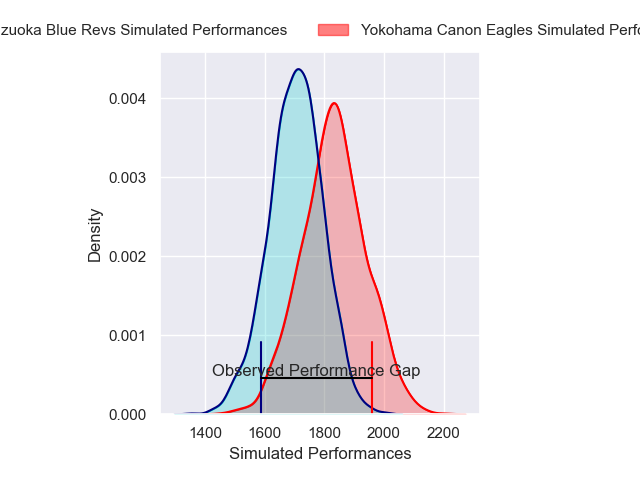
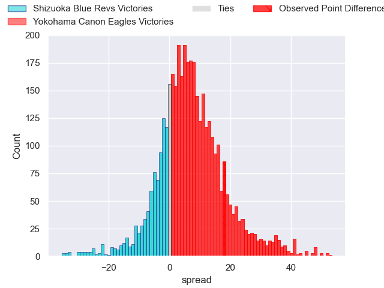
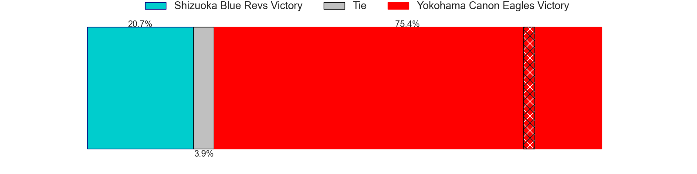
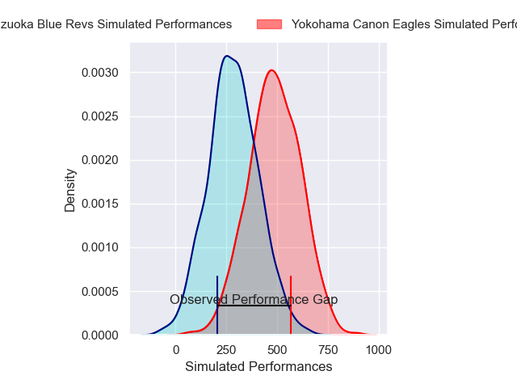
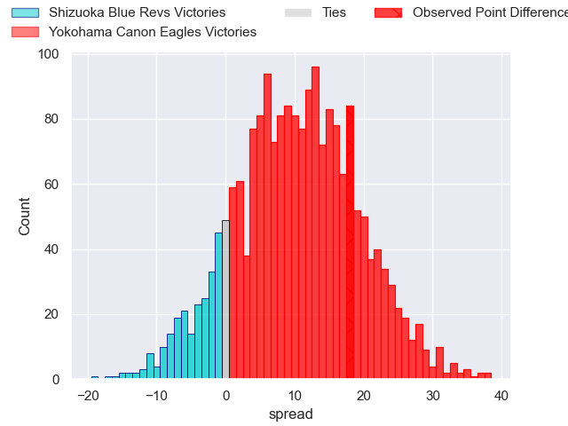
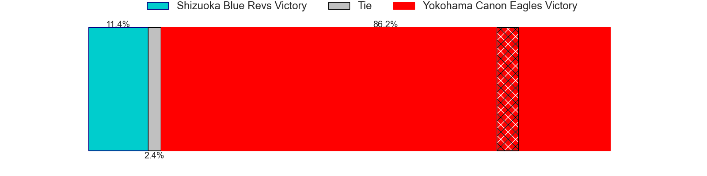

---  
layout: page  
title: Shizuoka Blue Revs at Yokohama Canon Eagles; 35-53  
date: 2025-01-11 18:00:00 -0500  
categories: "Japan Rugby League One 2024" match review  
---
# Shizuoka Blue Revs at Yokohama Canon Eagles; 35-53

# Club Level Predictions

The first set of predictions treats a club as the smallest object, as the club develops its members, organizes a gameplan, and deploys its players as needed for each match. This club model has a prediction of 0.674, which translates to predicting Yokohama Canon Eagles to win by 6.6.

Our Over/Under is 47.5 - and combined with the spread above, we have a predicted scoreline of 20 to 27

Each club has a rating and a rating deviation (similar to a Glicko rating), and expected performances can be generated. This allows for simulated matches and spreads like the ones below.
## Projected Performances - Club Model

## Projected Spreads - Club Model

## Projected Results - Club Model

# Player Level Predictions

Treating teams instead as an entity made up of the currently active players, I have ratings for each player in an altogether different system. These can be combined to form team ratings once teamsheets are announced, weighting starters a bit higher than the reserves. After the match is played, players can be weighted by their minutes on the field, allowing for an accurate measure of the team's composition. With these compiled team ratings, we can make predictions, measure inaccuracy, and update the individual player ratings.
## Prediction without Player Minutes: Yokohama Canon Eagles by 1.7

Shizuoka Blue Revs by 2.5 on a neutral pitch

## Projected Performances - Player Model

## Projected Spreads - Player Model

## Projected Results - Player Model

|   Away Minutes | Away Player             |   Away Percentile |   Number |   Home Percentile | Home Player        |   Home Minutes |
|---------------:|:------------------------|------------------:|---------:|------------------:|:-------------------|---------------:|
|             80 | Kenta Yamashita         |             45.75 |        1 |             97.65 | Takato Okabe       |             80 |
|             33 | Takeshi Hino            |             98.2  |        2 |             87.59 | Yusuke Niwai       |             18 |
|             72 | Heiichiro Ito           |             86.46 |        3 |              7.57 | Tatsuro Sugimoto   |             18 |
|             23 | Yuya Odo                |             95.57 |        4 |             11.77 | Liaki Moli         |              9 |
|             31 | Murray Douglas          |             92.56 |        5 |             70.32 | Matt Philip        |             71 |
|             18 | Vueti Tupou             |             56.75 |        6 |             72.91 | Billy Harmon       |             80 |
|             49 | Richard Goh Jones       |             70.65 |        7 |             81.26 | Masato Furukawa    |             80 |
|             18 | Kwagga Smith            |             91.93 |        8 |             85.99 | Sione Halasili     |             80 |
|             13 | Shuntaro Kitamura       |             74.82 |        9 |             95.47 | Faf de Klerk       |              7 |
|              8 | Kenta Iemura            |             76.38 |       10 |             88.08 | Yu Tamura          |             62 |
|             40 | Malo Tuitama            |             89.99 |       11 |             48.36 | Masayoshi Takezawa |              7 |
|             23 | Viliami Tahitu'a        |             75.96 |       12 |             97.46 | Yusuke Kajimura    |             67 |
|             69 | Sylvian Mahuza          |             53.36 |       13 |             99.01 | Jesse Kriel        |             57 |
|             80 | Damian Markus           |             62.93 |       14 |             63.43 | Kippei Ishida      |             80 |
|             80 | Charles Piutau          |             93.19 |       15 |             98.9  | Jumpei Ogura       |             80 |
|             19 | Minoru Tanoue           |            nan    |       16 |             86.15 | Shunta Nakamura    |             80 |
|             80 | Bunkei Kaku             |            nan    |       17 |             77.63 | Ryosuke Iwaihara   |             57 |
|             80 | Sione Vuna              |             54.78 |       18 |             96.18 | Amanaki Mafi       |             80 |
|             79 | Shoji Takuma            |             49.74 |       19 |             64.13 | Kafazumi Yamasuga  |             72 |
|             80 | Eishin Kuwano           |             82.39 |       20 |             57.14 | Cormac Daly        |             80 |
|             61 | Valynce Te Whare-Crosby |            nan    |       21 |             69.22 | Tomoki Minami      |             49 |
|              1 | Kazuhiro Kawata         |            nan    |       22 |             94.85 | Viliame Takayawa   |             80 |
|             80 | Richmond Tongatama      |            nan    |       23 |             30.98 | Ryo Tabata         |             31 |

