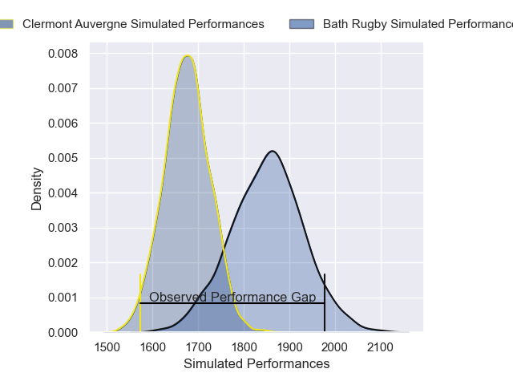
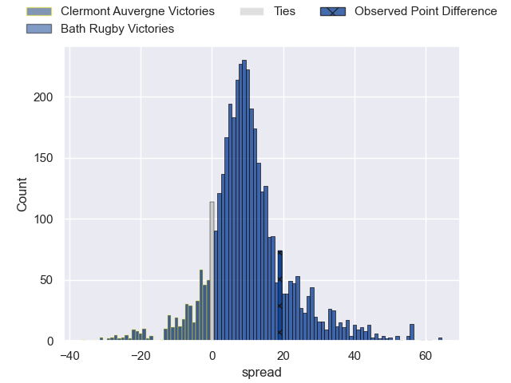
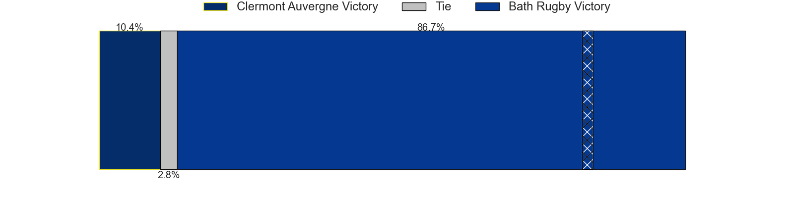
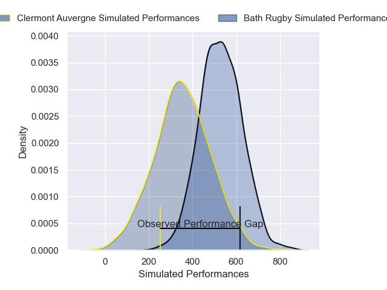
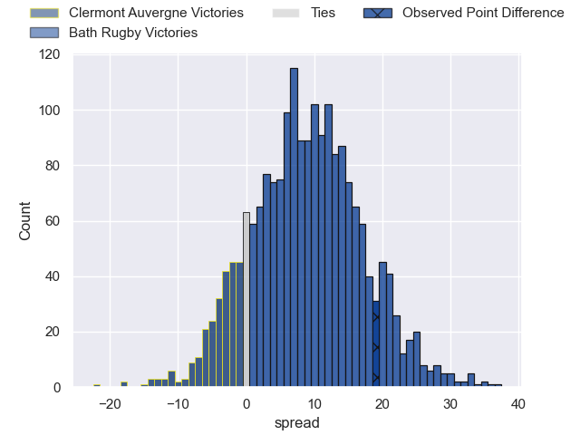
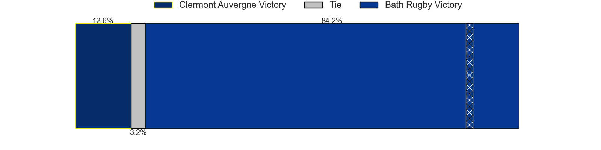

---  
layout: page  
title: Clermont Auvergne at Bath Rugby; 21-40  
date: 2025-01-12 18:00:00 -0500  
categories: "European Rugby Champions Cup 2024" match review  
---
# Clermont Auvergne at Bath Rugby; 21-40

# Club Level Predictions

The first set of predictions treats a club as the smallest object, as the club develops its members, organizes a gameplan, and deploys its players as needed for each match. This club model has a prediction of 0.734, which translates to predicting Bath Rugby to win by 8.9.

Our Over/Under is 59.5 - and combined with the spread above, we have a predicted scoreline of 25 to 34

Each club has a rating and a rating deviation (similar to a Glicko rating), and expected performances can be generated. This allows for simulated matches and spreads like the ones below.
## Projected Performances - Club Model

## Projected Spreads - Club Model

## Projected Results - Club Model

# Player Level Predictions

Treating teams instead as an entity made up of the currently active players, I have ratings for each player in an altogether different system. These can be combined to form team ratings once teamsheets are announced, weighting starters a bit higher than the reserves. After the match is played, players can be weighted by their minutes on the field, allowing for an accurate measure of the team's composition. With these compiled team ratings, we can make predictions, measure inaccuracy, and update the individual player ratings.
## Prediction without Player Minutes: Bath Rugby by 20.4

Bath Rugby by 6.2 on a neutral pitch

## Projected Performances - Player Model

## Projected Spreads - Player Model

## Projected Results - Player Model

|   Away Minutes | Away Player          |   Away Percentile |   Number |   Home Percentile | Home Player         |   Home Minutes |
|---------------:|:---------------------|------------------:|---------:|------------------:|:--------------------|---------------:|
|             80 | Giorgi Akhaladze     |             29.86 |        1 |             95.21 | Beno Obano          |             80 |
|             80 | Folau Fainga'a       |             91.01 |        2 |             96.76 | Tom Dunn            |             68 |
|             28 | Regis Montagne       |             82.59 |        3 |             97.98 | Thomas du Toit      |             18 |
|             80 | Rob Simmons          |             92.45 |        4 |             94.67 | Quinn Roux          |              9 |
|             80 | Peceli Yato Senibitu |             93.76 |        5 |             78.17 | Charlie Ewels       |             18 |
|             23 | Killian Tixeront     |             79.61 |        6 |             83.63 | Ted Hill            |             27 |
|             23 | Marcos Kremer        |             93    |        7 |             94.85 | Miles Reid          |             12 |
|             23 | Fritz Lee            |             92.99 |        8 |             79.19 | Alfie Barbeary      |             15 |
|             18 | Baptiste Jauneau     |             87.5  |        9 |             86.41 | Ben Spencer         |             80 |
|             68 | Anthony Belleau      |             96.47 |       10 |             99.34 | Finn Russell        |             16 |
|             74 | Lucas Tauzin         |             89.2  |       11 |             87.71 | Ruaridh McConnochie |             12 |
|             80 | Irae Simone          |             38.37 |       12 |             92.28 | Max Ojomoh          |             13 |
|             18 | Pierre Fouyssac      |             12.35 |       13 |             80.82 | Ollie Lawrence      |             23 |
|              6 | Bautista Delguy      |             80.97 |       14 |             95.64 | Joe Cokanasiga      |             23 |
|             62 | Alex Newsome         |             79.56 |       15 |             27.69 | Tom de Glanville    |             57 |
|             12 | Etienne Fourcade     |             90.11 |       16 |             88.31 | Francois van Wyk    |             57 |
|             80 | Michael Ala'alatoa   |             94.2  |       17 |             59.71 | Niall Annett        |             57 |
|             48 | Thomas Ceyte         |             72.54 |       18 |             52.14 | Will Stuart         |             57 |
|             80 | Sacha Lotrian        |             57.11 |       19 |             94.87 | Ross Molony         |             80 |
|             80 | Sebastien Bezy       |             78.99 |       20 |              9.99 | Josh Bayliss        |             80 |
|             57 | Théo Giral           |            nan    |       21 |             83.7  | Louis Schreuder     |              0 |
|             80 | Alivereti Raka       |             11.89 |       22 |             57.47 | Ethan Staddon       |             74 |
|            nan | nan                  |            nan    |       23 |             74.73 | Orlando Bailey      |              6 |

