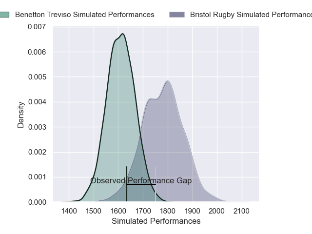
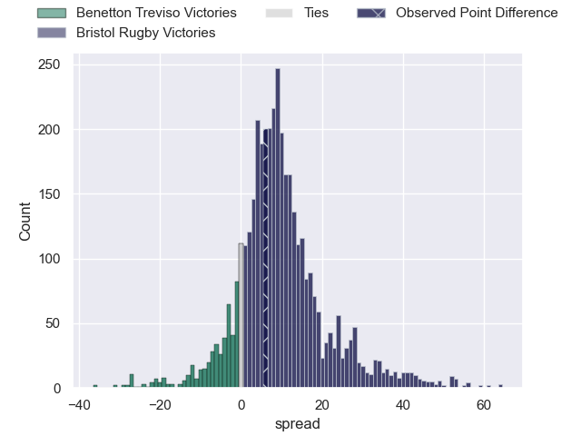
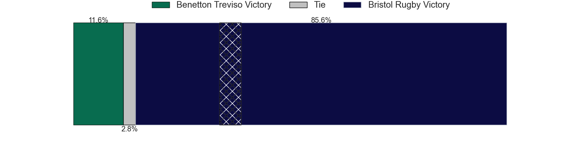
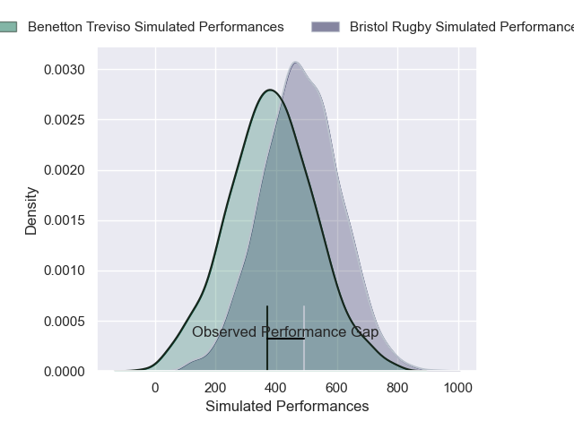
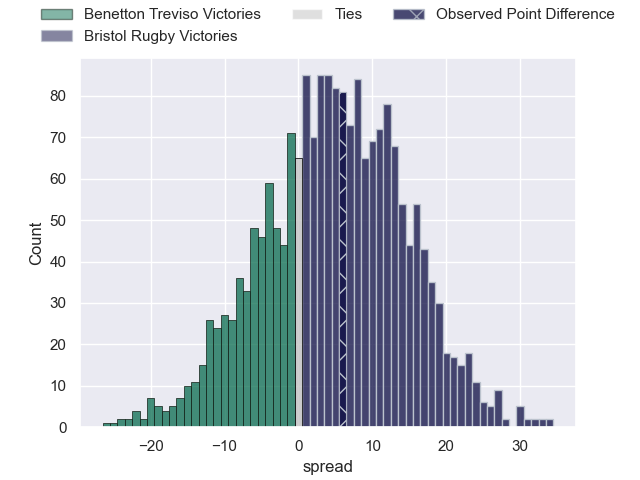
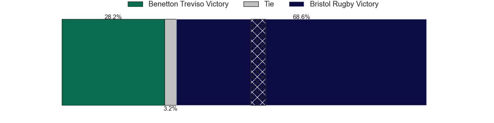

---  
layout: page  
title: Benetton Treviso at Bristol Rugby; 29-35  
date: 2025-01-12 18:00:00 -0500  
categories: "European Rugby Champions Cup 2024" match review  
---
# Benetton Treviso at Bristol Rugby; 29-35

# Club Level Predictions

The first set of predictions treats a club as the smallest object, as the club develops its members, organizes a gameplan, and deploys its players as needed for each match. This club model has a prediction of 0.731, which translates to predicting Bristol Rugby to win by 8.8.

Our Over/Under is 63.5 - and combined with the spread above, we have a predicted scoreline of 27 to 36

Each club has a rating and a rating deviation (similar to a Glicko rating), and expected performances can be generated. This allows for simulated matches and spreads like the ones below.
## Projected Performances - Club Model

## Projected Spreads - Club Model

## Projected Results - Club Model

# Player Level Predictions

Treating teams instead as an entity made up of the currently active players, I have ratings for each player in an altogether different system. These can be combined to form team ratings once teamsheets are announced, weighting starters a bit higher than the reserves. After the match is played, players can be weighted by their minutes on the field, allowing for an accurate measure of the team's composition. With these compiled team ratings, we can make predictions, measure inaccuracy, and update the individual player ratings.
## Prediction without Player Minutes: Bristol Rugby by 6.3

Benetton Treviso by 0.7 on a neutral pitch

## Projected Performances - Player Model

## Projected Spreads - Player Model

## Projected Results - Player Model

|   Away Minutes | Away Player        |   Away Percentile |   Number |   Home Percentile | Home Player       |   Home Minutes |
|---------------:|:-------------------|------------------:|---------:|------------------:|:------------------|---------------:|
|             80 | Thomas Gallo       |             93.72 |        1 |             92.19 | Yann Thomas       |             80 |
|             80 | Siua Maile         |              1.61 |        2 |             89.78 | Harry Thacker     |             80 |
|             80 | Giosue Zilocchi    |             44.91 |        3 |             35.4  | Max Lahiff        |             80 |
|             80 | Niccolo Cannone    |             45.11 |        4 |             77.9  | Joe Owen          |             80 |
|             80 | Federico Ruzza     |             96.54 |        5 |             80.35 | Joe Batley        |             80 |
|             80 | Michele Lamaro     |             96.04 |        6 |             93.81 | Santiago Grondona |             80 |
|             80 | Manuel Zuliani     |             63.39 |        7 |             95.03 | Fitz Harding      |             80 |
|             80 | Lorenzo Cannone    |             94.8  |        8 |             58.63 | Viliame Mata      |             80 |
|             80 | Andy Uren          |             12.41 |        9 |             95.14 | Kieran Marmion    |             80 |
|             80 | Tomas Albornoz     |             82.53 |       10 |             86.9  | Harry Byrne       |             80 |
|             80 | Onisi Ratave       |             51.47 |       11 |             86.27 | Noah Heward       |             80 |
|             80 | Juan Ignacio Brex  |             95.56 |       12 |             74.22 | James Williams    |             80 |
|             80 | Tommaso Menoncello |             92.56 |       13 |             82.33 | Kalaveti Ravouvou |             80 |
|             80 | Matt Gallagher     |             95.69 |       14 |              5.29 | Jack Bates        |             80 |
|             80 | Rhyno Smith        |             88.65 |       15 |             79.26 | Benjamin Elizalde |             80 |

