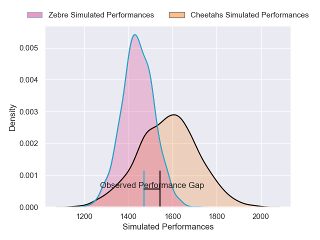
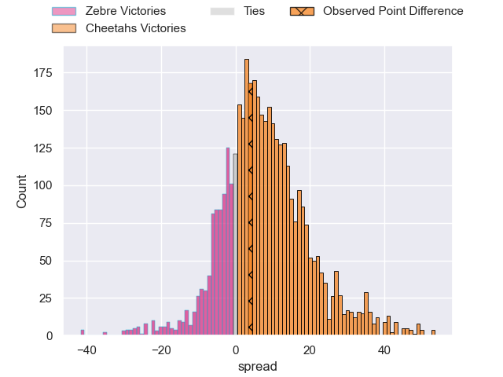
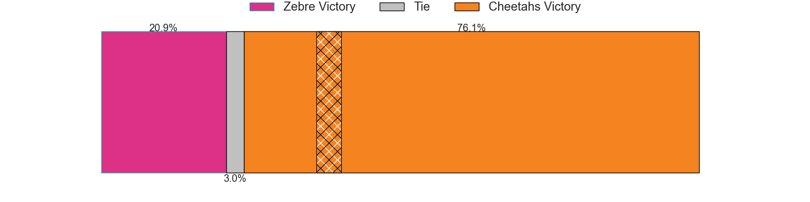
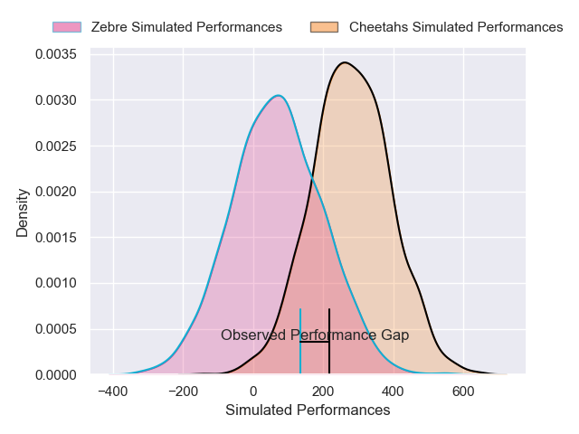
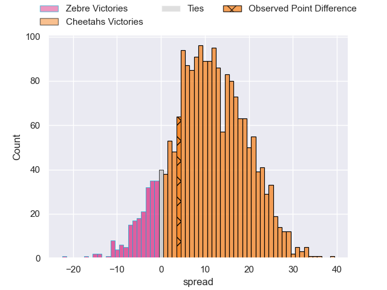
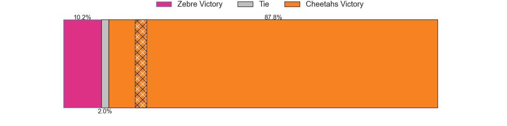

---  
layout: page  
title: Zebre at Cheetahs; 18-22  
date: 2025-01-12 18:00:00 -0500  
categories: "European Rugby Challenge Cup 2024" match review  
---
# Zebre at Cheetahs; 18-22

# Club Level Predictions

The first set of predictions treats a club as the smallest object, as the club develops its members, organizes a gameplan, and deploys its players as needed for each match. This club model has a prediction of 0.683, which translates to predicting Cheetahs to win by 6.8.

Our Over/Under is 51.5 - and combined with the spread above, we have a predicted scoreline of 22 to 29

Each club has a rating and a rating deviation (similar to a Glicko rating), and expected performances can be generated. This allows for simulated matches and spreads like the ones below.
## Projected Performances - Club Model

## Projected Spreads - Club Model

## Projected Results - Club Model

# Player Level Predictions

Treating teams instead as an entity made up of the currently active players, I have ratings for each player in an altogether different system. These can be combined to form team ratings once teamsheets are announced, weighting starters a bit higher than the reserves. After the match is played, players can be weighted by their minutes on the field, allowing for an accurate measure of the team's composition. With these compiled team ratings, we can make predictions, measure inaccuracy, and update the individual player ratings.
## Prediction without Player Minutes: Cheetahs by 12.4

Cheetahs by 6.6 on a neutral pitch

## Projected Performances - Player Model

## Projected Spreads - Player Model

## Projected Results - Player Model

|   Away Minutes | Away Player           |   Away Percentile |   Number |   Home Percentile | Home Player              |   Home Minutes |
|---------------:|:----------------------|------------------:|---------:|------------------:|:-------------------------|---------------:|
|             10 | Danilo Fischetti      |             57.16 |        1 |             56.64 | Hencus van Wyk           |             80 |
|             25 | Tommaso Di Bartolomeo |             59.18 |        2 |             88.95 | Louis van der Westhuizen |             80 |
|             80 | Muhamed Hasa          |             13.03 |        3 |             13.71 | Aranos Coetzee           |             17 |
|             80 | Matteo Canali         |             94.02 |        4 |             47.36 | Pieter Jansen van Vuuren |             61 |
|             80 | Leonard Krumov        |              4.87 |        5 |             84.99 | Victor Sekekete          |             13 |
|             80 | Giacomo Ferrari       |             58.6  |        6 |             84.6  | Daniel Johannes Maartens |             75 |
|             23 | Samuele Locatelli     |             72.1  |        7 |             95.5  | Friedle Olivier          |             59 |
|             80 | Giovanni Licata       |             11.9  |        8 |             30.3  | Jeandre Rudolph          |             80 |
|             27 | Thomas Dominguez      |             20.93 |        9 |             62.08 | Ruben de Haas            |             63 |
|             29 | Giovanni Montemauri   |              4.2  |       10 |             53.1  | Ethan SJ Wentzel         |             75 |
|             80 | Simone Gesi           |             16.58 |       11 |             34.16 | Prince Nkabinde          |             80 |
|             80 | Fetuli Paea           |             22.23 |       12 |             64.1  | Ali Mgijima              |             70 |
|             10 | Luca Morisi           |             94.79 |       13 |              0.11 | Carel-Jan Coetzee        |             53 |
|             10 | Jacopo Trulla         |             21.92 |       14 |             84.9  | Munier Hartzenberg       |             23 |
|             19 | Giacomo Da Re         |             14.16 |       15 |             36.95 | Michael Annies           |             80 |
|             80 | Luca Rizzoli          |             75.38 |       16 |            nan    | Vernon Paulo             |             16 |
|             80 | Luca Bigi             |             76.83 |       17 |             97.68 | Corne Fourie             |             16 |
|             80 | Bautista Stavile      |             17.4  |       18 |            nan    | Pierre-Raymond Uys       |             16 |
|             80 | Juan Pitinari         |             54.94 |       19 |            nan    | Laurence Herbert Victor  |             40 |
|             80 | Scott Gregory         |             80.75 |       20 |            nan    | Sisonke Vumazonke        |             31 |
|            nan | nan                   |            nan    |       21 |             75.62 | Cohen Jasper             |             40 |
|            nan | nan                   |            nan    |       22 |            nan    | Jandre Nel               |             31 |

