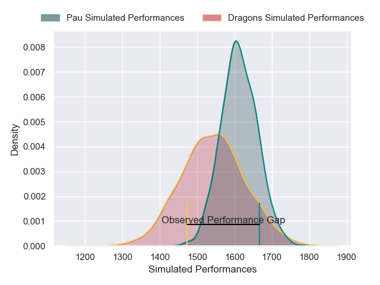
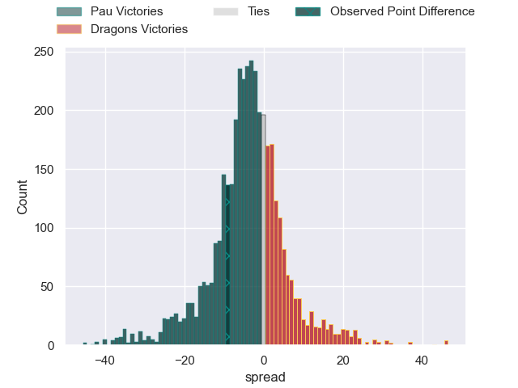
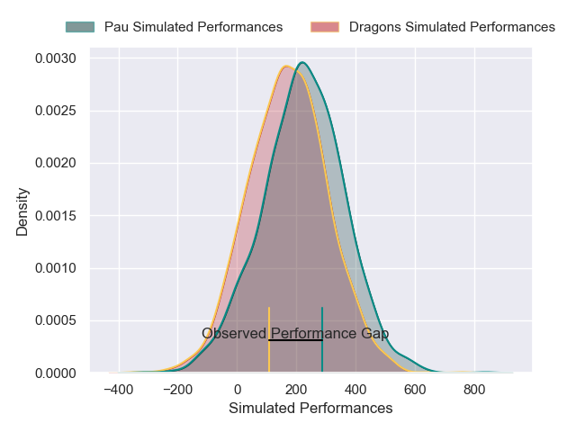
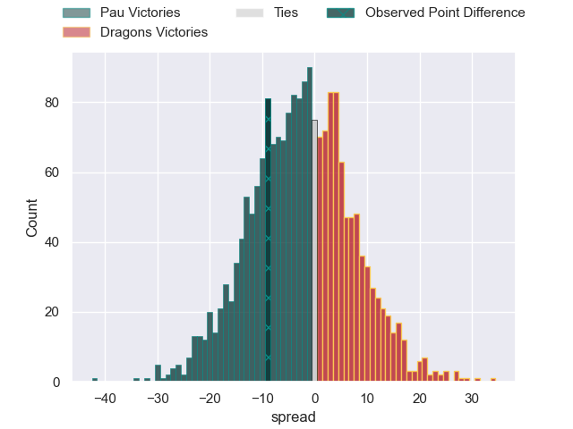

---  
layout: page  
title: Pau at Dragons; 24-15  
date: 2025-01-12 18:00:00 -0500  
categories: "European Rugby Challenge Cup 2024" match review  
---
# Pau at Dragons; 24-15

# Club Level Predictions

The first set of predictions treats a club as the smallest object, as the club develops its members, organizes a gameplan, and deploys its players as needed for each match. This club model has a prediction of 0.399, which translates to predicting Pau to win by 3.6.

Our Over/Under is 56.5 - and combined with the spread above, we have a predicted scoreline of 30 to 27

Each club has a rating and a rating deviation (similar to a Glicko rating), and expected performances can be generated. This allows for simulated matches and spreads like the ones below.
## Projected Performances - Club Model

## Projected Spreads - Club Model

## Projected Results - Club Model

# Player Level Predictions

Treating teams instead as an entity made up of the currently active players, I have ratings for each player in an altogether different system. These can be combined to form team ratings once teamsheets are announced, weighting starters a bit higher than the reserves. After the match is played, players can be weighted by their minutes on the field, allowing for an accurate measure of the team's composition. With these compiled team ratings, we can make predictions, measure inaccuracy, and update the individual player ratings.
## Prediction without Player Minutes: Pau by 3.1

Pau by 13.1 on a neutral pitch

## Projected Performances - Player Model

## Projected Spreads - Player Model

## Projected Results - Player Model

|   Away Minutes | Away Player        |   Away Percentile |   Number |   Home Percentile | Home Player        |   Home Minutes |
|---------------:|:-------------------|------------------:|---------:|------------------:|:-------------------|---------------:|
|             80 | Remi Seneca        |             79.71 |        1 |             40.75 | Rodrigo Martinez   |             80 |
|             80 | Romain Ruffenach   |             72.76 |        2 |             75.45 | Elliot Dee         |             80 |
|             80 | Jon Zabala         |             24.53 |        3 |             14.94 | Chris Coleman      |             80 |
|             80 | Hugo Auradou       |             50.71 |        4 |              6.42 | Joseph Davies      |             80 |
|             80 | Jimi Maximin       |             51.63 |        5 |             38.49 | Barny Langton      |             80 |
|             80 | Mehdi Tlili        |             72.41 |        6 |              3.35 | Shane Lewis-Hughes |             80 |
|             80 | Reece Hewat        |             85.29 |        7 |             35.4  | George Young       |             80 |
|             80 | Thibaut Hamonou    |              8.52 |        8 |             28.07 | Taine Basham       |             80 |
|             80 | Dan Robson         |             98.92 |        9 |             38.67 | Che Hope           |             80 |
|             80 | Axel Desperes      |             91.7  |       10 |              5.02 | Angus O'Brien      |             80 |
|             80 | Gregoire Arfeuil   |             50.29 |       11 |              1.08 | Jared Rosser       |             80 |
|             80 | Fabien Brau-Boirie |             84.78 |       12 |              9.78 | Harri Ackerman     |             80 |
|             80 | Elliot Roudil      |             46.89 |       13 |             27.44 | Joe Westwood       |             80 |
|             80 | Theo Attissogbe    |             20    |       14 |              4.51 | Rio Dyer           |             80 |
|             80 | Clement Mondinat   |             42.79 |       15 |             11.79 | Cai Evans          |             80 |

