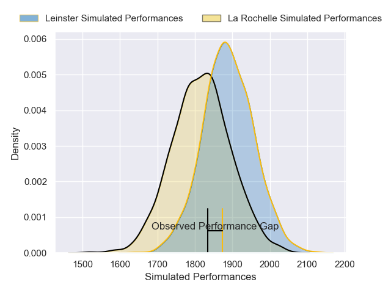
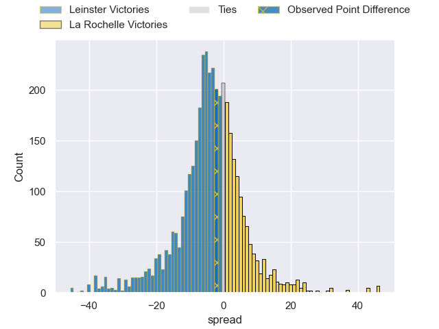
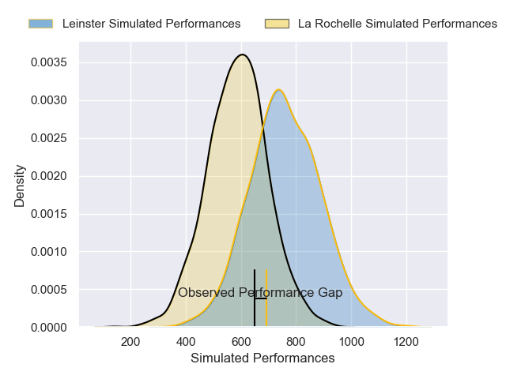
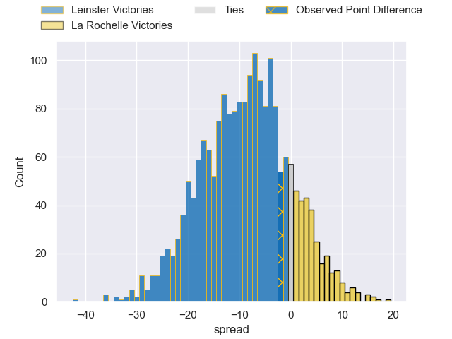
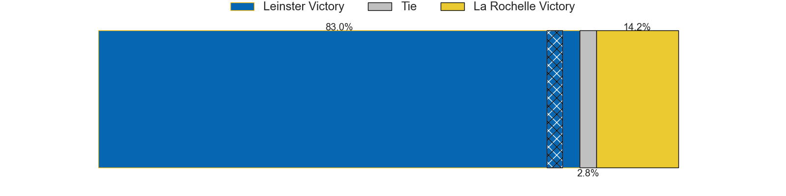

---  
layout: page  
title: Leinster at La Rochelle; 16-14  
date: 2025-01-12 18:00:00 -0500  
categories: "European Rugby Champions Cup 2024" match review  
---
# Leinster at La Rochelle; 16-14

# Club Level Predictions

The first set of predictions treats a club as the smallest object, as the club develops its members, organizes a gameplan, and deploys its players as needed for each match. This club model has a prediction of 0.398, which translates to predicting Leinster to win by 3.7.

Our Over/Under is 40.5 - and combined with the spread above, we have a predicted scoreline of 22 to 18

Each club has a rating and a rating deviation (similar to a Glicko rating), and expected performances can be generated. This allows for simulated matches and spreads like the ones below.
## Projected Performances - Club Model

## Projected Spreads - Club Model

## Projected Results - Club Model

# Player Level Predictions

Treating teams instead as an entity made up of the currently active players, I have ratings for each player in an altogether different system. These can be combined to form team ratings once teamsheets are announced, weighting starters a bit higher than the reserves. After the match is played, players can be weighted by their minutes on the field, allowing for an accurate measure of the team's composition. With these compiled team ratings, we can make predictions, measure inaccuracy, and update the individual player ratings.
## Prediction without Player Minutes: La Rochelle by 3.4

Leinster by 8.1 on a neutral pitch

## Projected Performances - Player Model

## Projected Spreads - Player Model

## Projected Results - Player Model

|   Away Minutes | Away Player         |   Away Percentile |   Number |   Home Percentile | Home Player           |   Home Minutes |
|---------------:|:--------------------|------------------:|---------:|------------------:|:----------------------|---------------:|
|             61 | Cian Healy          |             93.61 |        1 |             94.8  | Reda Wardi            |             10 |
|             47 | Ronan Kelleher      |             96.97 |        2 |             44.74 | Quentin Lespiaucq     |              5 |
|             80 | Tadhg Furlong       |             97.27 |        3 |             97.79 | Uini Atonio           |             26 |
|             52 | Joe McCarthy        |             81.54 |        4 |             88.44 | Thomas Lavault        |             80 |
|             80 | James Ryan          |             97.57 |        5 |             80.12 | Kane Douglas          |             32 |
|             32 | Ryan Baird          |             86.5  |        6 |              5.7  | Paul Boudehent        |             80 |
|             32 | Josh van der Flier  |             99    |        7 |             68.2  | Oscar Jegou           |             80 |
|             80 | Caelan Doris        |             95.67 |        8 |             98.27 | Gregory Alldritt      |             80 |
|             55 | Jamison Gibson-Park |             96.24 |        9 |             97.85 | Tawera Kerr-Barlow    |              7 |
|             18 | Sam Prendergast     |             23.67 |       10 |             65.04 | Antoine Hastoy        |             80 |
|             28 | Jamie Osborne       |             94.87 |       11 |             97.53 | Dillyn Leyds          |             61 |
|             17 | Robbie Henshaw      |             96.53 |       12 |             89.7  | Jules Favre           |             26 |
|             59 | Garry Ringrose      |             99.24 |       13 |             84.49 | Ulupano Seuteni       |             67 |
|             57 | Jimmy O'Brien       |             94.27 |       14 |             96.35 | Jack Nowell           |             80 |
|             80 | Jordie Barrett      |             89.82 |       15 |             99.78 | Brice Dulin           |             72 |
|             22 | Andrew Porter       |             88.42 |       16 |             13.88 | Georges-Henri Colombe |             46 |
|             80 | Rabah Slimani       |             92.93 |       17 |             43.1  | Alexandre Kaddouri    |             80 |
|             80 | Gus McCarthy        |             60.47 |       18 |             65.92 | Ultan Dillane         |             47 |
|             80 | RG Snyman           |             99.7  |       19 |             16.33 | Judicael Cancoriet    |             26 |
|             65 | Jack Conan          |             97.84 |       20 |             95    | Levani Botia          |             15 |
|             75 | Luke McGrath        |             98.57 |       21 |             61.99 | Hoani Bosmorin        |             50 |
|             48 | Ross Byrne          |             94.25 |       22 |             57.2  | Matthias Haddad       |             40 |
|             42 | Ciaran Frawley      |             48.81 |       23 |            nan    | nan                   |            nan |

