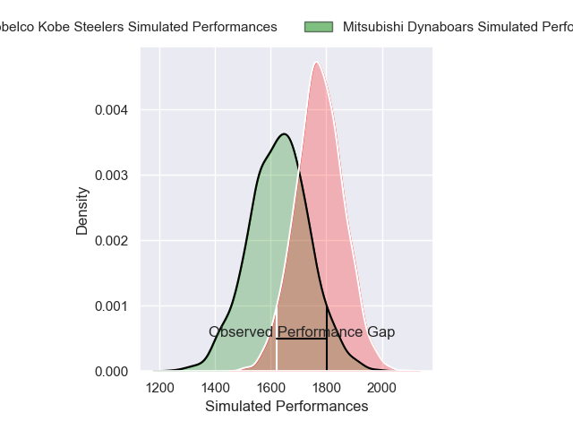
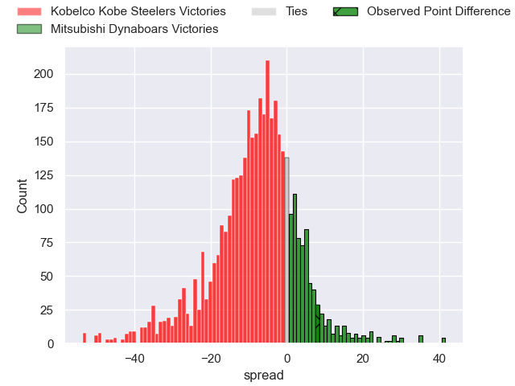
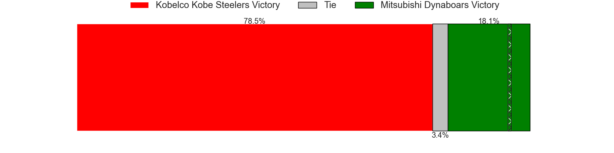
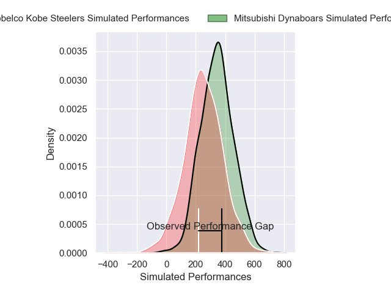
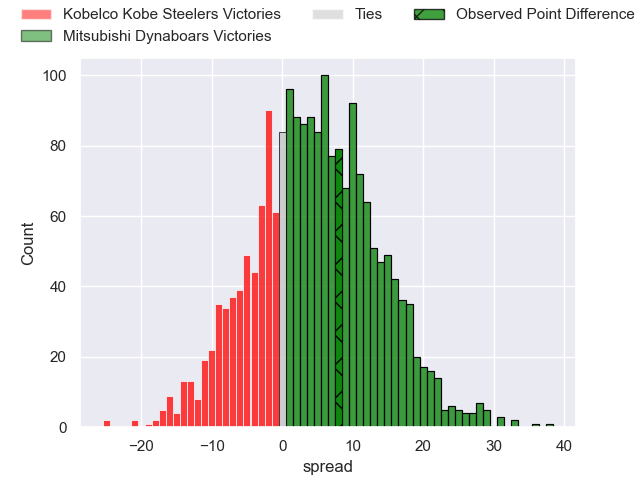
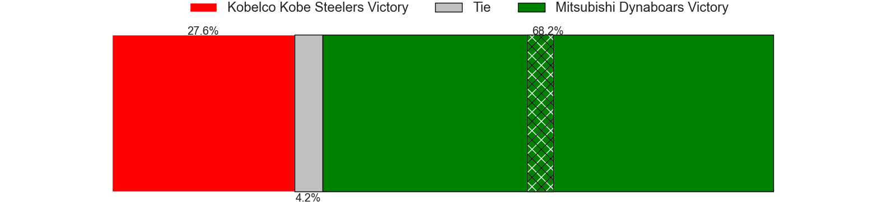

---  
layout: page  
title: Kobelco Kobe Steelers at Mitsubishi Dynaboars; 26-34  
date: 2025-01-12 18:00:00 -0500  
categories: "Japan Rugby League One 2024" match review  
---
# Kobelco Kobe Steelers at Mitsubishi Dynaboars; 26-34

# Club Level Predictions

The first set of predictions treats a club as the smallest object, as the club develops its members, organizes a gameplan, and deploys its players as needed for each match. This club model has a prediction of 0.307, which translates to predicting Kobelco Kobe Steelers to win by 7.3.

Our Over/Under is 50.5 - and combined with the spread above, we have a predicted scoreline of 29 to 21

Each club has a rating and a rating deviation (similar to a Glicko rating), and expected performances can be generated. This allows for simulated matches and spreads like the ones below.
## Projected Performances - Club Model

## Projected Spreads - Club Model

## Projected Results - Club Model

# Player Level Predictions

Treating teams instead as an entity made up of the currently active players, I have ratings for each player in an altogether different system. These can be combined to form team ratings once teamsheets are announced, weighting starters a bit higher than the reserves. After the match is played, players can be weighted by their minutes on the field, allowing for an accurate measure of the team's composition. With these compiled team ratings, we can make predictions, measure inaccuracy, and update the individual player ratings.
## Prediction without Player Minutes: Mitsubishi Dynaboars by 3.8

Mitsubishi Dynaboars by 0.6 on a neutral pitch

## Projected Performances - Player Model

## Projected Spreads - Player Model

## Projected Results - Player Model

|   Away Minutes | Away Player       |   Away Percentile |   Number |   Home Percentile | Home Player       |   Home Minutes |
|---------------:|:------------------|------------------:|---------:|------------------:|:------------------|---------------:|
|             47 | Shigure Takao     |             60.89 |        1 |              6.31 | Hayato Hosoda     |             40 |
|             40 | Takuya Kitade     |             87.05 |        2 |              5.58 | Lee Seung Hyok    |             34 |
|             52 | Sho Maeda         |             48.78 |        3 |             97.06 | Tomoaki Ishii     |             46 |
|             33 | Waisake Raratubua |             73.44 |        4 |             68.21 | Walt Steenkamp    |             28 |
|             33 | Brodie Retallick  |            100    |        5 |             19.92 | Daniel Linde      |             36 |
|              8 | Sosefo Fakatava   |             66.32 |        6 |             69.31 | Kyo Yoshida       |             80 |
|             16 | Willie Potgieter  |             26.98 |        7 |             93.82 | Masataka Tsuruya  |             64 |
|             80 | Tiennan Costley   |             60.51 |        8 |             59.45 | Jackson Hemopo    |             28 |
|             40 | Daiki Nakajima    |             31.16 |        9 |             73.37 | Kota Iwamura      |             16 |
|             80 | Seungsin Lee      |              1.32 |       10 |             92.05 | Jack Stratton     |             80 |
|             40 | Kanta Matsunaga   |             74.13 |       11 |             72.65 | Satoshi Koizumi   |             80 |
|             56 | Timothy Lafaele   |             44.21 |       12 |             92.5  | Charlie Lawrence  |             64 |
|             80 | Michael Little    |             67.14 |       13 |             80.15 | Curtis Rona       |             40 |
|             13 | Rakuhei Yamashita |             93.95 |       14 |             98.22 | Kurt-Lee Arendse  |             80 |
|             80 | Ryohei Yamanaka   |             65.93 |       15 |             11.43 | Kazuki Ishida     |             40 |
|             80 | Hiroshi Yamashita |             95.71 |       16 |            nan    | Rento Tsukayama   |             80 |
|             80 | Naohiro Kotaki    |             30.99 |       17 |             54.84 | Jun Morimoto      |             80 |
|             80 | Ngani Laumape     |             88.64 |       18 |            nan    | Riku Mishima      |             47 |
|             80 | Atsushi Hiwasa    |             90.76 |       19 |             61.59 | James Grayson     |             65 |
|             80 | Kenta Matsuoka    |             71.22 |       20 |            nan    | Timote Tavalea    |             64 |
|             80 | Junta Hamano      |             16.55 |       21 |             30.76 | Yuki Miyazato     |             16 |
|             67 | Takara Imamura    |             51.49 |       22 |             77.95 | Joichiro Iwashita |             40 |
|             23 | Hikaru Moriwaki   |            nan    |       23 |            nan    | nan               |            nan |

