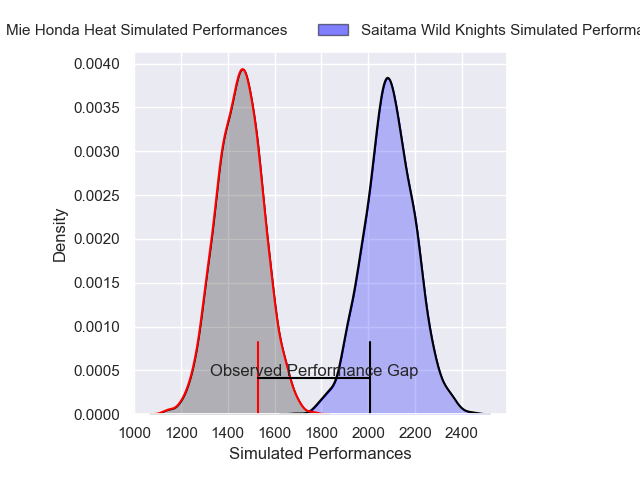
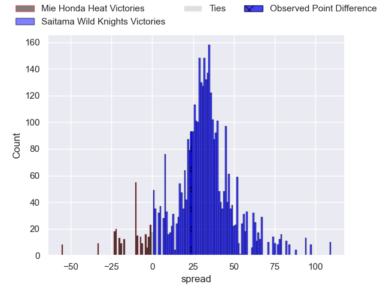
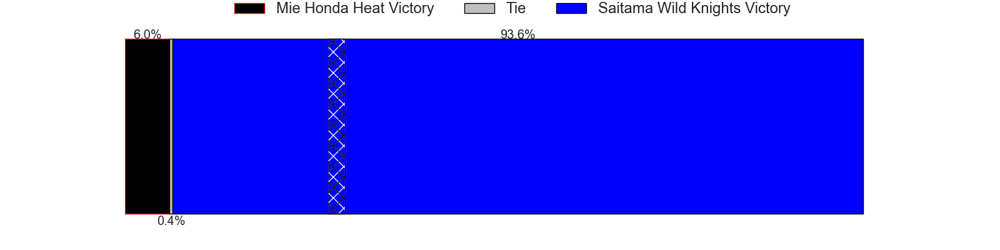
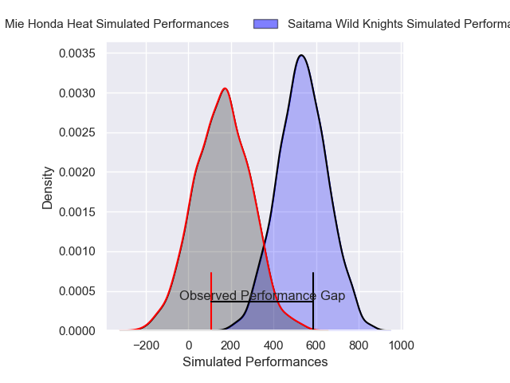
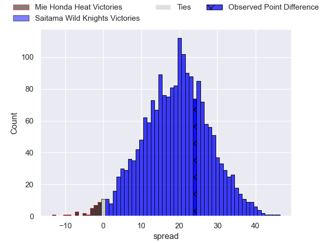
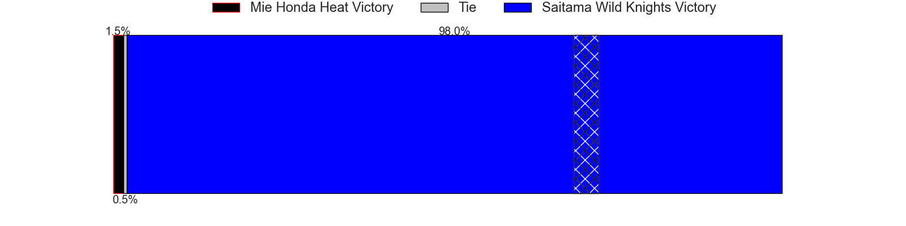

---  
layout: page  
title: Mie Honda Heat at Saitama Wild Knights; 24-48  
date: 2025-01-12 18:00:00 -0500  
categories: "Japan Rugby League One 2024" match review  
---
# Mie Honda Heat at Saitama Wild Knights; 24-48

# Club Level Predictions

The first set of predictions treats a club as the smallest object, as the club develops its members, organizes a gameplan, and deploys its players as needed for each match. This club model has a prediction of 0.971, which translates to predicting Saitama Wild Knights to win by 32.0.

Our Over/Under is 50.5 - and combined with the spread above, we have a predicted scoreline of 9 to 41

Each club has a rating and a rating deviation (similar to a Glicko rating), and expected performances can be generated. This allows for simulated matches and spreads like the ones below.
## Projected Performances - Club Model

## Projected Spreads - Club Model

## Projected Results - Club Model

# Player Level Predictions

Treating teams instead as an entity made up of the currently active players, I have ratings for each player in an altogether different system. These can be combined to form team ratings once teamsheets are announced, weighting starters a bit higher than the reserves. After the match is played, players can be weighted by their minutes on the field, allowing for an accurate measure of the team's composition. With these compiled team ratings, we can make predictions, measure inaccuracy, and update the individual player ratings.
## Prediction without Player Minutes: Saitama Wild Knights by 22.3

Saitama Wild Knights by 17.7 on a neutral pitch

## Projected Performances - Player Model

## Projected Spreads - Player Model

## Projected Results - Player Model

|   Away Minutes | Away Player            |   Away Percentile |   Number |   Home Percentile | Home Player       |   Home Minutes |
|---------------:|:-----------------------|------------------:|---------:|------------------:|:------------------|---------------:|
|             24 | Kanato Hirano          |             30.45 |        1 |             90.66 | Keita Inagaki     |             40 |
|             70 | Ikuma Yamada           |             52.88 |        2 |             75    | Atsushi Sakate    |             80 |
|             62 | Katsuyuki Hoshino      |             16.9  |        3 |             91.42 | Taiki Fujii       |             80 |
|             80 | Connor Wihongi         |             55.23 |        4 |             83.6  | Liam Mitchell     |             34 |
|             40 | Franco Mostert         |             95.37 |        5 |             85.31 | Esei Ha'angana    |             24 |
|             40 | Tevita Tupou           |             75.08 |        6 |             94.54 | Ben Gunter        |             80 |
|             40 | Ryota Kobayashi        |              6.8  |        7 |             98.76 | Lachlan Boshier   |             15 |
|             40 | Pablo Matera           |             99.79 |        8 |             97.03 | Jack Cornelsen    |             80 |
|             80 | Azuma Doei             |             71.01 |        9 |             51.81 | Shu Hagihara      |             80 |
|             80 | Hayata Nakao           |             73.95 |       10 |             82.12 | Kyohei Yamasawa   |             80 |
|             80 | Lomano Lemeki          |             85.93 |       11 |             27.35 | Tomoki Osada      |             40 |
|             53 | Dawid Kellerman        |             10.36 |       12 |             99.45 | Damian de Allende |             40 |
|             80 | Kyogo Okano            |             40.79 |       13 |             98.35 | Dylan Riley       |             46 |
|             65 | Haruhiko Uemura        |              9.71 |       14 |             97.52 | Koki Takeyama     |             18 |
|             80 | FC du Plessis          |             60    |       15 |             98.02 | Ryuji Noguchi     |             80 |
|             80 | Tatsuhiko Tsurukawa    |              4.63 |       16 |             63.58 | Craig Millar      |             67 |
|             23 | Janko Swanepoel        |             87.32 |       17 |             98.66 | Ryota Hasegawa    |             80 |
|             27 | Koki Hida              |             37.41 |       18 |             98.32 | Asaeli Ai Valu    |             40 |
|             80 | Feinga Kihe Lotu Fakai |            nan    |       19 |             80.04 | Kazuma Shimane    |             56 |
|             17 | Manu Vunipola          |             63.8  |       20 |             69.82 | Ockie Barnard     |             40 |
|             23 | Jonathan Faauli        |             87.54 |       21 |             70.01 | Vince Aso         |             52 |
|             61 | Takuro Hojo            |             54.53 |       22 |            nan    | nan               |            nan |
|             57 | Talifolofola Tangipa   |             33.12 |       23 |            nan    | nan               |            nan |

