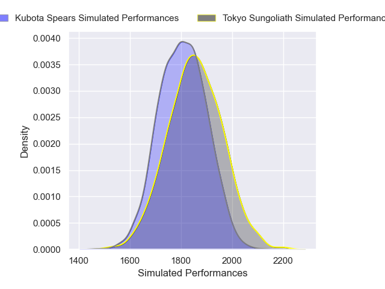
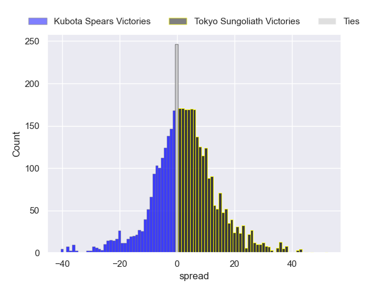
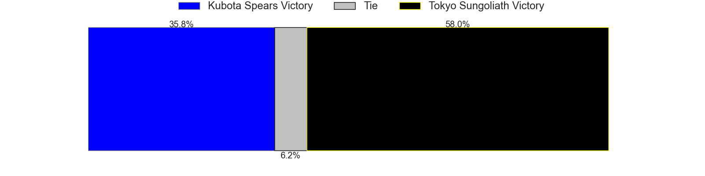
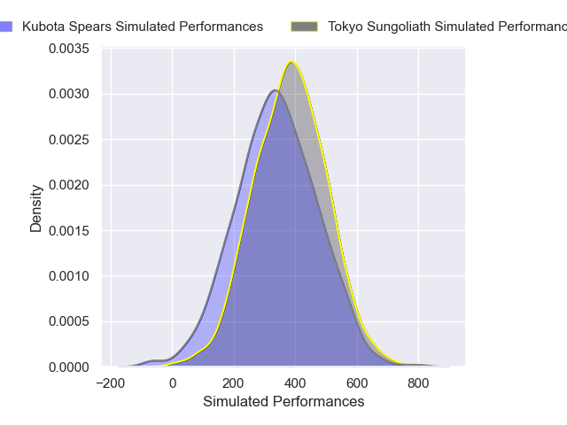
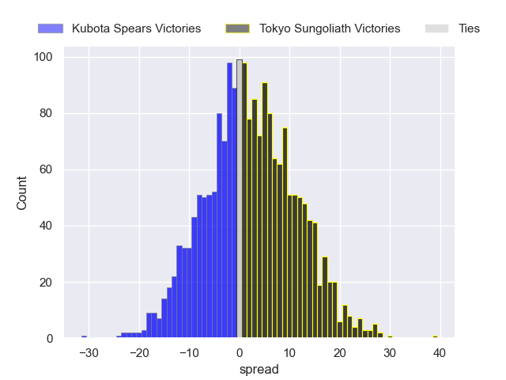

---  
layout: page  
title: Kubota Spears at Tokyo Sungoliath; 26-26  
date: 2025-01-12 18:00:00 -0500  
categories: "Japan Rugby League One 2024" match review  
---
# Kubota Spears at Tokyo Sungoliath; 26-26

# Club Level Predictions

The first set of predictions treats a club as the smallest object, as the club develops its members, organizes a gameplan, and deploys its players as needed for each match. This club model has a prediction of 0.563, which translates to predicting Tokyo Sungoliath to win by 2.3.

Our Over/Under is 52.5 - and combined with the spread above, we have a predicted scoreline of 25 to 27

Each club has a rating and a rating deviation (similar to a Glicko rating), and expected performances can be generated. This allows for simulated matches and spreads like the ones below.
## Projected Performances - Club Model

## Projected Spreads - Club Model

## Projected Results - Club Model

# Player Level Predictions

Treating teams instead as an entity made up of the currently active players, I have ratings for each player in an altogether different system. These can be combined to form team ratings once teamsheets are announced, weighting starters a bit higher than the reserves. After the match is played, players can be weighted by their minutes on the field, allowing for an accurate measure of the team's composition. With these compiled team ratings, we can make predictions, measure inaccuracy, and update the individual player ratings.
## Prediction without Player Minutes: Tokyo Sungoliath by 3.6

Kubota Spears by 1.2 on a neutral pitch

## Projected Performances - Player Model

## Projected Spreads - Player Model

## Projected Results - Player Model

|   Away Minutes | Away Player            |   Away Percentile |   Number |   Home Percentile | Home Player         |   Home Minutes |
|---------------:|:-----------------------|------------------:|---------:|------------------:|:--------------------|---------------:|
|             64 | Kota Kaishi            |             91.51 |        1 |             55.68 | Kenta Kobayashi     |             40 |
|             44 | Hayate Era             |             67.99 |        2 |             71.94 | Kosuke Horikoshi    |             80 |
|             15 | Keijiro Tamefusa       |             65.35 |        3 |             31.62 | Kan Nakano          |             23 |
|             65 | David Van Zeeland      |             49.3  |        4 |             17.71 | Trevor Hosea        |             80 |
|             16 | David Bulbring         |             84.71 |        5 |             98.69 | Harry Hockings      |             18 |
|             80 | Tyler Paul             |             97.94 |        6 |             68.69 | Kanji Shimokawa     |              9 |
|             80 | Takeo Suenaga          |             90.73 |        7 |             51.7  | Kai Yamamoto        |             22 |
|             80 | Faulua Makisi          |             87.47 |        8 |             97.88 | Sean McMahon        |             15 |
|             80 | Shinobu Fujiwara       |             63.95 |        9 |             79.71 | Yutaka Nagare       |             40 |
|             13 | Bernard Foley          |             99.56 |       10 |             57.62 | Mikiya Takamoto     |             32 |
|             72 | Haruto Kida            |             78.99 |       11 |             99.8  | Cheslin Kolbe       |             32 |
|             62 | Yuya Hirose            |             56.56 |       12 |             91.29 | Ryoto Nakamura      |             23 |
|             57 | Rikus Pretorius        |             39.8  |       13 |             54.36 | Isaiah Punivai      |             65 |
|             15 | Halatoa Vailea         |             79.88 |       14 |             90.49 | Seiya Ozaki         |             71 |
|             80 | Gerhard van den Heever |             92.97 |       15 |             30.99 | Ryosuke Kawase      |             57 |
|             23 | Asipeli Moala          |            nan    |       16 |            nan    | Kienori Go          |             80 |
|             58 | Tomoki Kishioka        |             48.12 |       17 |             75.7  | Sota Oketani        |             54 |
|             40 | Yota Kamimori          |             59.71 |       18 |             94.77 | Sam Jeffries        |             80 |
|              9 | Bryn Hall              |             97.46 |       19 |             91    | Yukio Morikawa      |             80 |
|             71 | Esi Sword              |            nan    |       20 |             87.38 | Shinnosuke Kakinaga |             57 |
|             80 | Akira Ieremia          |            nan    |       21 |             13.38 | Tamati Ioane        |             80 |
|             80 | Kanji Futamura         |            nan    |       22 |             71.85 | Taiga Ozaki         |             80 |
|             40 | Rikuto Fukuda          |             68.53 |       23 |             75.36 | Kenta Fukuda        |             80 |

