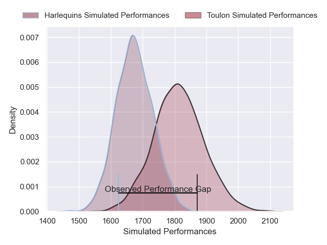
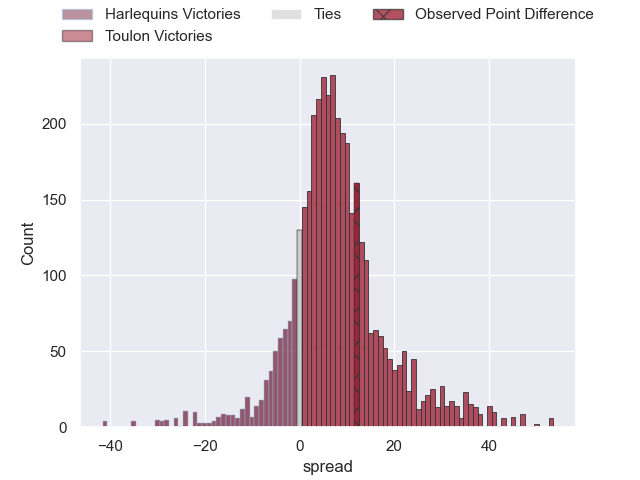
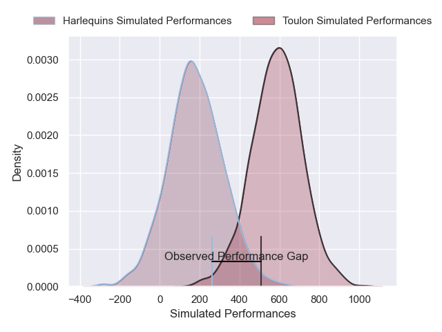
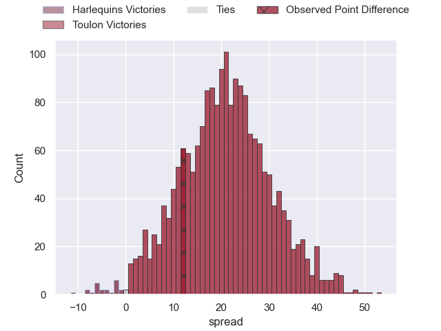

---  
layout: page  
title: Harlequins at Toulon; 21-33  
date: 2025-01-12 18:00:00 -0500  
categories: "European Rugby Champions Cup 2024" match review  
---
# Harlequins at Toulon; 21-33

# Club Level Predictions

The first set of predictions treats a club as the smallest object, as the club develops its members, organizes a gameplan, and deploys its players as needed for each match. This club model has a prediction of 0.686, which translates to predicting Toulon to win by 6.9.

Our Over/Under is 50.5 - and combined with the spread above, we have a predicted scoreline of 22 to 28

Each club has a rating and a rating deviation (similar to a Glicko rating), and expected performances can be generated. This allows for simulated matches and spreads like the ones below.
## Projected Performances - Club Model

## Projected Spreads - Club Model

## Projected Results - Club Model

# Player Level Predictions

Treating teams instead as an entity made up of the currently active players, I have ratings for each player in an altogether different system. These can be combined to form team ratings once teamsheets are announced, weighting starters a bit higher than the reserves. After the match is played, players can be weighted by their minutes on the field, allowing for an accurate measure of the team's composition. With these compiled team ratings, we can make predictions, measure inaccuracy, and update the individual player ratings.
## Prediction without Player Minutes: Toulon by 22.3

Toulon by 10.8 on a neutral pitch

## Projected Performances - Player Model

## Projected Spreads - Player Model

## Projected Results - Player Model

|   Away Minutes | Away Player     |   Away Percentile |   Number |   Home Percentile | Home Player        |   Home Minutes |
|---------------:|:----------------|------------------:|---------:|------------------:|:-------------------|---------------:|
|             80 | Fin Baxter      |              8.15 |        1 |             87.52 | Dany Priso         |             80 |
|             80 | Jack Walker     |             26.7  |        2 |             81.72 | Gianmarco Lucchesi |             80 |
|             80 | Titi Lamositele |             72.07 |        3 |             93.21 | Kyle Sinckler      |             80 |
|             80 | Joe Launchbury  |             98.68 |        4 |             40.33 | Matthias Halagahu  |             80 |
|             80 | George Hammond  |             36.05 |        5 |             77.6  | David Ribbans      |             80 |
|             80 | James Chisholm  |             95.54 |        6 |             54.46 | Lewis Ludlam       |             80 |
|             80 | Jack Kenningham |             90.97 |        7 |             76.37 | Esteban Abadie     |             80 |
|             80 | Alex Dombrandt  |             80.67 |        8 |             82.95 | Facundo Isa        |             80 |
|             80 | Will Porter     |             53.06 |        9 |             97.66 | Baptiste Serin     |             80 |
|             80 | Marcus Smith    |             87.77 |       10 |             83.19 | Paolo Garbisi      |             80 |
|             80 | Cadan Murley    |             10.39 |       11 |             93.53 | Jiuta Wainiqolo    |             80 |
|             80 | Luke Northmore  |             77.11 |       12 |              7.44 | Jérémy Sinzelle    |             80 |
|             80 | Oscar Beard     |             40.67 |       13 |             97.44 | Antoine Frisch     |             80 |
|             80 | Nick David      |             73.04 |       14 |             23.24 | Gael Drean         |             80 |
|             80 | Tyrone Green    |             30.35 |       15 |             47.6  | Marius Domon       |             80 |

