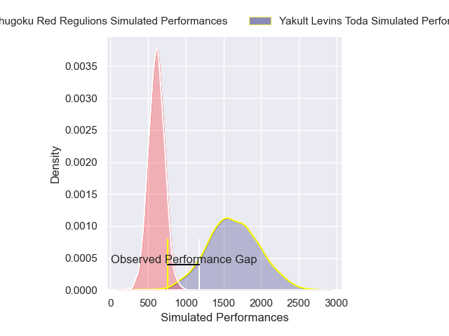
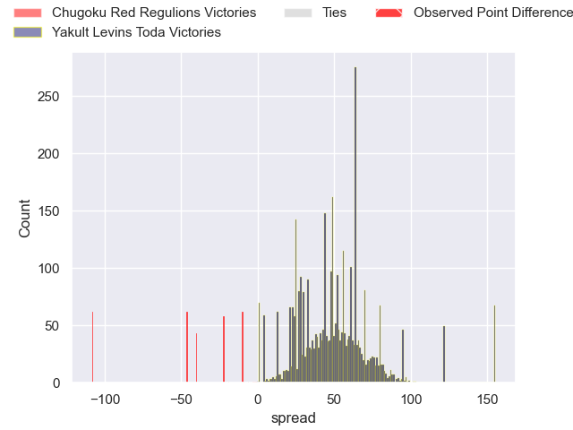
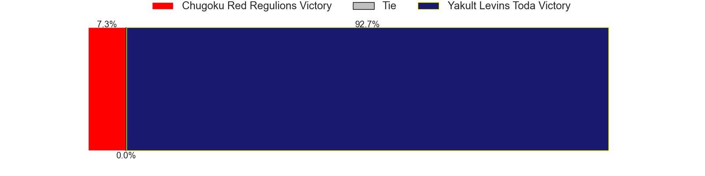
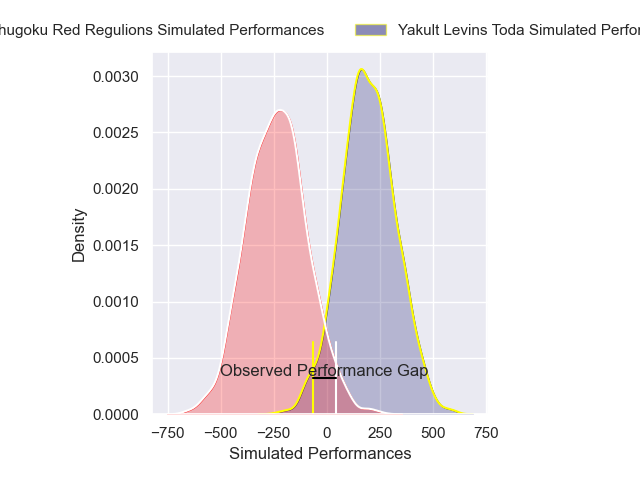
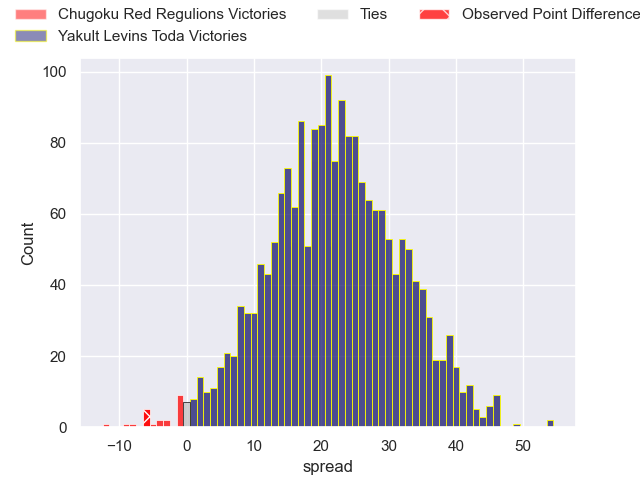
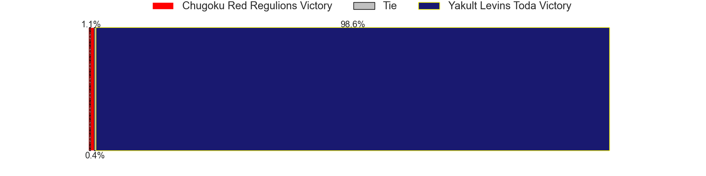

---  
layout: page  
title: Chugoku Red Regulions at Yakult Levins Toda; 26-20  
date: 2025-01-12 18:00:00 -0500  
categories: "Japan Rugby League One D3 2024" match review  
---
# Chugoku Red Regulions at Yakult Levins Toda; 26-20

# Club Level Predictions

The first set of predictions treats a club as the smallest object, as the club develops its members, organizes a gameplan, and deploys its players as needed for each match. This club model has a prediction of 0.996, which translates to predicting Yakult Levins Toda to win by 50.9.

Our Over/Under is 77.5 - and combined with the spread above, we have a predicted scoreline of 14 to 64

Each club has a rating and a rating deviation (similar to a Glicko rating), and expected performances can be generated. This allows for simulated matches and spreads like the ones below.
## Projected Performances - Club Model

## Projected Spreads - Club Model

## Projected Results - Club Model

# Player Level Predictions

Treating teams instead as an entity made up of the currently active players, I have ratings for each player in an altogether different system. These can be combined to form team ratings once teamsheets are announced, weighting starters a bit higher than the reserves. After the match is played, players can be weighted by their minutes on the field, allowing for an accurate measure of the team's composition. With these compiled team ratings, we can make predictions, measure inaccuracy, and update the individual player ratings.
## Prediction without Player Minutes: Yakult Levins Toda by 22.6

Yakult Levins Toda by 20.4 on a neutral pitch

## Projected Performances - Player Model

## Projected Spreads - Player Model

## Projected Results - Player Model

|   Away Minutes | Away Player      |   Away Percentile |   Number |   Home Percentile | Home Player          |   Home Minutes |
|---------------:|:-----------------|------------------:|---------:|------------------:|:---------------------|---------------:|
|             80 | Kojiro Arito     |             24.62 |        1 |             17.4  | Iori Nozaki          |             80 |
|             80 | Kentaro Iwanaga  |             16.13 |        2 |             20.43 | Kosetu Kawachi       |             80 |
|             80 | Haruki Miyata    |             78.61 |        3 |             18.76 | Atsushi Furuya       |             80 |
|             80 | Taro Nishikawa   |              0.41 |        4 |             32.48 | Masashi Ogawa        |             80 |
|             80 | Tomonari Aoki    |             34.83 |        5 |             90.12 | James Tucker         |             80 |
|             80 | Shintaro Matsuda |             17.95 |        6 |             46.25 | Masaya Makino        |             37 |
|             80 | Hayato Moriyama  |             78.6  |        7 |             23.23 | Kosuke Urabe         |             80 |
|             80 | Ed Quirk         |              1.46 |        8 |             25.99 | Ryusei Isaka         |             80 |
|             80 | Shohei Tsukamoto |              2.88 |        9 |             41.91 | Junpei Tada          |             43 |
|             80 | Hayato Miyazaki  |             82.31 |       10 |             17.9  | Nick Evemy           |             80 |
|             80 | Syougo Azuma     |             73.63 |       11 |             28.63 | Kagechika Ota        |             80 |
|             80 | Shinya Hirayama  |             62.22 |       12 |             26.22 | Takumi Hurukawa      |             80 |
|             80 | Masaaki Morita   |              2.78 |       13 |             10.89 | Antonio Mikaele-Tu'u |             80 |
|             80 | Kentaro Fujii    |             23.14 |       14 |             21.27 | Takuya Takahashi     |             80 |
|             80 | Sebastian Sialau |             62.01 |       15 |             27.29 | Masatoshi Doi        |             80 |
|            nan | nan              |            nan    |       16 |             54.87 | Yuto Usuda           |             80 |

