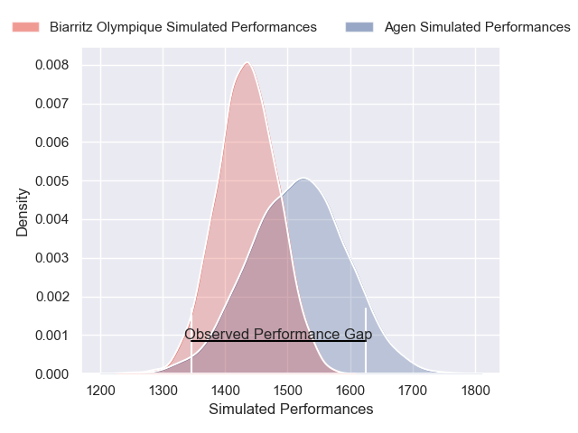
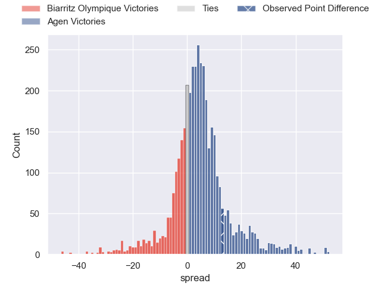
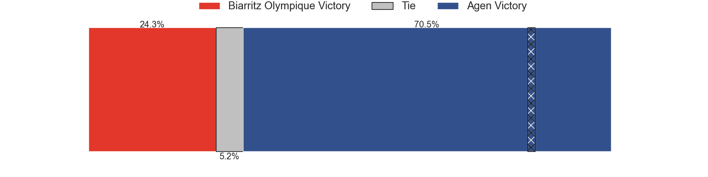
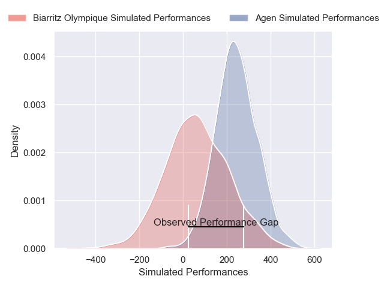
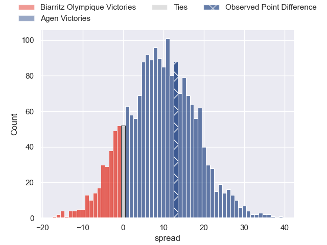
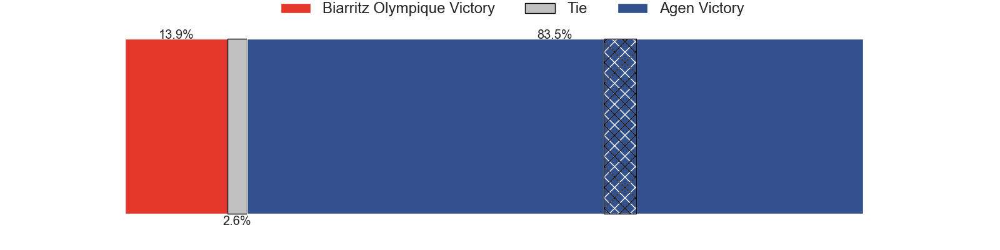

---  
layout: page  
title: Biarritz Olympique at Agen; 26-39  
date: 2025-01-16 18:00:00 -0500  
categories: "Pro D2 2024" match review  
---
# Biarritz Olympique at Agen; 26-39

# Club Level Predictions

The first set of predictions treats a club as the smallest object, as the club develops its members, organizes a gameplan, and deploys its players as needed for each match. This club model has a prediction of 0.613, which translates to predicting Agen to win by 4.0.

Our Over/Under is 48.5 - and combined with the spread above, we have a predicted scoreline of 22 to 26

Each club has a rating and a rating deviation (similar to a Glicko rating), and expected performances can be generated. This allows for simulated matches and spreads like the ones below.
## Projected Performances - Club Model

## Projected Spreads - Club Model

## Projected Results - Club Model

# Player Level Predictions

Treating teams instead as an entity made up of the currently active players, I have ratings for each player in an altogether different system. These can be combined to form team ratings once teamsheets are announced, weighting starters a bit higher than the reserves. After the match is played, players can be weighted by their minutes on the field, allowing for an accurate measure of the team's composition. With these compiled team ratings, we can make predictions, measure inaccuracy, and update the individual player ratings.
## Prediction without Player Minutes: Agen by 9.6

Biarritz Olympique by 4.6 on a neutral pitch

## Projected Performances - Player Model

## Projected Spreads - Player Model

## Projected Results - Player Model

|   Away Minutes | Away Player         |   Away Percentile |   Number |   Home Percentile | Home Player        |   Home Minutes |
|---------------:|:--------------------|------------------:|---------:|------------------:|:-------------------|---------------:|
|             80 | Giorgi Nutsubidze   |              0.95 |        1 |             72.68 | Hans Lombard-Buret |             80 |
|             41 | Yohan Beheregaray   |             26.11 |        2 |             30.37 | Pierre Jouvin      |             17 |
|             59 | Zakaria El Fakir    |              2.49 |        3 |             35.05 | Alex Burin         |             18 |
|             80 | Charlie Matthews    |             22.16 |        4 |             37.72 | Vincent Farre      |             80 |
|             39 | Piula Faasalele     |             31.14 |        5 |              3.69 | Javier Eissmann    |             26 |
|             80 | Aitor Hourcade      |              2.43 |        6 |             43.28 | Matthieu Bonnet    |             39 |
|             80 | Ekain Imaz Agirre   |             16.68 |        7 |              1.21 | Evan Olmstead      |             70 |
|             80 | Thomas Hebert       |             23.82 |        8 |             41.42 | Valentin Gayraud   |             14 |
|             80 | Kerman Aurrekoetxea |             71.35 |        9 |             42.52 | Dorian Bellot      |             10 |
|             32 | Edgar Retiere       |             55.63 |       10 |              3.09 | Billy Searle       |             60 |
|             63 | Bastien Guillemin   |             18.92 |       11 |             13.45 | Iban Etcheverry    |             39 |
|             55 | Tyler Morgan        |             18.97 |       12 |             60.24 | Kolinio Ramoka     |             50 |
|             27 | Mathieu Acebes      |             96.01 |       13 |             82.22 | Peyo Muscarditz    |             50 |
|             59 | Yohan Tapie         |             33.33 |       14 |             78.29 | Lucas Martins      |             10 |
|             62 | Gervais Cordin      |             19.24 |       15 |              0.89 | Loris Tolot        |             61 |
|             80 | Thomas Dolhagaray   |             40.62 |       16 |             80.11 | Santiago Socino    |             46 |
|             80 | Cornell du Preez    |             76.64 |       17 |             14.17 | John Madigan       |             21 |
|             80 | Masivesi Dakuwaqa   |             62.88 |       18 |              3    | Fotu Lokotui       |             30 |
|             32 | Luteru Tolai        |             56.84 |       19 |             55.84 | Beau Farrance      |             30 |
|             80 | Killian Taofifenua  |             43.04 |       20 |              4.47 | Florent Guion      |             34 |
|             25 | Levi Douglas        |             21.66 |       21 |             33.3  | Clement Garrigues  |             19 |
|             80 | Francois Vergnaud   |              3.12 |       22 |             11.35 | Theo Idjellidaine  |             41 |
|             80 | Nodari Shengelia    |            nan    |       23 |             11.48 | Emile Dayral       |             80 |

