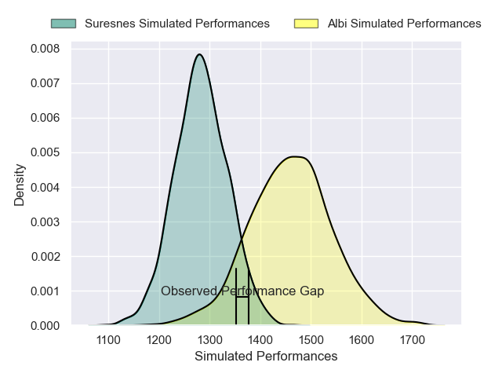
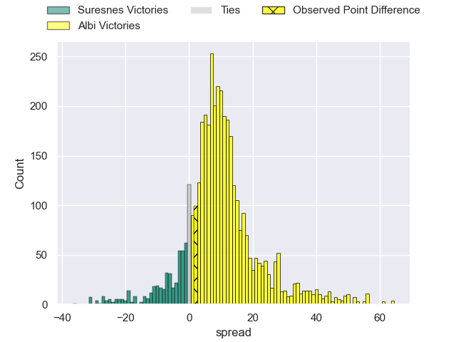
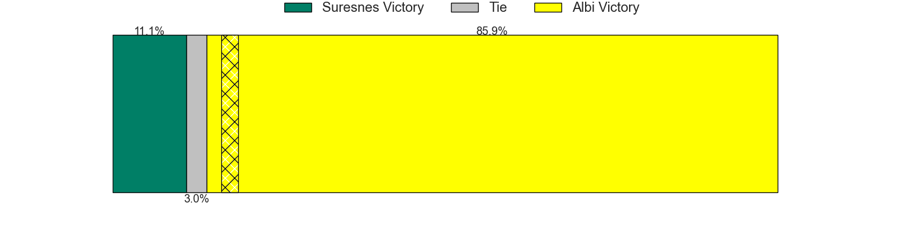
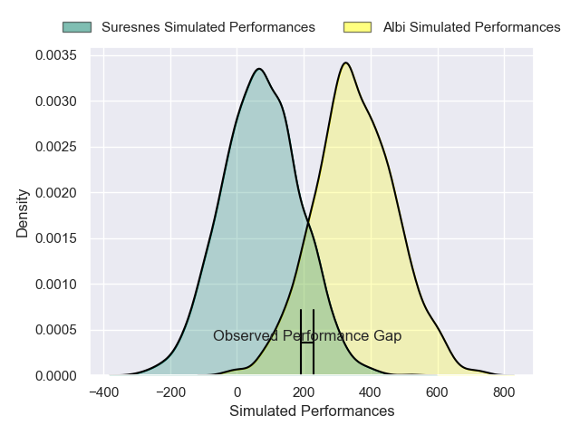
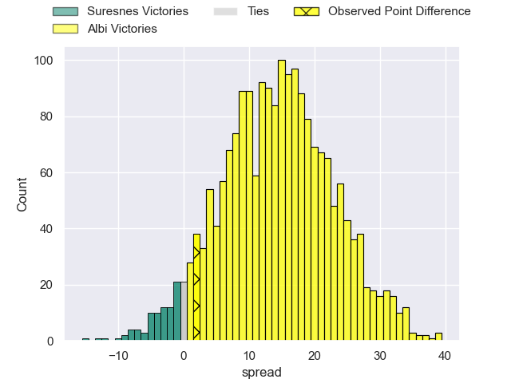
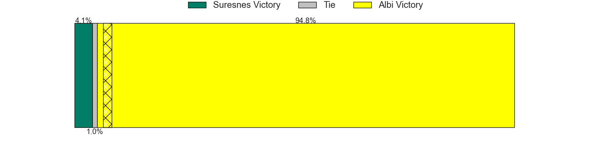

---  
layout: page  
title: Suresnes at Albi; 19-21  
date: 2025-01-17 18:00:00 -0500  
categories: "Nationale 2024" match review  
---
# Suresnes at Albi; 19-21

# Club Level Predictions

The first set of predictions treats a club as the smallest object, as the club develops its members, organizes a gameplan, and deploys its players as needed for each match. This club model has a prediction of 0.731, which translates to predicting Albi to win by 8.8.

Our Over/Under is 43.5 - and combined with the spread above, we have a predicted scoreline of 17 to 26

Each club has a rating and a rating deviation (similar to a Glicko rating), and expected performances can be generated. This allows for simulated matches and spreads like the ones below.
## Projected Performances - Club Model

## Projected Spreads - Club Model

## Projected Results - Club Model

# Player Level Predictions

Treating teams instead as an entity made up of the currently active players, I have ratings for each player in an altogether different system. These can be combined to form team ratings once teamsheets are announced, weighting starters a bit higher than the reserves. After the match is played, players can be weighted by their minutes on the field, allowing for an accurate measure of the team's composition. With these compiled team ratings, we can make predictions, measure inaccuracy, and update the individual player ratings.
## Prediction without Player Minutes: Albi by 14.9

Albi by 3.5 on a neutral pitch

## Projected Performances - Player Model

## Projected Spreads - Player Model

## Projected Results - Player Model

|   Away Minutes | Away Player                 |   Away Percentile |   Number |   Home Percentile | Home Player            |   Home Minutes |
|---------------:|:----------------------------|------------------:|---------:|------------------:|:-----------------------|---------------:|
|             54 | Thibaud Sebire              |             67.27 |        1 |             14.85 | Kevin Tougne           |             80 |
|             61 | Jean-Étienne Lesueur        |             16.01 |        2 |              6.29 | Reinach Venter         |             80 |
|             80 | Guiterembi Vickos           |             45.25 |        3 |             25.99 | Esteban Talalua        |             53 |
|             20 | Damien Bozic                |             57.16 |        4 |             56.05 | Yanis Horvat           |             61 |
|             40 | Marvin Woki                 |             72.88 |        5 |             12.4  | Dion Evrard Oulai      |             19 |
|             80 | Simon Veyrac                |             31.34 |        6 |             11.24 | Mattéo Coustalat       |             47 |
|             54 | Florian Desbordes           |             12.99 |        7 |             56.7  | Ianis Ponsole          |             80 |
|             80 | Lakisipone Lee              |             78.88 |        8 |             21.12 | Camille Jarreau        |             80 |
|             80 | Théo Bachiri                |             33.58 |        9 |             36.86 | Ruben Courties         |             63 |
|             59 | Jean Chezeau                |             69.6  |       10 |             71.81 | Théo Vidal             |             55 |
|             54 | Faraj Fartass               |             91.89 |       11 |             68.91 | Paul Clergue           |             59 |
|             18 | JJ Taulagi                  |              0.55 |       12 |             16.59 | Leo Treilles           |             21 |
|             63 | Victor Barnier              |             85.07 |       13 |             92.37 | Nasoni Naqiri Kunavore |             31 |
|             25 | Alexis Clement              |             12.51 |       14 |             55.13 | Simon Hartmann         |             80 |
|             39 | Goulwen Gueho               |              4.03 |       15 |             57.05 | Matis Pacchiana        |              7 |
|             25 | Yakine Mohamed Djebarri     |             42.64 |       16 |             20.38 | Lucas Pindor           |             49 |
|             29 | Gauthier Brute de Remur     |             84.17 |       17 |             92.49 | Maks van Dyk           |             80 |
|             80 | Gauthier Wolf               |             37.61 |       18 |             49.6  | Jonathan Kpoku         |             80 |
|             55 | Nail Audoire                |             29.71 |       19 |             75.11 | Baptiste Couchinave    |             80 |
|             80 | Yanis Trabelsi              |             41.36 |       20 |             70.62 | Gilen Queheille        |             20 |
|             18 | Thomas Lacroix              |             11.5  |       21 |             55.73 | Thibault Olender       |             41 |
|             29 | Tanguy Lacoste              |             51.1  |       22 |             22.41 | Guillem Calmon         |             48 |
|             31 | Boaventura Resende Da cunha |             30.82 |       23 |            nan    | nan                    |            nan |

