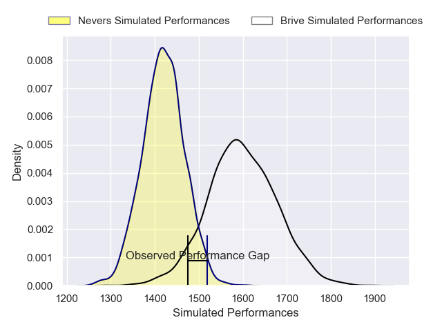
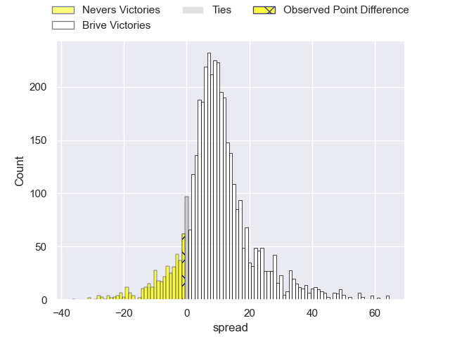
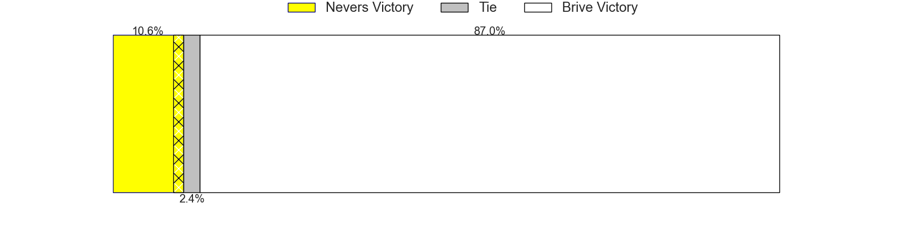
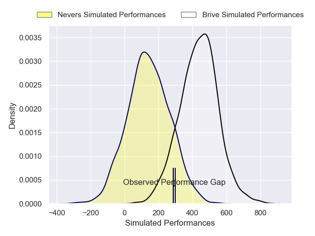
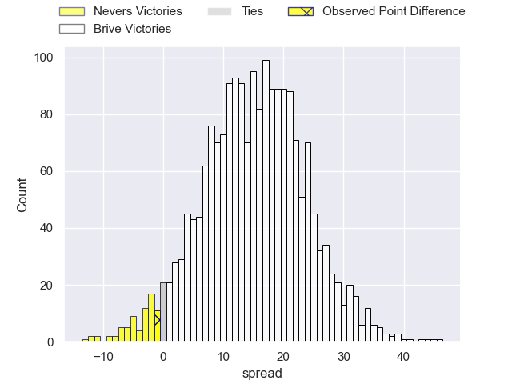
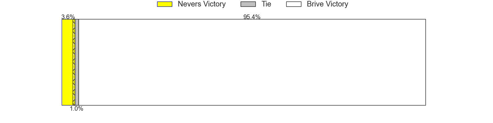

---  
layout: page  
title: Nevers at Brive; 23-22  
date: 2025-01-17 18:00:00 -0500  
categories: "Pro D2 2024" match review  
---
# Nevers at Brive; 23-22

# Club Level Predictions

The first set of predictions treats a club as the smallest object, as the club develops its members, organizes a gameplan, and deploys its players as needed for each match. This club model has a prediction of 0.735, which translates to predicting Brive to win by 9.0.

Our Over/Under is 47.5 - and combined with the spread above, we have a predicted scoreline of 19 to 28

Each club has a rating and a rating deviation (similar to a Glicko rating), and expected performances can be generated. This allows for simulated matches and spreads like the ones below.
## Projected Performances - Club Model

## Projected Spreads - Club Model

## Projected Results - Club Model

# Player Level Predictions

Treating teams instead as an entity made up of the currently active players, I have ratings for each player in an altogether different system. These can be combined to form team ratings once teamsheets are announced, weighting starters a bit higher than the reserves. After the match is played, players can be weighted by their minutes on the field, allowing for an accurate measure of the team's composition. With these compiled team ratings, we can make predictions, measure inaccuracy, and update the individual player ratings.
## Prediction without Player Minutes: Brive by 20.0

Brive by 7.1 on a neutral pitch

## Projected Performances - Player Model

## Projected Spreads - Player Model

## Projected Results - Player Model

|   Away Minutes | Away Player                |   Away Percentile |   Number |   Home Percentile | Home Player             |   Home Minutes |
|---------------:|:---------------------------|------------------:|---------:|------------------:|:------------------------|---------------:|
|             24 | Aitor Kitutu               |             42.92 |        1 |             11.23 | Simon-Pierre Chauvac    |             80 |
|             39 | Jean-Maxence Jules-Rosette |             49.1  |        2 |             72.12 | Issam Hamel             |             39 |
|             80 | Lasha Pkhakadze            |             63.99 |        3 |             27.37 | Henzo Kiteau            |             80 |
|             40 | Ugo Vignolles              |             42.34 |        4 |             51.51 | Tevita Ratuva           |             57 |
|             41 | Chris Gabriel              |             54.64 |        5 |              9.07 | Hendre Stassen          |             55 |
|             80 | Luka Plataret              |             87.84 |        6 |             81.34 | Retief Marais           |             56 |
|             51 | Rati Zazadze               |             39.18 |        7 |             13.3  | Sasha Gue               |             51 |
|             80 | Jason-Colin Fraser         |             94.4  |        8 |             35.34 | Rahboni Warren-Vosayaco |             80 |
|             41 | Hugo Bouyssou              |              1.82 |        9 |              8.58 | Hugo Verdu              |             26 |
|             26 | Yohan Le Bourhis           |             68.94 |       10 |             83.04 | Curwin Bosch            |             80 |
|             80 | Johan Georg Wasserman      |             69.21 |       11 |             89.74 | Erwan Dridi             |             18 |
|             57 | Noa Pommelet               |             64.71 |       12 |             57.08 | Georges Shvelidze       |             26 |
|             68 | Leonard Paris              |             80.31 |       13 |             99.45 | Matias Moroni           |             24 |
|             39 | Lucas Blanc                |             74.39 |       14 |             73.31 | Asaeli Tuivuaka         |             24 |
|             80 | Perry Mayo                 |             63.31 |       15 |             66.18 | Mathis Ferté            |             27 |
|             80 | Julien Kazubek             |             64.12 |       16 |              5.34 | Konstantin Mikautadze   |             27 |
|             23 | Stefan Buruiana            |             62.95 |       17 |              3.2  | Marcel van der Merwe    |             32 |
|             80 | Kamaliele Tufele           |             65.8  |       18 |             87.5  | Asier Usarraga          |             44 |
|             16 | Nicolas Ragoevi            |             32.85 |       19 |            nan    | Nathan Fraissenon       |             80 |
|             57 | Farai Mudariki             |             20.55 |       20 |             22.12 | Benjamin Boudou         |             80 |
|             46 | Lasha Jaiani               |             86.49 |       21 |             39    | Benjamin Lefranc        |             74 |
|             60 | Simon Tarel                |             37.23 |       22 |             66.7  | Matthieu Voisin         |             80 |
|             50 | Shaun Reynolds             |             31.94 |       23 |            nan    | nan                     |            nan |

