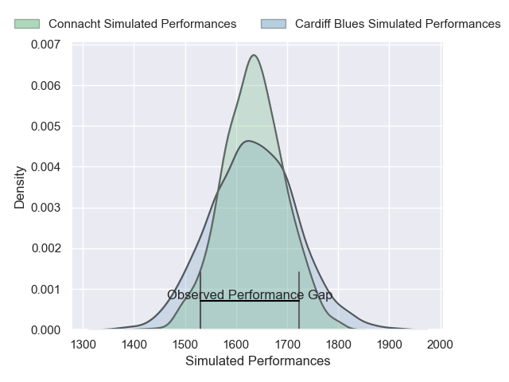
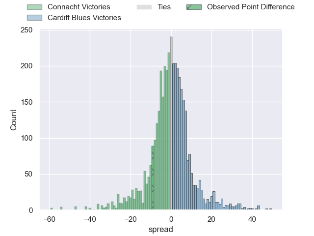
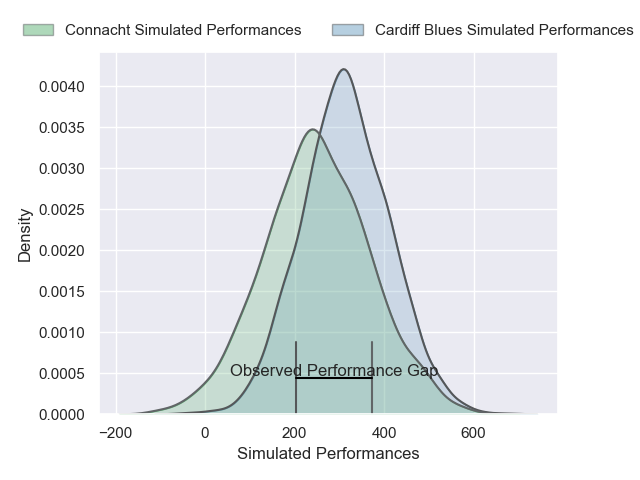
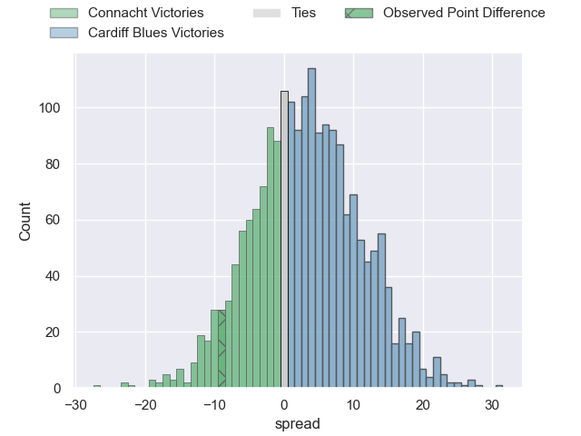
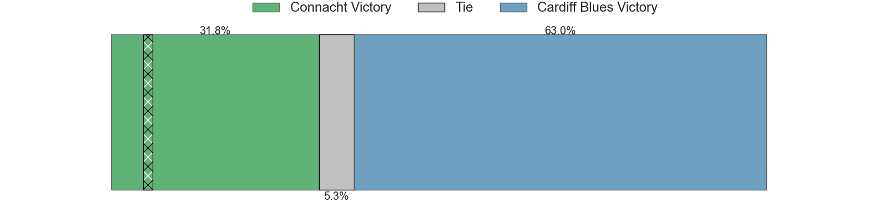

---  
layout: page  
title: Connacht at Cardiff Blues; 28-19  
date: 2025-01-17 18:00:00 -0500  
categories: "European Rugby Challenge Cup 2024" match review  
---
# Connacht at Cardiff Blues; 28-19

# Club Level Predictions

The first set of predictions treats a club as the smallest object, as the club develops its members, organizes a gameplan, and deploys its players as needed for each match. This club model has a prediction of 0.49, which translates to predicting Connacht to win by 0.4.

Our Over/Under is 51.5 - and combined with the spread above, we have a predicted scoreline of 26 to 25

Each club has a rating and a rating deviation (similar to a Glicko rating), and expected performances can be generated. This allows for simulated matches and spreads like the ones below.
## Projected Performances - Club Model

## Projected Spreads - Club Model

## Projected Results - Club Model

# Player Level Predictions

Treating teams instead as an entity made up of the currently active players, I have ratings for each player in an altogether different system. These can be combined to form team ratings once teamsheets are announced, weighting starters a bit higher than the reserves. After the match is played, players can be weighted by their minutes on the field, allowing for an accurate measure of the team's composition. With these compiled team ratings, we can make predictions, measure inaccuracy, and update the individual player ratings.
## Prediction without Player Minutes: Cardiff Blues by 2.7

Connacht by 9.4 on a neutral pitch

## Projected Performances - Player Model

## Projected Spreads - Player Model

## Projected Results - Player Model

|   Away Minutes | Away Player      |   Away Percentile |   Number |   Home Percentile | Home Player        |   Home Minutes |
|---------------:|:-----------------|------------------:|---------:|------------------:|:-------------------|---------------:|
|             48 | Peter Dooley     |             96.84 |        1 |             36.15 | Rhys Barratt       |             80 |
|             17 | Dave Heffernan   |             61.7  |        2 |             11.88 | Evan Lloyd         |             80 |
|             60 | Finlay Bealham   |             96.15 |        3 |              3.25 | Keiron Assiratti   |             59 |
|             50 | Josh Murphy      |             95.04 |        4 |             83.3  | Josh McNally       |             40 |
|             52 | Joe Joyce        |             97.06 |        5 |             21.66 | Teddy Williams     |             21 |
|             19 | Cian Prendergast |             16.3  |        6 |              6.17 | Alex Mann          |             80 |
|             18 | Conor Oliver     |             87.96 |        7 |             75.81 | Thomas Young       |             80 |
|             20 | Paul Boyle       |             31.39 |        8 |             82.47 | Alun Lawrence      |             21 |
|             80 | Ben Murphy       |             70.65 |        9 |             21.01 | Ellis Bevan        |             23 |
|             80 | Josh Ioane       |             84.86 |       10 |             67.04 | Ben Thomas         |             19 |
|             21 | Byron Ralston    |              4.23 |       11 |             50.79 | Tom Bowen          |             17 |
|             21 | Bundee Aki       |             98.91 |       12 |             36.75 | Rory Jennings      |             29 |
|             61 | Piers O'Conor    |             47.11 |       13 |             91.93 | Rey Lee-Lo         |             38 |
|             80 | Chay Mullins     |             68.11 |       14 |             86.91 | Gabriel Hamer-Webb |             56 |
|             61 | Santiago Cordero |             98.24 |       15 |             14.51 | Jacob Beetham      |             28 |
|             23 | Jordan Duggan    |             40.77 |       16 |             38.12 | Danny Southworth   |             14 |
|             23 | Eoin de Buitléar |             59.75 |       17 |             14.02 | Rhys Litterick     |             32 |
|             77 | Jack Aungier     |             66.32 |       18 |            nan    | Efan Daniel        |             80 |
|             23 | David O'Connor   |             24.19 |       19 |              7.79 | Seb Davies         |             51 |
|             52 | Sean Jansen      |              9.09 |       20 |              6.78 | Rory Thornton      |             42 |
|             80 | Matthew Devine   |             48.91 |       21 |            nan    | Johan Mulder       |             48 |
|             69 | David Hawkshaw   |             67.83 |       22 |             11.21 | Cameron Winnett    |             18 |
|             42 | JJ Hanrahan      |             89.09 |       23 |            nan    | nan                |            nan |

