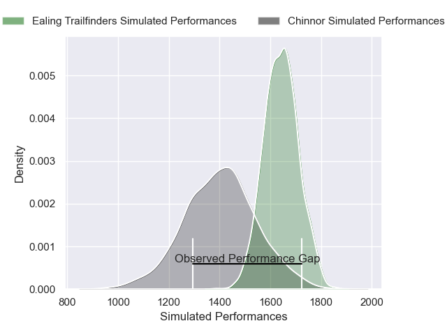
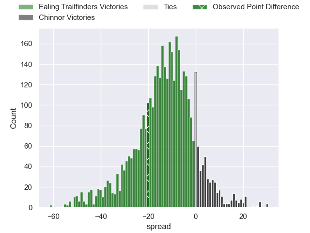
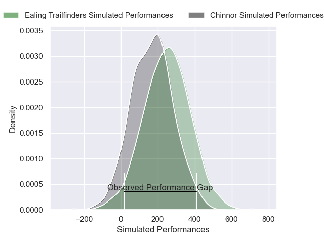
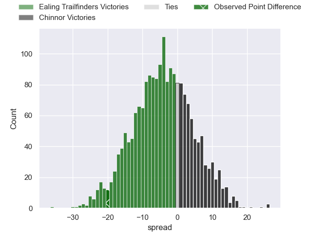

---  
layout: page  
title: Ealing Trailfinders at Chinnor; 28-8  
date: 2025-01-17 18:00:00 -0500  
categories: "RFU Championship 2024" match review  
---
# Ealing Trailfinders at Chinnor; 28-8

# Club Level Predictions

The first set of predictions treats a club as the smallest object, as the club develops its members, organizes a gameplan, and deploys its players as needed for each match. This club model has a prediction of 0.208, which translates to predicting Ealing Trailfinders to win by 11.9.

Our Over/Under is 52.5 - and combined with the spread above, we have a predicted scoreline of 32 to 20

Each club has a rating and a rating deviation (similar to a Glicko rating), and expected performances can be generated. This allows for simulated matches and spreads like the ones below.
## Projected Performances - Club Model

## Projected Spreads - Club Model

## Projected Results - Club Model

# Player Level Predictions

Treating teams instead as an entity made up of the currently active players, I have ratings for each player in an altogether different system. These can be combined to form team ratings once teamsheets are announced, weighting starters a bit higher than the reserves. After the match is played, players can be weighted by their minutes on the field, allowing for an accurate measure of the team's composition. With these compiled team ratings, we can make predictions, measure inaccuracy, and update the individual player ratings.
## Prediction without Player Minutes: Ealing Trailfinders by 8.2

Ealing Trailfinders by 10.5 on a neutral pitch

## Projected Performances - Player Model

## Projected Spreads - Player Model

## Projected Results - Player Model

|   Away Minutes | Away Player          |   Away Percentile |   Number |   Home Percentile | Home Player           |   Home Minutes |
|---------------:|:---------------------|------------------:|---------:|------------------:|:----------------------|---------------:|
|             80 | Kyle John Whyte      |             88.17 |        1 |             25.22 | Keston Lines          |             41 |
|             80 | Mike Willemse        |             87.05 |        2 |             98.38 | Alun Walker           |             30 |
|             80 | George Davis         |             90.93 |        3 |             26.34 | Tim Hoyt              |             56 |
|             39 | Bobby de Wee         |             96.57 |        4 |             11.19 | Scott Hall            |             25 |
|             80 | Sean Lonsdale        |             56.65 |        5 |             26.51 | Alfie North           |             80 |
|             80 | David Douglas Bridge |             24.02 |        6 |             51.65 | Harry Dugmore         |             39 |
|             80 | Jordy Reid           |             83.71 |        7 |             37.22 | George Richard Stokes |             41 |
|             52 | Will Montgomery      |             64.44 |        8 |             28.02 | Izzy Wharton          |             30 |
|             80 | Craig Hampson        |             89.78 |        9 |             86.5  | Luke Carter           |             80 |
|             30 | Craig Willis         |             98.68 |       10 |             44.93 | Nick Smith            |             50 |
|             48 | Ben Harris           |             46.53 |       11 |             50.44 | Kieran Goss           |              6 |
|             20 | Jordan Holgate       |             86.73 |       12 |             29.65 | Grant Hughes          |             23 |
|             80 | Francis Moore        |             60.4  |       13 |             31.64 | Charlie Watson        |             50 |
|             20 | Angus Kernohan       |             92.18 |       14 |             26.1  | Ryan Crowley          |             56 |
|             24 | Tobi Wilson          |             83    |       15 |             27.74 | William Feeney        |             30 |
|             24 | Biyi Alo             |             91.28 |       16 |             41.15 | Morgan Passman        |             80 |
|             23 | Cameron Terry        |             80.58 |       17 |            nan    | Callum Pascoe         |             80 |
|             30 | Lefty Zigiriadis     |             90.67 |       18 |            nan    | Max Clementson        |             50 |
|             80 | Matas Jurevicius     |             30.54 |       19 |             58.03 | Rob Hardwick          |             80 |
|             28 | Siya Ningiza         |             71.55 |       20 |            nan    | Lawson Porter         |             50 |
|             80 | Ollie Newman         |             31.75 |       21 |            nan    | Cameron Rafferty      |             29 |
|            nan | nan                  |            nan    |       22 |            nan    | Will Cave             |             80 |
|            nan | nan                  |            nan    |       23 |            nan    | Dan Cooke             |             80 |

