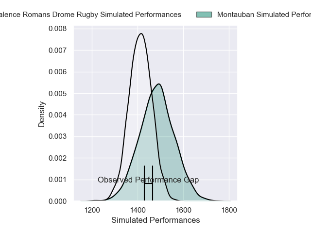
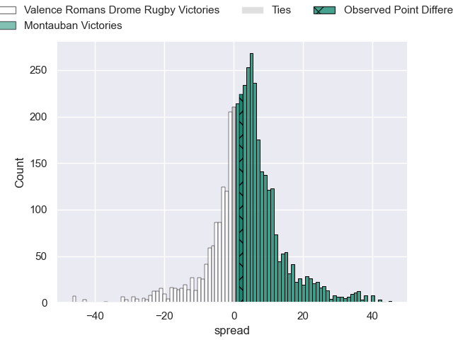
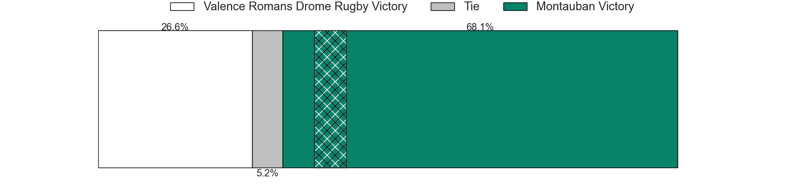
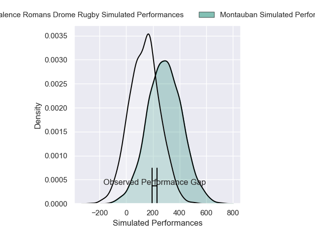
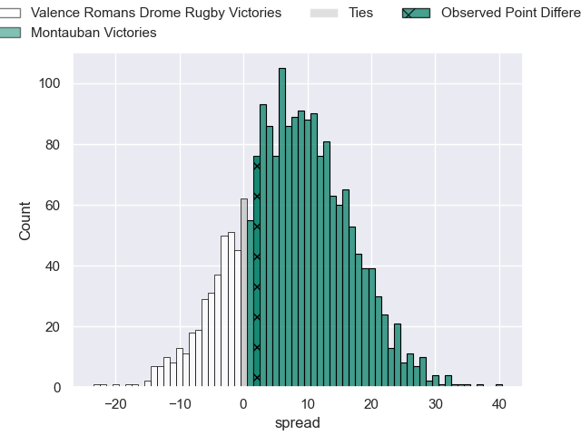
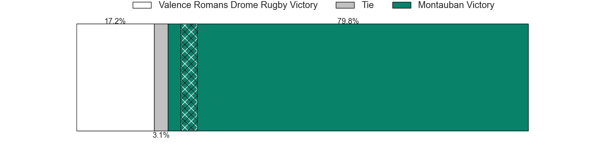

---  
layout: page  
title: Valence Romans Drome Rugby at Montauban; 23-25  
date: 2025-01-17 18:00:00 -0500  
categories: "Pro D2 2024" match review  
---
# Valence Romans Drome Rugby at Montauban; 23-25

# Club Level Predictions

The first set of predictions treats a club as the smallest object, as the club develops its members, organizes a gameplan, and deploys its players as needed for each match. This club model has a prediction of 0.601, which translates to predicting Montauban to win by 3.6.

Our Over/Under is 57.5 - and combined with the spread above, we have a predicted scoreline of 27 to 31

Each club has a rating and a rating deviation (similar to a Glicko rating), and expected performances can be generated. This allows for simulated matches and spreads like the ones below.
## Projected Performances - Club Model

## Projected Spreads - Club Model

## Projected Results - Club Model

# Player Level Predictions

Treating teams instead as an entity made up of the currently active players, I have ratings for each player in an altogether different system. These can be combined to form team ratings once teamsheets are announced, weighting starters a bit higher than the reserves. After the match is played, players can be weighted by their minutes on the field, allowing for an accurate measure of the team's composition. With these compiled team ratings, we can make predictions, measure inaccuracy, and update the individual player ratings.
## Prediction without Player Minutes: Montauban by 10.3

Valence Romans Drome Rugby by 0.6 on a neutral pitch

## Projected Performances - Player Model

## Projected Spreads - Player Model

## Projected Results - Player Model

|   Away Minutes | Away Player          |   Away Percentile |   Number |   Home Percentile | Home Player       |   Home Minutes |
|---------------:|:---------------------|------------------:|---------:|------------------:|:------------------|---------------:|
|             40 | Andrea Pontanier     |             76.12 |        1 |             15.29 | Thomas Bue        |             80 |
|             32 | Cyril Deligny        |              0.53 |        2 |              6.93 | Kevin Firmin      |             60 |
|             30 | Gareth Milasinovich  |             28.87 |        3 |             68.38 | Tietie Tuimauga   |             80 |
|             20 | Éloi Massot          |              8.18 |        4 |             73.25 | Clément Bitz      |             80 |
|             80 | Florian Goumat       |             59.98 |        5 |             11.28 | Lewis Bean        |             23 |
|             20 | Adrien Roux          |             38.12 |        6 |             10.92 | Karl Wilkins      |             80 |
|             21 | Ilia Spanderashvili  |              9.71 |        7 |             57.23 | Kyllian Ringuet   |             80 |
|              7 | Sven Bernat Girlando |             77.47 |        8 |             81.33 | Sikhumbuzo Notshe |             41 |
|             27 | Thomas Lhusero       |             75.86 |        9 |             79.1  | Joe Powell        |             41 |
|             48 | Lucas Meret          |             28.26 |       10 |             35.98 | Thomas Fortunel   |              8 |
|             80 | Thomas Roziere       |             25.17 |       11 |             40.73 | Yvan Reilhac      |             44 |
|             29 | Louis Marrou         |             84.48 |       12 |             80.17 | Simon Renda       |             54 |
|             56 | Ben Neiceru          |             87.18 |       13 |             21.77 | JT Jackson        |             80 |
|             67 | Adam Vargas          |             95.39 |       14 |             51.49 | Maxime Espeut     |             80 |
|             41 | Joris De Moura       |             81.21 |       15 |             86.13 | Baptiste Mouchous |             64 |
|             80 | Anatole Pauvert      |             77.37 |       16 |             50    | Facundo Pomponio  |             80 |
|             62 | Julien Royer         |              7.99 |       17 |              4.26 | Jeremie Maurouard |             53 |
|             80 | Thembelani Bholi     |             66.63 |       18 |              2.73 | Frédéric Quercy   |             53 |
|             55 | Mattéo Rodor         |             13.15 |       19 |             55.81 | Noa Kanika        |             80 |
|             60 | Dorian Marco Pena    |             60.39 |       20 |              6.69 | Tjuee Uanivi      |             80 |
|             46 | Axel Bruchet         |             17.69 |       21 |             17    | Thomas Larregain  |             19 |
|             60 | Yassine Maamry       |             69.56 |       22 |             24.32 | Hugo Zabalza      |             13 |
|             80 | Enzo Bailly          |            nan    |       23 |              6.01 | Lucas Seyrolle    |             80 |

