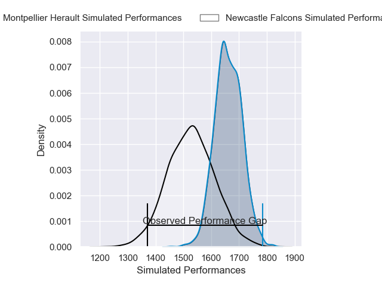
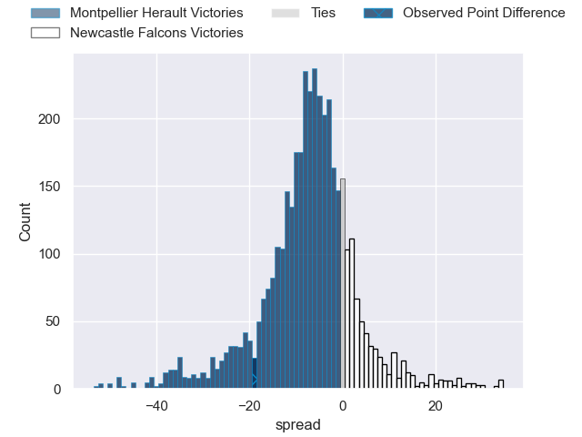
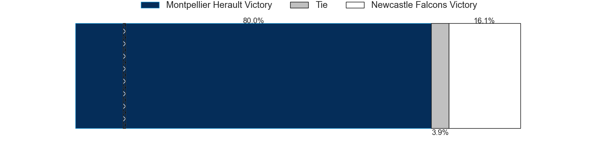
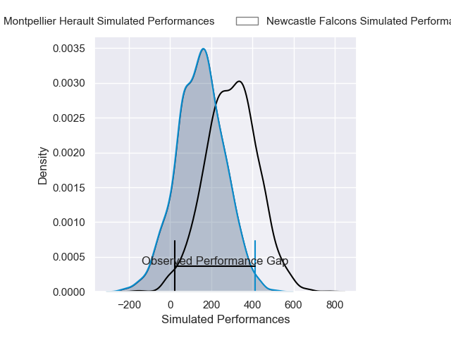
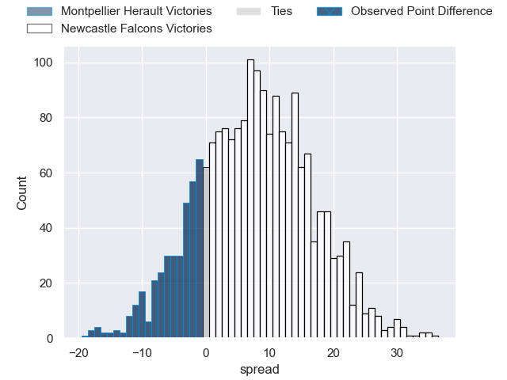
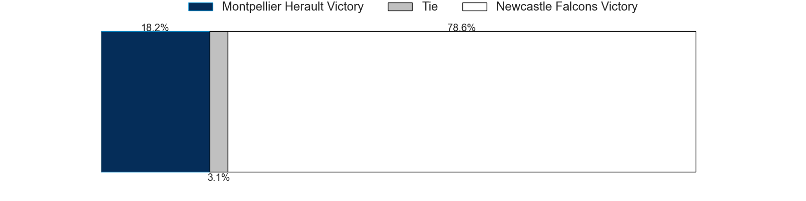

---  
layout: page  
title: Montpellier Herault at Newcastle Falcons; 26-7  
date: 2025-01-17 18:00:00 -0500  
categories: "European Rugby Challenge Cup 2024" match review  
---
# Montpellier Herault at Newcastle Falcons; 26-7

# Club Level Predictions

The first set of predictions treats a club as the smallest object, as the club develops its members, organizes a gameplan, and deploys its players as needed for each match. This club model has a prediction of 0.321, which translates to predicting Montpellier Herault to win by 6.6.

Our Over/Under is 48.5 - and combined with the spread above, we have a predicted scoreline of 28 to 21

Each club has a rating and a rating deviation (similar to a Glicko rating), and expected performances can be generated. This allows for simulated matches and spreads like the ones below.
## Projected Performances - Club Model

## Projected Spreads - Club Model

## Projected Results - Club Model

# Player Level Predictions

Treating teams instead as an entity made up of the currently active players, I have ratings for each player in an altogether different system. These can be combined to form team ratings once teamsheets are announced, weighting starters a bit higher than the reserves. After the match is played, players can be weighted by their minutes on the field, allowing for an accurate measure of the team's composition. With these compiled team ratings, we can make predictions, measure inaccuracy, and update the individual player ratings.
## Prediction without Player Minutes: Newcastle Falcons by 6.7

Montpellier Herault by 6.9 on a neutral pitch

## Projected Performances - Player Model

## Projected Spreads - Player Model

## Projected Results - Player Model

|   Away Minutes | Away Player         |   Away Percentile |   Number |   Home Percentile | Home Player         |   Home Minutes |
|---------------:|:--------------------|------------------:|---------:|------------------:|:--------------------|---------------:|
|             80 | Baptiste Erdocio    |             11.94 |        1 |             12.63 | Mike Rewcastle      |             80 |
|             25 | Christopher Tolofua |             94.32 |        2 |             24.87 | Bryan Byrne         |             23 |
|             23 | Mohamed Haouas      |             74.74 |        3 |              5.33 | Murray McCallum     |             49 |
|             80 | Youssouf Soucouna   |             75.25 |        4 |              2.69 | Philip van der Walt |             49 |
|             21 | Marco Tauleigne     |             97.41 |        5 |              3.29 | John Hawkins        |             49 |
|             28 | Romain Delemarle    |             56.83 |        6 |             35.09 | Reuben Parsons      |             14 |
|             57 | Alexandre Becognee  |             69.16 |        7 |             15.17 | Ollie Leatherbarrow |             14 |
|             21 | Sam Simmonds        |             49.79 |        8 |             11.16 | Freddie Lockwood    |             57 |
|             17 | Alexis Bernadet     |             59.1  |        9 |              0.72 | James Elliott       |             32 |
|             80 | Domingo Miotti      |             86.98 |       10 |             21.41 | Kieran Wilkinson    |             80 |
|             19 | Gabriel Ngandebe    |              5.28 |       11 |             12.78 | Max Pepper          |             80 |
|             80 | Jan Serfontein      |             74.57 |       12 |             18.86 | Oliver Spencer      |             59 |
|              9 | Thomas Darmon       |             25.54 |       13 |             11.53 | Alex Hearle         |             80 |
|             64 | Pierre Lucas        |             23.15 |       14 |             28.24 | Ben Redshaw         |             57 |
|             66 | Julien Tisseron     |             83    |       15 |             61.3  | Louis Brown         |             80 |
|             42 | Lyam Akrab          |             65.72 |       16 |             13.32 | Callum Hancock      |             57 |
|             57 | Nika Abuladze       |             89.52 |       17 |            nan    | Connor Hancock      |             23 |
|             24 | Wilfrid Hounkpatin  |             54.81 |       18 |              0.89 | Jamie Blamire       |             38 |
|             80 | Florian Verhaeghe   |             77.54 |       19 |             30.14 | Kiran McDonald      |             80 |
|             19 | Nicolas Martins     |             87.66 |       20 |              1.29 | Callum Chick        |             80 |
|             80 | Aurelien Barreau    |            nan    |       21 |              1.1  | Brett Connon        |             63 |
|             39 | Anthony Bouthier    |             69.35 |       22 |             85.13 | Max Clark           |             80 |
|             23 | Auguste Cadot       |             34.59 |       23 |            nan    | Joe Davis           |             80 |

