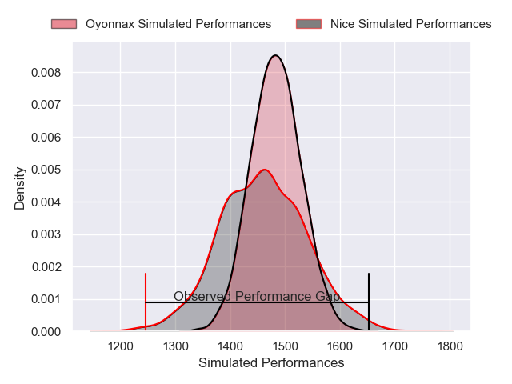
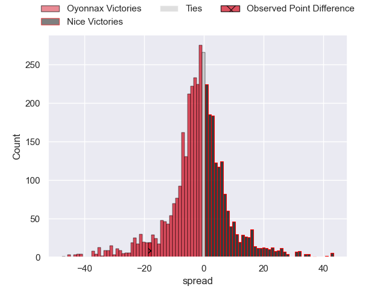
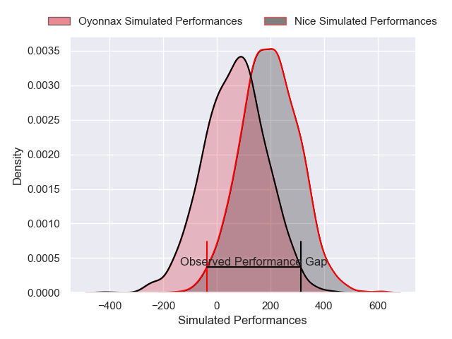
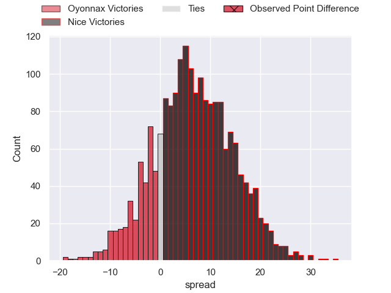
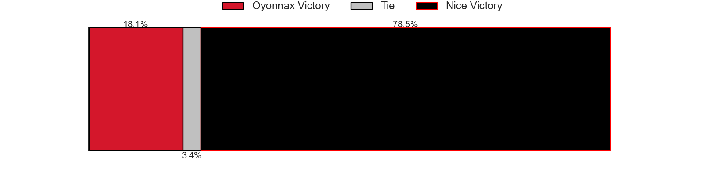

---  
layout: page  
title: Oyonnax at Nice; 33-15  
date: 2025-01-17 18:00:00 -0500  
categories: "Pro D2 2024" match review  
---
# Oyonnax at Nice; 33-15

# Club Level Predictions

The first set of predictions treats a club as the smallest object, as the club develops its members, organizes a gameplan, and deploys its players as needed for each match. This club model has a prediction of 0.462, which translates to predicting Oyonnax to win by 1.4.

Our Over/Under is 51.5 - and combined with the spread above, we have a predicted scoreline of 26 to 25

Each club has a rating and a rating deviation (similar to a Glicko rating), and expected performances can be generated. This allows for simulated matches and spreads like the ones below.
## Projected Performances - Club Model

## Projected Spreads - Club Model

## Projected Results - Club Model

# Player Level Predictions

Treating teams instead as an entity made up of the currently active players, I have ratings for each player in an altogether different system. These can be combined to form team ratings once teamsheets are announced, weighting starters a bit higher than the reserves. After the match is played, players can be weighted by their minutes on the field, allowing for an accurate measure of the team's composition. With these compiled team ratings, we can make predictions, measure inaccuracy, and update the individual player ratings.
## Prediction without Player Minutes: Nice by 9.0

Nice by 5.6 on a neutral pitch

## Projected Performances - Player Model

## Projected Spreads - Player Model

## Projected Results - Player Model

|   Away Minutes | Away Player       |   Away Percentile |   Number |   Home Percentile | Home Player              |   Home Minutes |
|---------------:|:------------------|------------------:|---------:|------------------:|:-------------------------|---------------:|
|             48 | Adrien Bordenave  |             31.45 |        1 |              6.32 | Jules Martinez           |             18 |
|             80 | Teddy Durand      |              6.03 |        2 |             86.17 | Sione Anga'aelangi       |             61 |
|             80 | Paulo Tafili      |             87.01 |        3 |              2.05 | Luvuyo Pupuma            |             48 |
|             55 | Phoenix Battye    |             96.36 |        4 |             99.6  | Tom Murday               |             27 |
|             48 | Hugo Fabregue     |             23.79 |        5 |             71.26 | Martin Freytes           |             80 |
|             80 | Kevin Lebreton    |             27.94 |        6 |             30.36 | Kylian Laurans           |             30 |
|             80 | Hugo Hermet       |             35.93 |        7 |             95.34 | Louis Suaud              |             39 |
|             38 | Loic Godener      |              4.33 |        8 |             35.93 | Ramiha Tarrel Tia Smiler |             25 |
|             25 | Jonathan Ruru     |             94.38 |        9 |              2.9  | Jules Gimbert            |             80 |
|             61 | Zack Holmes       |             83.3  |       10 |              7.13 | Paul Auradou             |             80 |
|             29 | Karim Qadiri      |             57.97 |       11 |             68.01 | Christian Erasmus        |             41 |
|             25 | Lucas Mensa       |             13.09 |       12 |              0.76 | Christa Powell           |             39 |
|             18 | Maelan Rabut      |             72.74 |       13 |             12.65 | Tom Daly                 |             24 |
|             80 | Daniel Ikpefan    |             74.7  |       14 |             35.04 | Simon Delas              |             80 |
|             48 | Martin Bogado     |             19.78 |       15 |             93.41 | David Odiete             |             30 |
|             66 | Chris Smith       |             69.27 |       16 |             10.26 | Tom Ross                 |             30 |
|             58 | Maxime Salles     |             13.39 |       17 |             31.88 | Hugo Sarrasin            |             80 |
|             29 | Thibault Berthaud |             64.1  |       18 |             40.28 | Clément Chartier         |             80 |
|             32 | Victor Lebas      |            nan    |       19 |             31.03 | Pierre Strippoli         |             32 |
|             29 | Antoine Miquel    |             37.85 |       20 |              2.53 | Bastien Berenguel        |             27 |
|             61 | Vasil Lobzhanidze |             10.14 |       21 |             75.13 | Sunia Vola               |             80 |
|             80 | Rémi Di Pietro    |            nan    |       22 |             64.31 | Jules Solinas            |             41 |
|              8 | Peniami Narisia   |             92.02 |       23 |             74.92 | Nathan Courtade          |             50 |

